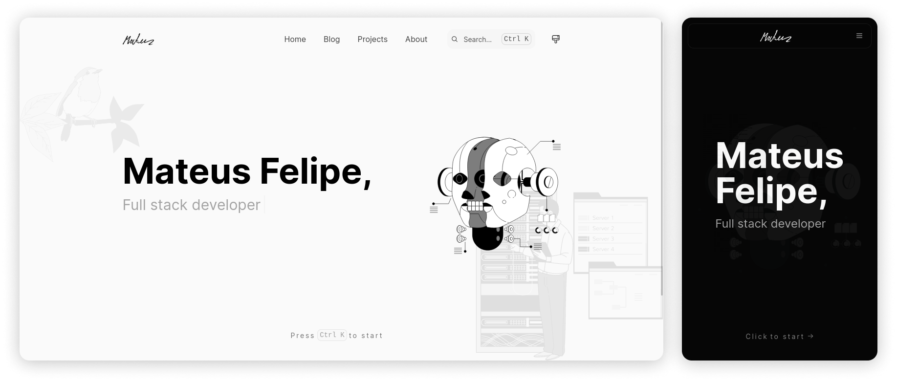

# 👨‍💻 Mateus' Hideout
My personal homepage & portfolio: https://mateusf.com

 
 
 

## ✨ Features

- Dark Mode
- Mobile friendly
- Reading-time prediction like Medium
- Feed RSS
- Command bar/Search modal _by [KBar](https://kbar.vercel.app/)_
- Post comments _by [Utterances](https://utteranc.es)_
- Sorting posts by tags, categories and author
- Sitemap
- SEO Optimized with meta information tags
- Post OG image generator
- Tailwind CSS for styling
- Next 13 App dir with RSC and Typescript
- Github actions workflow with Vercel for deployment
- Automatic changelog generator

## 🚀 PageSpeed

 
 
 
 

