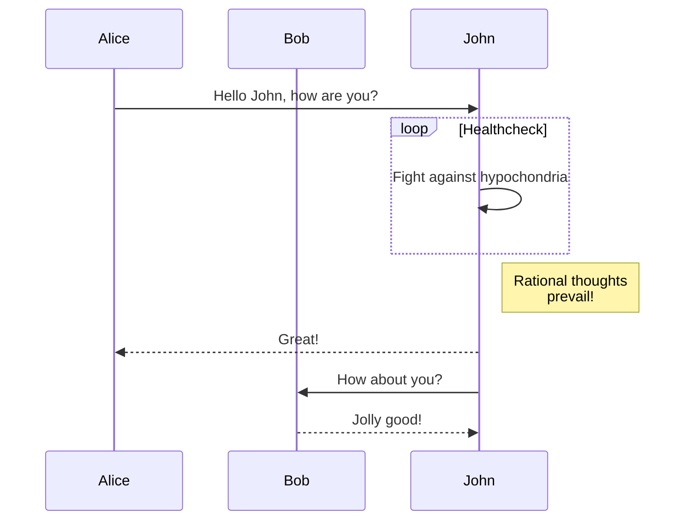
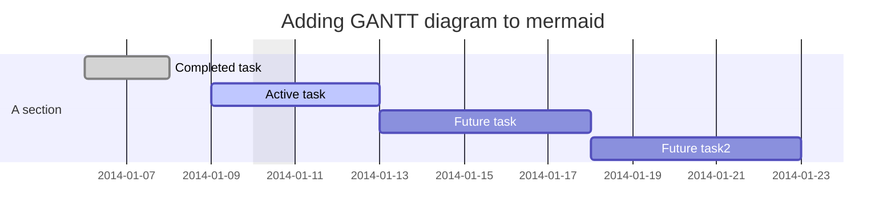
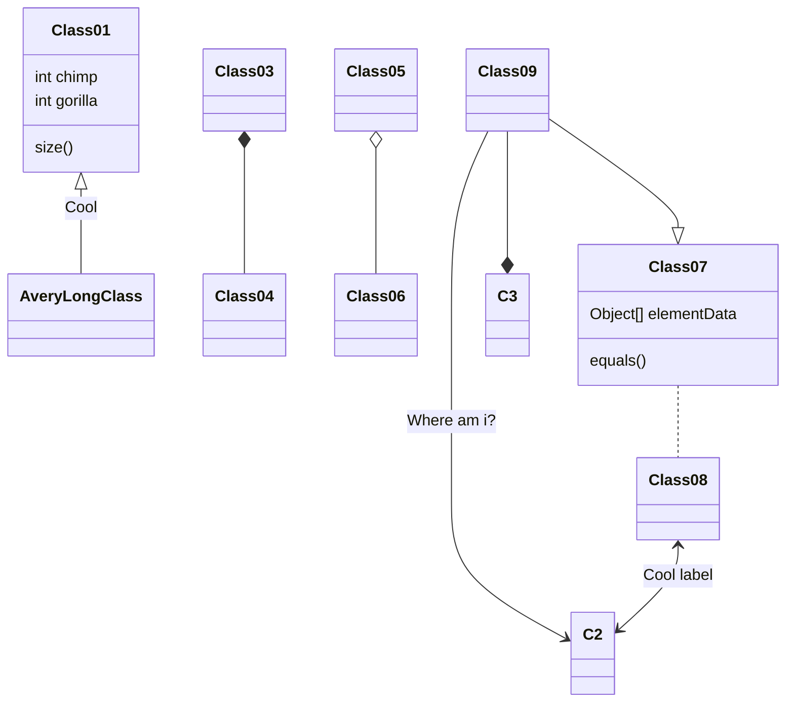
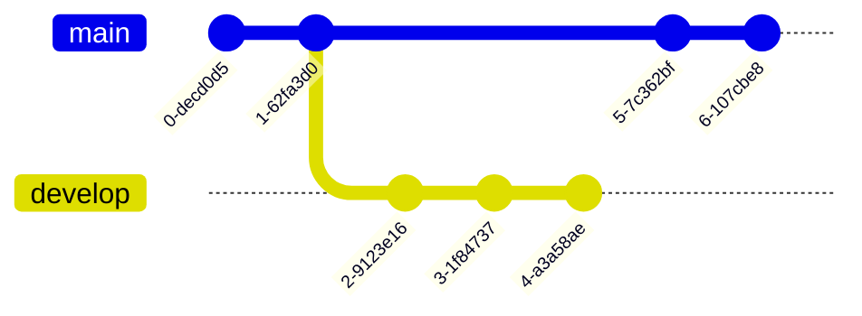
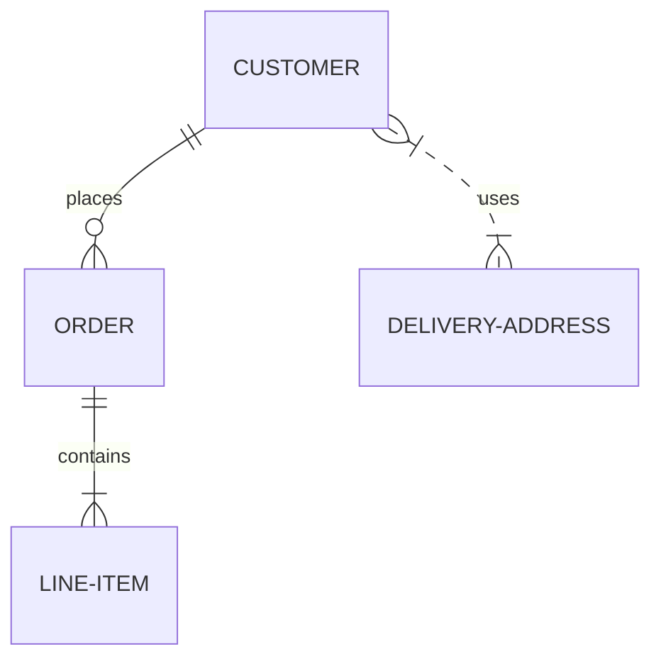
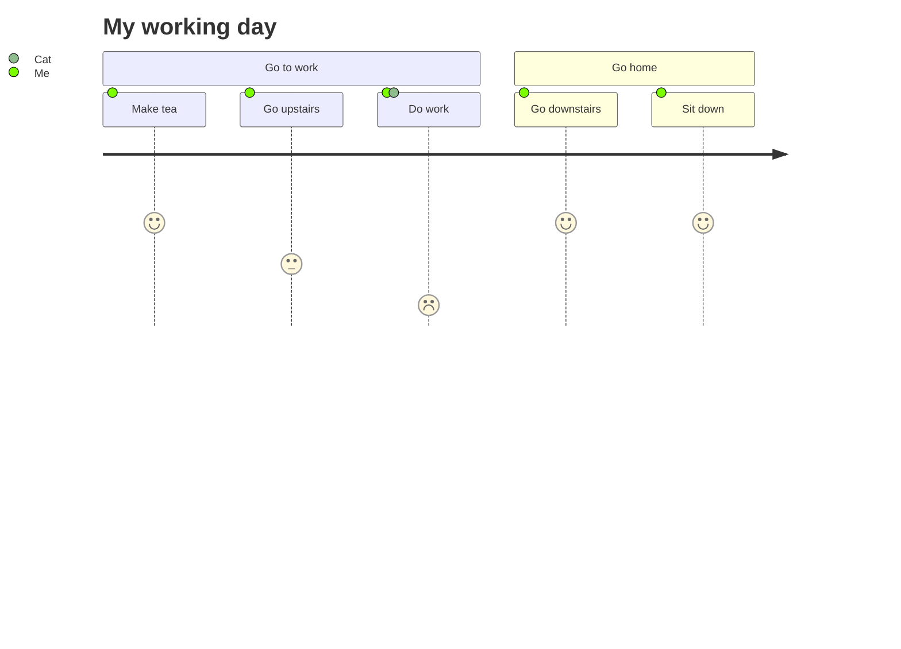
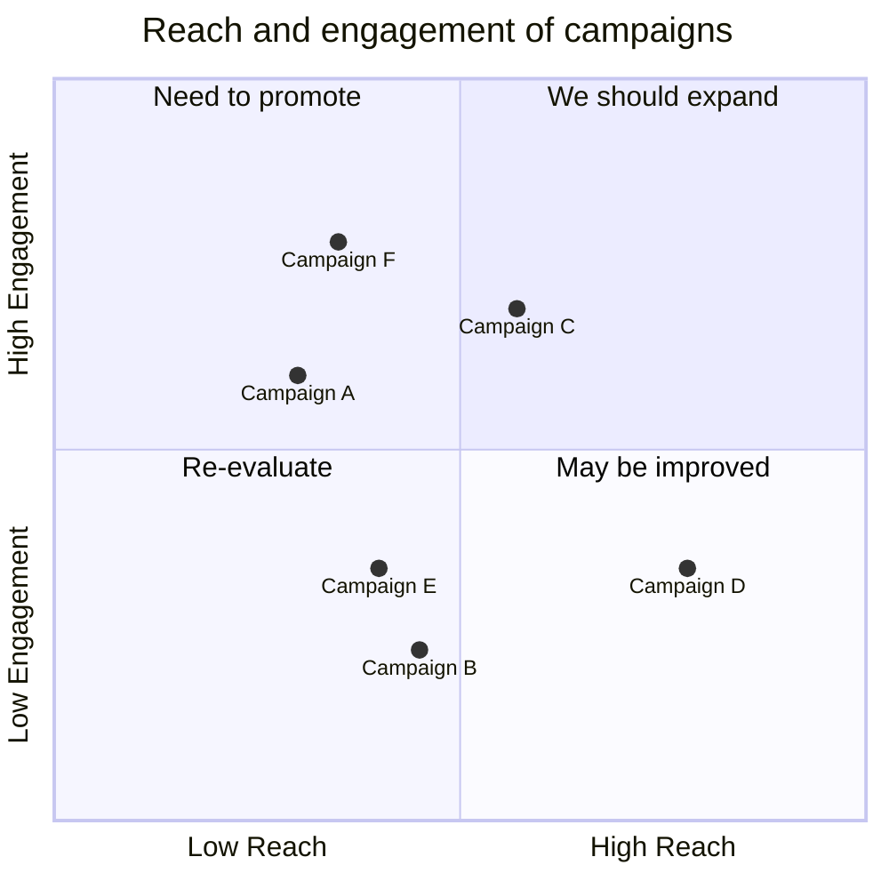
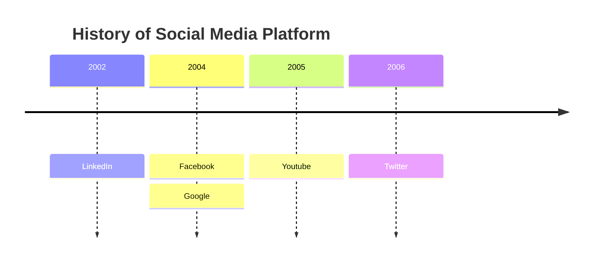
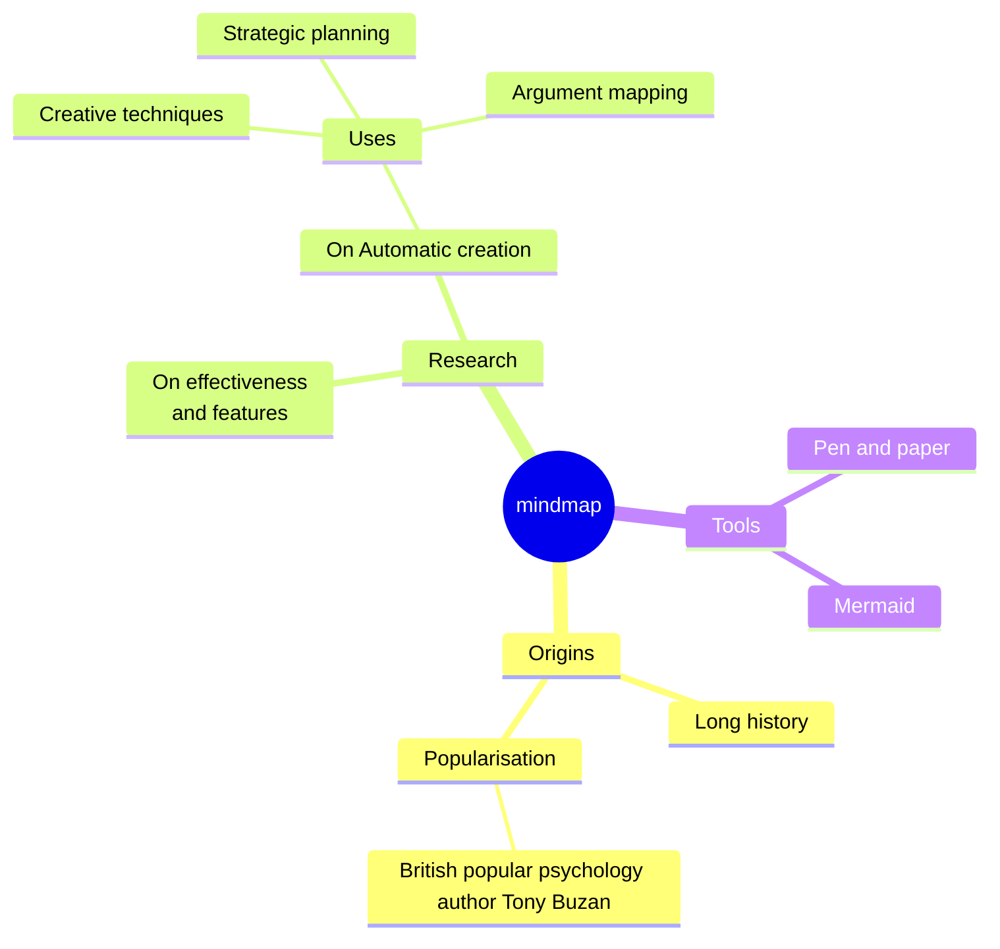

# Title 1

## Title 2

### Title 3

#### Title 4

# HTML Tests

## Common Tags

<h1> Title with HTML </h1>

<p>tag p</p>

<div>content in a simple div</div>

<div align="center">content in a div with align center</div>

## Iframe

<iframe
  width="560"
  height="315"
  src="https://www.youtube.com/embed/ms1iTZzAutY"
  title="YouTube video player"
  frameborder="0"
  allow="accelerometer; autoplay; clipboard-write; encrypted-media; gyroscope; picture-in-picture; fullscreen"
  allowfullscreen
></iframe>

## Image

### Width 100px


### Width 300px


### Width 560px


### Width 1000px


### Width 2000px


# Formating

normal
**negrito**
_itálico_
~~riscado~~

# Image

## Alt text


# Code

## Inline

`inline code`

&nbsp;

## Block

elixir (hightlight /x = Foo.bar 0/)

```elixir /x = Foo.bar 0/
defmodule Foo do
  def bar(x), when x == 0, do: x+1 end
  def bar(x) do
    x + 2
  end
end

x = Foo.bar 0
y = Foo.bar 1

^y = x + 1
```

sql

```sql
SELECT * FROM my_table;
```

bash

```bash
#!/bin/bash

var1=$1

if [ $var1 -gt 5 ]; do
  echo "Is greather than 5"
fi
```

python (hightlight \{1\-3\,5\})

```python {1-3,5}
def foo(x):
  return x + 1

def bar(y):
  return y + 1

x = foo(1)
y = bar(1)
```

python (hightlight \{1\-3\,5\} and line-numbers)

```python showLineNumbers {1-3,5}
def foo(x):
  return x + 1

def bar(y):
  return y + 1

x = foo(1)
y = bar(1)
```

Javascript

```javascript
function foo(x) {
  return x + 1
}

function bar(y) {
  return y + 1
}

const x = foo(1)
const y = bar(1)
```

Typescript (show line numbers)

```typescript showLineNumbers
function foo(x: number): number {
  return x + 1
}

const sum: (x: number) => number = foo
const y: number = sum(1)
```

Rust

```rust title="Simple Rust code with title"
fn factorial(i: u64) -> u64 {
  match i {
    0 => 1,
    n => n * factorial(n-1)
  }
}

fn main() {
  println!("Hello World");
}
```
_another_ Rust,_but with caption_

```rust caption="This is a caption with some note about the code"
fn factorial(i: u64) -> u64 {
  match i {
    0 => 1,
    n => n * factorial(n-1)
  }
}

fn main() {
  println!("Hello World");
}
```

Go Lang

```go
// ZeroBroadcast reports whether addr is 255.255.255.255.
func (addr ipv4addr) ZeroBroadcast() bool {
  return addr == 0xFFFFFFFF
}
```

Rust complete code features

```rust showLineNumbers title="src/main.rs" caption="the code above return the factorial of an given number" /factorial(n-1)/ {9}
fn factorial(i: u64) -> u64 {
  match i {
    0 => 1,
    n => n * factorial(n-1)
  }
}

fn main() {
  println!("Hello World");
}
```

Long Block Quote

```text
sdasdaskjdfhsdakjasjkfdfkjghsdfkjhdsgfdshgdshgfhjdsfghdsfgkhsdghjghsdgfhsadgfkhgsfkhgsfhgsajhfgajsfghasdgfsdasdaskjdfhsdakjasjkfdfkjghsdfkjhdsgfdshgdshgfhjdsfghdsfgkhsdghjghsdgfhsadgfkhgsfkhgsfhgsajhfgajsfghasdgfsdasdaskjdfhsdakjasjkfdfkjghsdfkjhdsgfdshgdshgfhjdsfghdsfgkhsdghjghsdgfhsadgfkhgsfkhgsfhgsajhfgajsfghasdgfsdasdaskjdfhsdakjasjkfdfkjghsdfkjhdsgfdshgdshgfhjdsfghdsfgkhsdghjghsdgfhsadgfkhgsfkhgsfhgsajhfgajsfghasdgfsdasdaskjdfhsdakjasjkfdfkjghsdfkjhdsgfdshgdshgfhjdsfghdsfgkhsdghjghsdgfhsadgfkhgsfkhgsfhgsajhfgajsfghasdgfsdasdaskjdfhsdakjasjkfdfkjghsdfkjhdsgfdshgdshgfhjdsfghdsfgkhsdghjghsdgfhsadgfkhgsfkhgsfhgsajhfgajsfghasdgfsdasdaskjdfhsdakjasjkfdfkjghsdfkjhdsgfdshgdshgfhjdsfghdsfgkhsdghjghsdgfhsadgfkhgsfkhgsfhgsajhfgajsfghasdgfsdasdaskjdfhsdakjasjkfdfkjghsdfkjhdsgfdshgdshgfhjdsfghdsfgkhsdghjghsdgfhsadgfkhgsfkhgsfhgsajhfgajsfghasdgfsdasdaskjdfhsdakjasjkfdfkjghsdfkjhdsgfdshgdshgfhjdsfghdsfgkhsdghjghsdgfhsadgfkhgsfkhgsfhgsajhfgajsfghasdgfsdasdaskjdfhsdakjasjkfdfkjghsdfkjhdsgfdshgdshgfhjdsfghdsfgkhsdghjghsdgfhsadgfkhgsfkhgsfhgsajhfgajsfghasdgfsdasdaskjdfhsdakjasjkfdfkjghsdfkjhdsgfdshgdshgfhjdsfghdsfgkhsdghjghsdgfhsadgfkhgsfkhgsfhgsajhfgajsfghasdgfsdasdaskjdfhsdakjasjkfdfkjghsdfkjhdsgfdshgdshgfhjdsfghdsfgkhsdghjghsdgfhsadgfkhgsfkhgsfhgsajhfgajsfghasdgfsdasdaskjdfhsdakjasjkfdfkjghsdfkjhdsgfdshgdshgfhjdsfghdsfgkhsdghjghsdgfhsadgfkhgsfkhgsfhgsajhfgajsfghasdgfsdasdaskjdfhsdakjasjkfdfkjghsdfkjhdsgfdshgdshgfhjdsfghdsfgkhsdghjghsdgfhsadgfkhgsfkhgsfhgsajhfgajsfghasdgfsdasdaskjdfhsdakjasjkfdfkjghsdfkjhdsgfdshgdshgfhjdsfghdsfgkhsdghjghsdgfhsadgfkhgsfkhgsfhgsajhfgajsfghasdgfsdasdaskjdfhsdakjasjkfdfkjghsdfkjhdsgfdshgdshgfhjdsfghdsfgkhsdghjghsdgfhsadgfkhgsfkhgsfhgsajhfgajsfghasdgf
sdasdaskjdfhsdakjasjkfdfkjghsdfkjhdsgfdshgdshgfhjdsfghdsfgkhsdghjghsdgfhsadgfkhgsfkhgsfhgsajhfgajsfghasdgfsdasdaskjdfhsdakjasjkfdfkjghsdfkjhdsgfdshgdshgfhjdsfghdsfgkhsdghjghsdgfhsadgfkhgsfkhgsfhgsajhfgajsfghasdgfsdasdaskjdfhsdakjasjkfdfkjghsdfkjhdsgfdshgdshgfhjdsfghdsfgkhsdghjghsdgfhsadgfkhgsfkhgsfhgsajhfgajsfghasdgfsdasdaskjdfhsdakjasjkfdfkjghsdfkjhdsgfdshgdshgfhjdsfghdsfgkhsdghjghsdgfhsadgfkhgsfkhgsfhgsajhfgajsfghasdgfsdasdaskjdfhsdakjasjkfdfkjghsdfkjhdsgfdshgdshgfhjdsfghdsfgkhsdghjghsdgfhsadgfkhgsfkhgsfhgsajhfgajsfghasdgfsdasdaskjdfhsdakjasjkfdfkjghsdfkjhdsgfdshgdshgfhjdsfghdsfgkhsdghjghsdgfhsadgfkhgsfkhgsfhgsajhfgajsfghasdgfsdasdaskjdfhsdakjasjkfdfkjghsdfkjhdsgfdshgdshgfhjdsfghdsfgkhsdghjghsdgfhsadgfkhgsfkhgsfhgsajhfgajsfghasdgfsdasdaskjdfhsdakjasjkfdfkjghsdfkjhdsgfdshgdshgfhjdsfghdsfgkhsdghjghsdgfhsadgfkhgsfkhgsfhgsajhfgajsfghasdgf
```

# Mermaid charts

## Flowchart


## Sequence diagram


## Gantt diagram


## Class diagram


## Git graph


## Entity Relationship Diagram - ❗ experimental


## User Journey Diagram


## Quadrant Chart


## Timeline


## Mindmap


# Tables

## Md

### Tipo 1

```markdown
| A   | B   | C   |
| --- | --- | --- |
| a1  | b1  | c1  |
| a2  | b1  | c2  |
```

| A   | B   | C   |
| --- | --- | --- |
| a1  | b1  | c1  |
| a2  | b1  | c2  |

### Tipo 2

```markdown
| A | B | C |
|---|---|---|
| a1 | b1 | c1 |
|---|---|---|
| a2 | b1 | c2 |
|---|---|---|
```

| A | B | C |
|---|---|---|
| a1 | b1 | c1 |
|---|---|---|
| a2 | b1 | c2 |
|---|---|---|

### Tipo 3

```markdown
| A   | B   | C   |
| --- | --- | --- |
| a1  | b1  | c1  |
| a2  | b1  | c2  |
```

| A   | B   | C   |
| --- | --- | --- |
| a1  | b1  | c1  |
| a2  | b1  | c2  |

### Tipo 4

```markdown
| foo | bar |
| :-- | :-: |
| baz | qux |
```

| foo | bar |
| :-- | :-: |
| baz | qux |

## Html

```html
<table>
  <tr>
    <th>Test 1</th>
    <th>Test 2</th>
  </tr>
  <tr>
    <td>Test 3</td>
    <td>Test 4</td>
  </tr>
  <tr>
    <td>Test 5</td>
    <td>Test 6</td>
  </tr>
</table>
```

<table>
  <tr>
    <th>Test 1</th>
    <th>Test 2</th>
  </tr>
  <tr>
    <td>Test 3</td>
    <td>Test 4</td>
  </tr>
  <tr>
    <td>Test 5</td>
    <td>Test 6</td>
  </tr>
</table>

# Tasks

- [x] task 1
- [x] task 2
- [ ] task 3
- [ ] task 4

# Lists

## Unordered

- item 1
- item 2
- item 3
- `item 4`
- `item 5`
- item 6
  - item 6.1
  - item 6.2
    - item 6.2.1
  - item 6.3
- item 7
- **Long item 8:** Ex elit id do ea do voluptate incididunt. Excepteur sit sit veniam in nulla Lorem sunt elit non proident nostrud qui do consectetur. Officia deserunt labore sit amet ad culpa velit magna. Cupidatat culpa pariatur incididunt minim aliquip exercitation officia incididunt mollit nostrud ad. Ea officia nisi laboris Lorem. Lorem incididunt culpa occaecat sint Lorem aliquip nisi.
- **Long item 9:** Ex elit id do ea do voluptate incididunt. Excepteur sit sit veniam in nulla Lorem sunt elit non proident nostrud qui do consectetur. Officia deserunt labore sit amet ad culpa velit magna. Cupidatat culpa pariatur incididunt minim aliquip exercitation officia incididunt mollit nostrud ad. Ea officia nisi laboris Lorem. Lorem incididunt culpa occaecat sint Lorem aliquip nisi.

## Ordered

1. Mateus
2. Felipe
3. Gonçalves
4. Laboris tempor magna nulla mollit esse mollit cillum commodo ad eu veniam ullamco irure. Nulla non ullamco minim minim eu ad et fugiat aliquip excepteur Lorem labore amet ex. Eu ea in ipsum ullamco dolor excepteur fugiat commodo esse. Ex ad velit do dolore excepteur officia irure. Nisi sunt consectetur minim occaecat culpa enim minim incididunt fugiat aliqua sint. Est ipsum ullamco veniam ut non cillum minim consequat aliquip mollit commodo mollit sunt. Ex velit laboris laboris excepteur irure culpa id Lorem sit occaecat laboris voluptate.
5. Laboris tempor magna nulla mollit esse mollit cillum commodo ad eu veniam ullamco irure. Nulla non ullamco minim minim eu ad et fugiat aliquip excepteur Lorem labore amet ex. Eu ea in ipsum ullamco dolor excepteur fugiat commodo esse. Ex ad velit do dolore excepteur officia irure. Nisi sunt consectetur minim occaecat culpa enim minim incididunt fugiat aliqua sint. Est ipsum ullamco veniam ut non cillum minim consequat aliquip mollit commodo mollit sunt. Ex velit laboris laboris excepteur irure culpa id Lorem sit occaecat laboris voluptate.
6. Laboris tempor magna nulla mollit esse mollit cillum commodo ad eu veniam ullamco irure. Nulla non ullamco minim minim eu ad et fugiat aliquip excepteur Lorem labore amet ex. Eu ea in ipsum ullamco dolor excepteur fugiat commodo esse. Ex ad velit do dolore excepteur officia irure. Nisi sunt consectetur minim occaecat culpa enim minim incididunt fugiat aliqua sint. Est ipsum ullamco veniam ut non cillum minim consequat aliquip mollit commodo mollit sunt. Ex velit laboris laboris excepteur irure culpa id Lorem sit occaecat laboris voluptate.

# Hints

!> This is a tip.
_A cheat for yout life_

?> This is a warning...
~Be careful.~

x> This is a error!!
Pay **attention**!

!> **LONG TIP** _Nisi est dolore magna laboris esse quis tempor laborum quis ipsum pariatur amet fugiat ipsum. Ad veniam qui enim nisi ut reprehenderit duis anim eu. Ex proident fugiat non duis consequat et officia et exercitation culpa reprehenderit eiusmod._

# Math

block

$$
f(x) = \int_{-\infty}^\infty
    f\hat\xi\,e^{2 \pi i \xi x}
    \,d\xi
$$

inline math: $ x+1 = 2 $

# Blockquot

> This is a blockquote

# Separation

---

foo

# Footnote

Sample footnote [^1], sample another footnote [^another]

[^1]: Just a footnote
[^another]: Just one more footnote

# Variables

## Text

[var]: This text was inside a variable

Text: [var]

## Image

[image]: https://external-content.duckduckgo.com/iu/?u=http%3A%2F%2Fwww.steves-digicams.com%2Fblog%2Fwp-content%2Fuploads%2F2017%2F10%2FNikon_D850_Sample_13.jpg&f=1&nofb=1

![image with sample image][image]

# Referencies

Google: [_google.com_](https://google.com)
