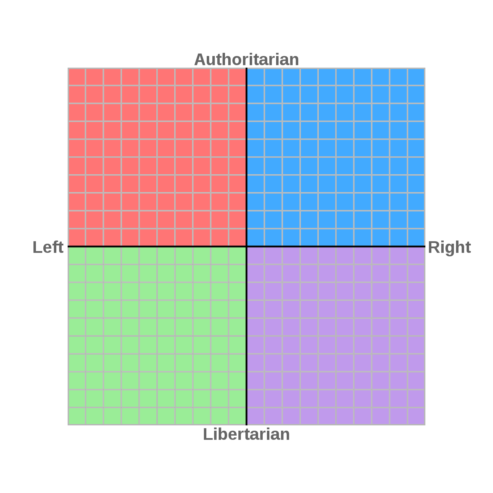

<Warn>
Essa é uma tradução da publicação original ["The Hacker Key Guide"](http://files.catwell.info/misc/mirror/hackerkey.html) de [Pierre 'catwell' Chapuis](https://catwell.info/).
</Warn>

# Sobre o Guia do Código Hacker

O Guia do Código Hacker foi inspirado no excelente [Código Geek](https://web.archive.org/web/20000511144513/http://www.geekcode.com/) (_Geek Code_) de Robert Hayden, que é um dos favoritos dos hackers há muito tempo. No entanto, o Código Geek não é atualizado há muito tempo e, embora a comercialização da Internet tenha eliminado grande parte do antigo ambiente hacker (MUDs, BBSes, DOS...), devemos tentar manter vivas as tradições hackers, por reimplementação, se necessário.

Vamos ver um exemplo de um bloco de Código Geek:

```plaintext
-----BEGIN GEEK CODE BLOCK-----
Version: 3.12
GCS d- s+: a- C++ US++++ P++ L+++ E--- W++ N+ o K- w--
O+ M+ V PS++ PE- Y PGP+ t+ 5 X R tv+ b+ DI+ D+
G++ e++ h--- r+++ y+
------END GEEK CODE BLOCK------
```

O Código Geek faz muitas coisas bem:

- É MUITO geek. Strings de texto curtas com delimitadores `+` ou `-` para mostrar posições relativas em um problema.
- É único. É muito fácil identificar o código geek e ele vem sendo adotado por outros grupos que buscam formas de se identificar, mostrando sua versatilidade.
- É muito simples determinar por quais coisas uma pessoa é apaixonada. No exemplo acima, uma rápida olhada mostra que a pessoa parece ser um geek casado, liberal e amante do Unix, que não liga muito para programas de TV.

No entanto, também existem alguns problemas com o GeekCode:
- Em primeiro lugar, há muito espaço desperdiçado. Embora seja muito fácil determinar se uma pessoa é mestre em algo com 5 sinais de mais, é um desperdício. O local principal (e mais lógico) para exibir o código geek é no arquivo de assinatura. Ainda hoje, a netiqueta ainda favorece arquivos de assinatura curtos, e o Código Geek médio tem 6 linhas sozinho. Os geeks tendem a seguir a netiqueta quando possível, então isso faz com que as próprias pessoas visadas pelo Código Geek não o promovam em suas assinaturas!
- O código foi projetado para se parecer com um bloco de chave PGP, mas inclui caracteres que não são válidos em uma chave PGP, em particular, o símbolo de menos `-` e parênteses `()` são muito comumente usados. Os caracteres válidos em uma chave PGP são [A-Za-z0-9], mais `+` e barra `/`. Também não há espaços em uma chave normal.
- Não é enigmático o suficiente ;) Isso é uma brincadeira, mas é quase MUITO fácil determinar rapidamente o Código Geek de uma pessoa, o que meio que tira a diversão do tipo anel decodificador secreto das coisas.
- O problema mencionado acima é que o Código Geek está desatualizado.

O Guia do Código Hacker espera manter os aspectos bons do Código Geek e melhorar alguns dos ruins.
Os objetivos de design do Guia do Código Hacker são:
1. Uma chave normal com algumas opções de categoria extras deve caber em uma linha de texto de 80 colunas. Idealmente, ele deve ter espaço suficiente para que o URL da chave do hacker caiba na mesma linha, para dar às pessoas uma chance de descobrir o que diabos é.
2. Certifique-se de que os símbolos mais comumente usados também sejam símbolos de chave PGP válidos. Para compatibilidade com o Código Geek, usaremos mais símbolos que não são válidos, mas garantiremos que os mais usados sejam.
3. Mantenha o Guia atualizado. Só posso prometer que manterei o guia atualizado ou o entregarei a alguém que o faça. O tempo dirá se conseguirei cumprir essa promessa.

# Formato de uma entrada de Código Hacker

Uma Código Hacker é construído da seguinte forma:

- A categoria em questão será listada em letras minúsculas (por exemplo, u é para Unix).
- O número correspondente à sua resposta à categoria (por exemplo, 7). Em vez de mais ou menos, é atribuída uma pontuação média de 5 para cada categoria. As respostas extremamente positivas são superiores a 5 (o máximo normal é 9), as respostas negativas são inferiores a 5 (o mínimo normal é 0).
- As opções opcionais de gaiola devem estar no final e em letras maiúsculas (por exemplo, SL para Solaris, Linux).
- Ao prosseguir para a próxima seção, não pule um espaço!

Então, para nosso exemplo, a categoria Unix seria preenchida como: u7SL

## Modificadores (variáveis)

As "variáveis" do Geek Code mais comumente usadas parecem ser "intervalos" (`@` e `()`) e "aspirante" (`>`). Para seguir o Objetivo de Design nº 2, as seguintes alterações foram feitas na Chave Hackey:
- `/` - Para indicar uma resposta de "intervalo", use a tecla barra (`/`) em sua resposta. Para a opção (`@`) de variação livre, use um `/` no final da sua resposta numérica, por exemplo. `u5/`. Para indicar um intervalo específico em sua resposta, use a barra entre suas duas respostas, por exemplo. você5/7.
- `+` - Para indicar sua classificação de "aspirante", use o símbolo de mais (`+`). Sim, parece estranho e (`>`) é um caractere mais intuitivo, mas não usar um caractere-chave PGP válido quando é um dos dois únicos caracteres não alfanuméricos disponíveis seria uma farsa. Por exemplo, se você gosta de Unix, mas gostaria de ser um guru, você usaria u5+8.

O restante dos símbolos são compatíveis com o Código Geek. Eles estão listados para compatibilidade com o Código Geek, embora sejam opcionais e sejam caracteres inválidos em uma chave PGP. Para completar, aqui estão eles:

- `$` - Para indicar que você ganha a vida com um certo tipo de hacking de atividade relacionada, adicione um `$` no final, ex.: `u9$`
- `?` - Afirma que não sabe nada sobre esta categoria. Se for esse o caso, por que você está criando um Código Hacker?
- `!` - Recusa veemente em participar da categoria. Isso normalmente deveria ser feito com um 0 para uma categoria, então realmente não deveria ser usado. Para ser consistente com o Código Geek, se você decidir usar este caractere, coloque-o SOMENTE no início de uma categoria e obviamente não insira um valor numérico.

# O guia em sí

`v` - Versão - Inclua a versão atual como a primeira entrada em sua chave de hacker.

A versão atual do Hacker Key é v4.

## Parte I – Que tipo de hacker você é?

`sw` - **Hacking de software** (_Software Hacking_)

**9** – Sou Bill Joy, Eric Raymond ou JWZ.
**8** – Sou um uberhacker; Eu escrevi meu shell/depurador/editor/compilador em 30 linhas de código. Outras pessoas usam e amam meus hacks.
**7** – Viva para Hackear, Hackeie para Viver!
**6** – Não há nada melhor do que um hack elegante.
**5** – Em média, fiz alguns hacks de software no meu dia.
**4** – Já hackeei código uma ou duas vezes, software não é minha praia.
**3** – Eu não hackeio software de jeito nenhum. Sou um programador estruturado!
**2** – Não sou nem programador e muito menos hacker!
**1** – Sou gerente e/ou trabalho na IBM.

Indique sua linguagem de hacking preferida

- `C` C(++)
- `P` Perl
- `Y` Python
- `U` Unix Shell
- `B` (Visual) Basic
- `J` Java
- `A` Ada
- `S` Assembler
- `L` Lisp
- `G` Prolog
- `M` Esquema
- `F` Fortran
- `H` PHP
- `R` Rubi

`hw` - **Hacking de hardware** (_Hardware Hacking_)

**9** – Eu sou Steve Wozniak.
**8** – Tenho meu próprio gravador de eeprom no porão. Eu não vou usar o que não foi feito por mim mesmo.
**7** – Meus projetos de hardware foram usados em produtos reais.
**6** – Já brinquei com alguns desenhos de hardware, mas nunca fiz meu próprio hardware. Conheço o hardware do PC como a palma da minha mão.
**5** – Construí todos os PCs da minha casa do zero. Newegg me conhece por meu primeiro nome.
**4** – Eu construí um ou dois PCs na minha época. É apenas mais fácil prepará–los.
**3** – As pessoas me perguntam o que significa USB, eu sei algumas coisas sobre hardware.
**2** – Sei montar meu computador sem diagrama.
**1** – Cara! Você tem um Dell!

`ln` - **Hacking de linguagem** (_Language Hacking_)

**9** – Eu sou J.R.R. Tolkien.
**8** – Minha linguagem de estimação foi usada e estudada por outras pessoas.
**7** – Pessoas que não me conhecem usaram palavras que criei. eu escrevi minha própria linguagem artificial.
**6** – Sou conhecido por certas palavras ou frases, meus amigos usam minhas criações linguísticas regularmente.
**5** – Criei uma frase ou inventei uma ou duas palavras novas.
**4** – Sou um nazista gramatical; as pessoas odeiam falar comigo porque eu as corrijo no meio da frase.
**3** – Odeio pessoas que não seguem as regras básicas do $LANG, que eu me esforcei para falar corretamente.
**2** – Sou analfabeto e/ou só falo IM: l8r sk8r!
**1** – Sou editor do Slashdot.

`pr` - **Programação** _Ei, alguns hackers pensam que são programadores_ ;-)

**9** – Só programo em ADA, e ADORO!
**8** – Atualmente estou programando um link de conectividade célebro–IDE.
**7** – Eu programo bastante, e passo muito tempo no meu IDE de escolha.
**6** – Definitivamente sou um programador, não um hacker. Eu gosto do básio, um editor de texto e um compilador/depurador.
**5** – Sou um programador comum, prefiro pensar que sou um hacker.
**4** – Sacrificarei o design elegante pelo desempenho ou tamanho.
**3** – Comentários são para maricas! Se foi difícil escrever, deveria ser difícil de ler.
**2** – Posso escrever olá mundo, mas meus programas não fazem tanto assim.
**1** – Não consigo programar de jeito nenhum.

Indique sua metodologia de programação

- `O` Orientado a Objetos
- `S` Estruturado
- `A` Orientado a Aspectos
- `U` Unificado
- `R` Racional Unificado
- `P` Processual
- `F` Funcional

`ck` - **Cracking** _O ato malicioso de invadir sistemas que obtém todos os destaques; o que pessoas não técnicas consideram "hacking"._

**9** – Trabalho para @Stake ou escrevo por 2600.
**8** – Eu escrevo os "_sploits_" que todas as crianças usam. eu seria um _black–hat_ profissional, exceto para esta economia.
**7** – Black Hat – Cracking é coisa antiga para mim. Eu só comprometo um sistema se parece um desafio. _Script Kiddies_ me adoram.
**6** – Gray Hat – Algumas dos meus _cracks_ são para o bem, outras são para o mal. Isto realmente depende de quem se beneficia com o que eu faço.
**5** – Tento invadir sistemas ocasionalmente. É para fins de educação, é isso!
**4** – White Hat – Eu estudo exploits porque sou eu quem tem que corrigir os sistemas quando eles são liberados. Eu assino o CERT.
**3** – Já tentei uma ou duas vezes, mas achei errado. Eu fico com o warez.
**2** – Nunca tento invadir um computador, isso é contra a lei!
**1** – Mal sei quebrar um ovo!

`ma` - **Matemática** _A matemática ocupa grande parte da computação, e portanto, o hacking. Indique o seu mais alto grau de Matématica._

**9** – Cálculo/Teoria Avançada
**8** – Equações Diferenciais
**7** – Cálculo II
**6** – Probabilidade/Estatísticas
**5** – Álgebra Linear
**4** – Cálculo I
**3** – Terminei o HS Math e percebi que isso era o suficiente para mim
**2** – Ainda no ensino médio e indo muito bem.
**1** – Fico irritado com os números. Há muitos deles e outras coisas.

## Parte II – Guerra de S.O.!

`u` - **Unix**

**9** – Eu sou Ken Thompson.
**8** – Eu sou um guru. Todo mundo me pede ajuda com suas máquinas Unix. Unix é mais que um sistema operacional, é minha religião!
**7** – Utilizo exclusivamente Unix em todos os meus computadores. Se não é Unix, é uma merda!
**6** – Gosto muito de Unix; Eu instalei o Linux uma ou duas vezes, mas principalmente uso Windows ou MacOS para minhas necessidades diárias.
**5** – Unix está bem, é apenas uma ferramenta como qualquer outra.
**4** – O Mac OS X é o mais próximo do Unix que eu gostaria de chegar.
**3** – Não gosto de Unix, é muito enigmático, e que porcaria de _shell_ é essa! A GUI é muito superior!
**2** – Unix é uma abominação. É um daqueles sistemas operacionais mortos que não percebe ainda que está morto.
**1** – Eu sou Bill Gates.

Insira seus sistemas operacionais *nix mais (menos) favoritos:

- `L` Linux
- `I` Irix
- `A` AIX
- `S` (Open) Solaris
- `F` FreeBSD
- `N` NetBSD
- `O` OpenBSD
- `B` Outro BSD
- `H` HP-UX
- `M` MacOS X
- `T` Tru64

`w` - **Windows**

**9** – Eu trabalho para a Microsoft, eles me chamam de _code monkey_... bem, apenas _monkey_.
**8** – Eu instalo todas as versões beta da versão mais recente do Windows que consigo sair da rede. Eu quero trabalhar na Microsoft.
**7** – Desenvolvi meus próprios programas para Windows, VB e .NET me pertencem.
**6** – Gosto muito do Windows; Eu tenho meu tema de área de trabalho e protetor de tela do jeitinho que eu gosto.
**5** – O Windows está OK, estou bastante indiferente a isso.
**4** – Quando é que vão parar de roubar ideias alheias e surgir com algo INOVADOR? Eu ainda o executo, o que mais há?
**3** – Eu mantenho o Windows no meu disco rígido apenas para testar o novo hardware que compro. Regras do Linux!
**2** – Aniquilei totalmente o Windows do meu disco sem olhar para trás!
**1** – Na verdade, nunca usei o Windows, estou completamente imaculado!

- `D` MS-DOS/Windows 3.x
- `N` Windows NT
- `T` Windows 2000
- `W` Windows 95/98/Me
- `C` Windows CE/Mobile
- `X` Windows XP
- `U` Windows Server 2003
- `V` Vista

Modificadores especiais
- `G` Utilizo máquinas Windows mas apenas com Cygwin instalado

`m` - **MacOS (X)** _Vamos ser sinceros, minhas crianças, o OS 9 está morto._

**9** – Eu sou Steve Jobs.
**8** – Já escrevi livros sobre programação com Cocoa e Carbon. Vejo você na WWDC!
**7** – Adoro! O poder do Unix e uma GUI aqua elegante são o auge da computação. Eu escrevi um ou dois aplicativos ocasionais.
**6** – Gosto do novo MacOS. Finalmente estabilidade E facilidade de uso!
**5** – MacOS X está bem. Um bom front-end GUI para um sistema operacional Unix.
**4** – Não gosto disso. Não há ênfase suficiente na CLI.
**3** – Eu odeio isso. A GUI ocupa metade da minha RAM e ainda trava pra mim, mesmo sendo baseada em UNIX!
**2** – Desprezo o MacOS X. Sinto falta do MacOS "Clássico" (\<= 9).
**1** – Desprezo o MacOS X. Sinto falta do Apple II.

`l` - **Linux** _O sistema operacional gratuito que mudou a computação. Para a turma do GNU/Software Livre, use `g/l` (GNU/Linux)._

**9** – Sou Linus Torvalds ou Alan Cox.
**8** – Sou um hacker/mantenedor de pacotes ativos do kernel. Se o Linux não existir, talvez eu tenha que sair de casa de vez em quando!
**7** – Sou um usuário avançado. Desenvolvi minha própria minidistribuição por capricho. Perdi a conta de quantos kernels compilei.
**6** – Gosto muito de Linux. Eu tentei algumas distribuições e estou quase decidindo por uma. _Windows sucks_.
**5** – Linux é ok.
**4** – Não gosto de Linux. Ainda depende muito da linha de comando.
**3** – Eu odeio Linux. Não é realmente UNIX, é uma cópia barata. Essa coisa toda de feridas abertas nunca vai funcionar!
**2** – Eu desprezo o Linux e seus apoiadores comunistas. Graças a Deus há um uma grande empresa como a Microsoft e um ótimo sistema operacional como o Windows!
**1** – Trabalho para a SCO

Inclua sua distribuição favorita. Como qualquer bom fanático sabe, só pode haver um!

- `A` Damn Small
- `D` Debian
- `E` (Open) SuSE
- `F` Fedora Core
- `G` Gentoo
- `I` (Lin|Free) spire
- `K` Knoppix (et al)
- `L` Linux From Scratch
- `M` Mandriva
- `P` Puppy
- `R` Red Hat
- `S` Slackware
- `U` Ubuntu (et al)
- `V` Vetor

`O` – outra distro de sua escolha! Existem mais distros do que letras, e eles vêm, vão e se fundem mais rápido do que posso atualizar. Então, aqui está a sintaxe para adicionar seu favorito:
Adicione o nome da sua distribuição imediatamente após o `O` e acrescente um caractere de barra (`/`), exemplo:
`lOgNewSense/` para os entusiastas do combo FSF-and-Ubuntu. O modificador `O` deve ser o ÚLTIMO listado para esta categoria para minimizar confusão.

`i` - **IDE/Editor de texto**

Como todos parecem ter seu próprio editor de texto favorito, os números mostrarão seu interesse em IDE/integração, bem como seu ambiente favorito.

**0** – cat
**1** – ed
**2** – vi (e seus clones)
**3** – jed
**4** – jove
**5** – pico/nano
**6** – emacs
**7** – CodeWarrior
**8** – Visual Studio
**9** – Xcode
**A** – Anjuta
**C** – Eclipse
**D** – Delphi
**E** – ee
**F** – (v)FTE
**G** – GNUstep
**H** – HTE
**I** – NEdit
**J** – jEdit
**L** – Idle
**N** – Notepad _~doente~_
**P** – Powerbuilder
**T** – Textpad
**O** – outro IDE de sua escolha! Sim, quase ficamos sem cartas para IDEs, então aqui está a sintaxe para adicionar seu editor ou IDE favorito:
Adicione seu programa imediatamente após o `O` e acrescente um caractere de barra (`/`), por exemplo: `iOBBEdit/` para os fãs do BBEdit por aí, ou `iOdd/` para aqueles verdadeiros durões do Unix (não). O modificador `O` deve ser o ÚLTIMO listado para esta categoria para minimizar confusão.

## Parte III – Vida e Estilo de Vida - seção "work friendly"

`e` - **Educação** _Indique o seu nível de escolaridade mais alto._

**9** – Sou onisciente, seu idiota insensível!
**8** – Doutorado
**7** – Mestrado
**6** – Bacharelado
**5** – Escola Comercial/Técnica/Associados
**4** – Alguma faculdade
**3** – Diploma de ensino médio
**2** – Atualmente cursando o ensino médio
**1** – Ensino fundamental/médio
**0** – Não precisamos de educação

`t` - **Televisão** _A maioria dos hackers não assiste muita TV (é hora de eles estarem hackeando!), mas para completar, ela está incluída._

**9** – Sou Max Headroom.
**8** – Faz tempo que desisti de outras coisas como trabalhar, conversar com outras pessoas e sair de casa. Tenho soro intravenoso e diálise, então não preciso me preocupar com funções corporais incômodas.
**7** – Assisto TV religiosamente. A televisão nunca está desligada na minha casa. Tenho um gerador para poder assistir TV mesmo quando há queda de energia!
**6** – Assisto muita TV. Eu tenho um TiVo só para poder assistir todos os programas das minhas séries favoritas!
**5** – Assisto TV algumas horas por dia e tenho alguns programas favoritos.
**4** – Assisto TV de vez em quando. Simplesmente não há mais muita coisa boa.
**3** – TV é um lixo. Prefiro ler um livro ou dar um passeio.
**2** – A TV é apenas a ferramenta de controle do (Diabo | Governo | Grandes Empresas)! Jogue fora sua TV!
**1** – Eu sou Amish

Série de TV Hackers:

- `T` Star Trek
- `N` TNG
- `D` DS9
- `V` Voyager
- `E` Enterprise
- `B` Babylon 5
- `S` Stargate SG1/Atlantis
- `H` Xena/Hércules
- `L` LEXXX
- `F` Farscape
- `R` Red Dwarf
- `X` The X Files
- `M` Monty Python
- `A` Adult Swim
- `G` Battlestar Galactica
- `W` Doctor Who

`b` - Livros (_Books_) _Muita variedade aqui, já que alguns hackers são ávidos leitores, enquanto outros se limitam à web.

**9** – Sou obcecado por leitura. Na verdade, escrevo meus próprios contos/poesias, além de ler livros.
**8** – Sou uma espécie de leitor ávido, procuro ler um livro por semana/mês.
**7** – Leio livros reais, não apenas referências técnicas.
**6** – Pego o livro ímpar. Conheço bem as fronteiras locais.
**5** – Leio livros ocasionalmente. Você quer dizer além dos livros da O'Reilly? Ah, então não.
**4** – Não leio livros, a web é um meio de leitura suficiente para mim.
**3** – Não leio um livro desde a faculdade.
**2** – Não leio um livro desde o ensino médio.
**1** – Sou analfabeto (Ver ln1).

Livros e autores favoritos dos hackers:

- `A` Isaac Asimov
- `D` O Novo Dicionário do Hacker
- `G` William Gibson
- `H` Guia do Mochileiro
- `I` Trilogia Illuminatus
- `L` C. S. Lewis
- `K` Philip K. Dick
- `M` Páginas de Manual/Texto informativo
- `O` Livros técnicos O'rielly
- `P` Série Harry Potter
- `R` _Request for Comments_ (RFCs)
- `S` Neil Stephenson
- `T` J.R.R. Tolkien

`en` - **Criptografia** _O único obstáculo real entre seus dados e um cracker, ou não?_

**9** – Tenho meu próprio algoritmo de criptografia com meu nome.
**8** – Posso decifrar a Enigma na minha cabeça.
**7** – Eu uso GnuPG para todos os emails e tenho muitos sistemas de arquivos criptográficos no meu disco rígido. Se você quiser meus dados, terá que conquistá-los!
**6** – Utilizo criptografia com frequência. Quer assinar minha chave?
**5** – Gosto e uso criptografia.
**4** – Não uso criptografia. Não tenho nada a esconder.
**3** – A criptografia é uma sobrecarga desnecessária. Se você usá-lo, deve ter algo a esconder!
**2** – Somente terroristas usam criptografia. O governo deveria ter _back doors_ para todos os mecanismos de criptografia.
**1** – Somente o governo deveria poder usar criptografia para poder manter seus segredos seguros!

`g` - **Jogos** _Seja console ou PC, os videogames são populares entre alguns hackers._

**9** – Eu sou John Carmack.
**8** – Desenvolvi o jogo ocasional. As pessoas me consideram um guru dos jogos. As pessoas se desconectam dos servidores quando me veem fazer logon.
**7** – Brinco o tempo todo, quando não estou hackeando, comendo ou dormindo.
**6** – Jogo com frequência, tenho um ou dois consoles e/ou alguns jogos para PC.
**5** – Vou pegar um jogo ocasional.
**4** – Eu costumava jogar videogame na época dos 8 bits, mas não mais.
**3** – Não gosto de videogame, nessa hora eu poderia estar hackeando.
**2** – Não gosto de videogame, nessa hora eu poderia estar dormindo.
**1** – Sou péssimo em videogame.

Gênero:

- `R` RPG Gráfico
- `A` Ação/Aventura
- `S` Esportes
- `Z` Puzzle
- `T` Baseado em texto/MUD
- `O` Tiro
- `V` Jogos multijogador massivo (_como você encontra tempo para hackear??_)
- `G` Estratégia em tempo real

Console:

- `C` Sistemas "clássicos" (_ou seja, mortos_) - Nintendo [S]NES, Sega
- `M` Sistemas modernos (PS2/3, XBOX (360), GameCube/Wii).
- `H` Portáteis (Gameboy/PSP)
- `P` PC Gamer

## Parte IV – Vida e Estilo de Vida - seção "work unfriendly"
Sim, pessoas que trabalham em megacorporações malignas foram punidas por terem essas seções em seus Códigos Hacker, então moveremos esta seção para o final. Observe que TODAS as seções são OPCIONAIS, mas esta em particular você pode querer deixar de fora.

`a` - **Idade**

**[0-9][0-9]** – Idade real
**[0-9]X** – Só tenho vontade de atualizar minha idade uma vez por década!
**F** – 100+ (Velho Peido)
**Eu** – Imortal
**N** – N/A ou Não é da sua conta

`s` - **Sexo** _Se não tivéssemos, de onde viriam os bebês?_

**9** – Meu nome é Jenna Jameson.
**8** – Sou um (a) ninfomaníaco (a). Se não faço sexo a cada 6 horas fico totalmente irritado.
**7** – Já fiz mais do que a minha cota de sexo. Eu sou um garanhão!
**6** – Já fiz sexo mais do que algumas vezes. Ainda estamos no cenário do namoro, então não vamos entrar em números.
**5** – Já fiz sexo. Próximo assunto.
**4** – Não fiz sexo, não que não tenha tido oportunidade mas estou me salvando.
**3** – Ainda nem passei da segunda base. Assim que meu rosto melhorar, vou pegar alguns!
**2** – Sexo é sujo! Guarde para alguém que você ama!
**1** – Sou membro do clero. Nada para mim, obrigado.

**0** – Sou um eunuco.
**$** – Sou uma prostituta.

- `M` Masculino
- `G` Gay/Lésbica
- `S` Solteiro
- `T` Travesti
- `F` Feminino
- `B` Bissexual
- `R` Casada
- `D` BDSM
- `W` Swinger
- `I` Envolvido (namoro)

`r` - **Religião** _Geralmente os hackers acreditam em alguma coisa, mesmo que seja apenas em seu sistema operacional favorito. Outros têm uma opinião real sobre um Poder Superior_

**9** – Eu sou Deus, seu tolo mortal!
**8** – Panteísta – O Universo É Deus.
**7** – Pagão/Wiccano – Eu adoro mais a natureza do que uma divindade.
**6** – Politeísta – Acredito em múltiplos Deuses.
**5** – Monothiest – Só existe um Deus.
**4** – Teísta – Deus existe e interage com o mundo e com Seus seguidores.
**3** – Deísta – Deus existe, mas não intervém no mundo.
**2** – Agnóstico – Inseguro da existência de Deus.
**1** – Ateu – Deus não existe.

`p` - **Política**

Para a versão 4, use as classificações do Political Compass (www.politicalcompass.org). Basta listar seu nível econômico "Esquerda/Direita" e o nível social "Libertário/Autoritário" com uma barra entre elas, ou arredonde para cima/para baixo para o número inteiro mais próximo para economizar espaço (preferencial). Sim, o símbolo (`-`) não é PGP válido, mas pelo menos a categoria agora é um tanto útil.



Se você listar apenas um número nesta categoria, será consideradoa a classificação Social Libertário/Autoritário, já que as questões sociais tendem a ser mais importantes para os hackers.

Exemplo (ambas as categorias): `p-4,20/-5,10` ou (preferencialmente) `p-4/-5`
Exemplo (somente social): `p6.10` ou (preferencialmente) `p6`

# Exibindo seu Código Hacker

Devido ao seu design, o Código Hacker deve caber discretamente em seu arquivo de assinatura. Como o Guia do Código Hacker não é muito conhecido, se você puder incluir uma referência ao site, isso ajudará a divulgar o Guia. Aqui está um exemplo da versão 4 do Código Hacker:

```plaintext caption="Meu Código Hacker, em 11/03/2024."
v4sw5Uhw6ln5pr7FOck5ma4u7Lw3Vm5l6OManjaro/i2OVscode/e6t5b7ATen6g5RASOCMPaNr2p1/-9 hackerkey.com
```

# Quem é responsável pelo Código Hacker?

O crédito deve ficar com você, _Chris Allegretta_ \<[chrisa@asty.org](mailto:chrisa@asty.org)>. Inspiração adicional, sugestões e feedback foram dados por _Murray Schwalbaum_, \<[loser@e0f.org](mailto:loser@e0f.org)>. Obrigado também a _Charles Mason_, _Jim Ault_, _Eric Tucker_ e _Jason Burks_ pelas sugestões para a **versão 0**.

Para a **versão 2**, gostaria de agradecer: _Daniel Keep_, _Luke-Jr_, _Tony Lainson_ e _Cody Hatch_ pela revisão da seção Política.

Para a **versão 3**, gostaria de agradecer a _Jon Spriggs_, _Stephen E. Mynhier_, _Kyle Goetz_, _Neil Williams_, _Roie Marianer_, _Eric Davis_ e _Joey Harrison_ pelas sugestões de categoria ou organização.

Para a **versão 4**, gostaria de agradecer a _Scott A Gallaher_ (`w`), _Thomas Jollans_ (`ma` e `e`), _Jon Wickes_ (`g`), _Matej Cizek_ e _Fabio Emilio Costa_ (`b`), _Sandy Knight_ por `O` em (`l`) e (`i`), e especialmente a _Carlos Alberto Pinto Peixoto Bastos Santos_ pelas diversas sugestões para (`l`) e por me indicar o site do Political Compass para (`p`).

# Feedback - Por favor!
O Guia ainda é bem jovem e estou muito interessado em ouvir a opinião de vocês sobre o que você gosta, o que não gosta e acha que o Guia precisa ou não. Por favor, não sugira mudanças radicais na própria estrutura do código, pois esta é a única área com a qual me sinto bastante confortável. Envie suas idéias para [chrisa@asty.org](mailto:chrisa@asty.org).

# Licença
> Direitos autorais **(c) 2003-2006 Chris Allegretta**
> É concedida permissão para copiar, distribuir e/ou modificar este documento sob os termos da GNU Free Documentation License, Versão 1.2 ou qualquer versão posterior publicada pela Free Software Foundation; sem seções invariantes, sem textos de capa e sem textos de contracapa. Uma cópia da licença está incluída na seção intitulada "GNU Free Documentation License".

# Histórico

- `v0` - Lançado em **29.11.2003** - lançamento RFC
- `v1` - Lançado em **08.02.2004** - Adicionadas seções de Programação e Matemática, adicionada categoria Swinger a Sexo, categorias de jogos renovadas
- `v2` - Lançado em **17.04.2005** - Divida a seção III em 'amigável ao trabalho' e 'hostil ao trabalho'. Reescreveu a categoria política por ser muito centrada na política dos EUA.
- `v3` - Lançado em **22.02.2006** - Adicionado: PHP e Ruby para `sw`, Dr Who e Battlestar Galactica para `t`, Idle e Anjuta para `i`, Envolvido para `s`, Windows Server 2003 e Vista para `w`. Alterado: duplicar `S` para atiradores para `O` em `g`.
- `v4` - Lançado em **29.12.2006** - Adicionado: Cygwin para `w`, MMO e RTS para `g`, muitas novas entradas para `b`. Alterado: `m` e `e` retrabalhados para os hackers ainda na escola secundária, `l` completamente renovado (várias letras de distro alteradas e adicionadas) e adicionadas (`O`) outras categorias especificadas pelo usuário a `l` e `i`, descartadas categorias `p` em favor das classificações do site Polical Compass.
