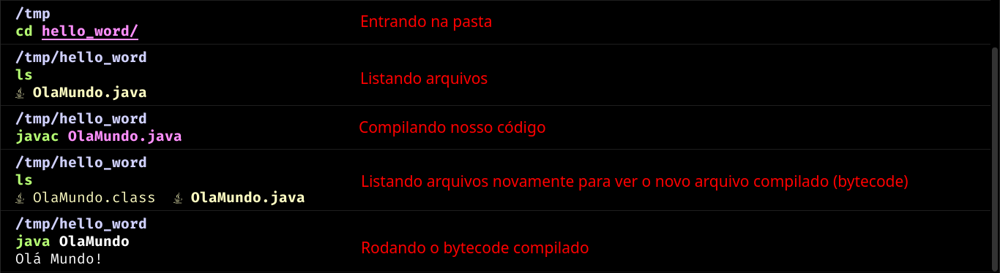

# Introdução

Esse artigo é um resumo feito no intuito de servir como fixação dos conteúdos da matéria de **Programação Orientada à Objetos**, no curso de [**Gestão da T.I - FAPAM**](https://www.fapam.edu.br/graduacao/project/gestao-de-t-i/) 2º Período.

_Aulas ministradas pelo professor [**Daniel Oliveira Capanema**](https://www.linkedin.com/in/danielcapanema/)._

Os conceitos de POO serão abordados utilizando a linguagem de programação [**Java**](https://www.java.com/pt-BR/).

<Tip>
Esse artigo assume que você já tenha domínio em lógica de programação.
</Tip>

# O que é POO?

**POO** (**Programação Orientada a Objetos**) é um paradigma de programação que utiliza objetos para representar entidades do mundo real. Um "objeto" refere-se aqui a qualquer coisa que possua características e comportamentos.

Por exemplo, um carro pode ser representado como um objeto, com atributos como cor, modelo, marca, etc. E métodos como acelerar, frear, etc.

Na programação, em especial Java, um objeto é uma instância de uma classe. Uma classe é um modelo que define as características e comportamentos de um objeto.

Mais à frente vamos conectar esses conceitos com a linguagem Java.

# O que é Java?

**Java** é uma linguagem de programação de alto nível, orientada a objetos e multiplataforma. Foi criada pela **Sun Microsystems** em 1995 e é uma das linguagens mais populares do mundo.

Java é uma linguagem compilada e interpretada. Isso significa que o código fonte é compilado para um código intermediário chamado **bytecode**. Esse bytecode é interpretado pela **Java Virtual Machine (JVM)**, que é responsável por executar o código em qualquer sistema operacional.

A grande vantagem de Java é a portabilidade. Uma vez que o bytecode é interpretado pela JVM, o mesmo código pode ser executado em qualquer sistema operacional que possua uma JVM. Isso é o que chamamos de "write once, run anywhere".

## Onde o Java é utilizado?

Java é uma linguagem muito versátil e é utilizada em diversas áreas, como: desenvolvimento web, desktop, mobile, jogos, sistemas embarcados, entre outros.

Além disso, Java era a linguagem oficial para desenvolvimento de aplicativos Android, até a chegada do **Kotlin**, conhecida como um Java melhorado. Linguagem essa que não é o foco desse artigo.

Confira [esse blog post](https://blogs.oracle.com/javamagazine/post/the-top-25-greatest-java-apps-ever-written) da Oracle com os 25 maiores aplicativos já escritos em Java.

# Instalação do Java

<Warn>
Não vou mostrar o passo a passo da instalação do Java em cada ambiente, pois o mesmo pode mudar com o tempo. Mas vou dar referẽncias de onde você pode encontrar essas informações em canais oficiais do desenvolvimento Java. Exercite sua capacidade de pesquisa {';)'}
</Warn>

Para começar a programar em Java, você precisa instalar o **JDK** (**Java Development Kit**). O JDK é um conjunto de ferramentas que permite desenvolver aplicações em Java.

Acesse o site da [Oracle](https://www.oracle.com/java/technologies/downloads) e faça o download da versão mais recente do JDK. Siga as instruções de instalação para o seu sistema operacional.

Após a instalação, você pode verificar se o Java foi instalado corretamente abrindo o terminal e digitando:

```bash
java -version
```

Se tudo estiver correto, você verá a versão do Java instalada.

# Hello World em Java

Vamos criar o famoso "Olá Mundo!" em Java para testar se a instalação foi feita corretamente.

Abra um editor de texto (qualquer um) e digite o seguinte código:

```java
public class OlaMundo {
    public static void main(String[] args) {
        System.out.println("Olá Mundo!");
    }
}
```

Agora salve o arquivo com o nome `OlaMundo.java`.

**USUÁRIOS WINDOWS**: Se você estiver usando um editor de texto simples, como o Bloco de Notas, salve o arquivo com a extensão `.java` e mude a opção "**Salvar como tipo**" para "**Todos os arquivos**".

Abra o terminal e navegue até o diretório onde você salvou o arquivo `OlaMundo.java` (Pelo terminal).

<Tip>
Caso você ainda não tenha domínio sobre navegação de diretórios no terminal, recomendo que estude sobre isso, pois terá dificuldades para proseguir no munda da programação e T.I em geral sem esse conhecimento.
<br />
Comandos básicos Bash (**Linux**): https://phbols.medium.com/quais-s%C3%A3o-os-comandos-b%C3%A1sicos-do-bash-24d27e7a03db
Comandos básicos PowerShell (**Windows**): https://www.devmedia.com.br/solucoes-com-o-windows-powershell-revista-infra-magazine-6/24818
</Tip>

Compile o arquivo Java digitando o seguinte comando:

```bash
javac OlaMundo.java
```

Se não houver erros, um arquivo chamado `OlaMundo.class` será gerado no mesmo diretório.

Agora execute o arquivo compilado com o seguinte comando:

```bash
java OlaMundo
```

Se tudo estiver correto, você verá a mensagem "Olá Mundo!" impressa no terminal.



Note que na hora de rodar o comando `java OlaMundo{:bash}`, não é necessário colocar a extensão `.class`, isso porque o Java já sabe que o arquivo a ser executado é um arquivo `.class`.

# Estrutura de um código Java

O Java é uma linguagem fortemente tipada, ou seja, você precisa declarar o tipo de dado de cada variável. Além disso, o Java é uma linguagem orientada a objetos, então tudo em Java é um objeto.

Para criarmos uma classe no Java, usamos a palavra-chave `class`, seguida do nome da classe. Por convençao nome de classes seguem o padrão [**CamelCase**](https://pt.wikipedia.org/wiki/CamelCase), mas não é uma regra.

```java /class PrimeiroPrograma/
public class PrimeiroPrograma {
    // Corpo da classe
}
```

Se criarmos a classe `PrimeiroPrograma` em um arquivo `.java`, o nome do arquivo deve ser igual ao nome da classe. Sendo assim o arquivo que escrevermos a classe `PrimeiroPrograma` deve se chamar `PrimeiroPrograma.java`. Isso é uma **regra obrigatória** do Java.

Para iniciarmos o nosso programa, precisamos de um método `main`. Esse método é o ponto de entrada do programa e é onde a execução começa.

```java /main/
public class PrimeiroPrograma {
    public static void main(String[] args) {
        // Corpo do método
    }
}
```

O método `main` recebe um argumento do tipo `String[]{:java}`, que é um array de strings. Esse argumento é uma lista de argumentos que podem ser passados para o programa na hora da execução.

Dentro do método `main`, é onde escrevemos o código que queremos executar, é o primeiro método a ser executado, e é nele que vamos chamar todo o resto do programa. Sendo assim, todo programa Java **precisa ter um método `main`**.


