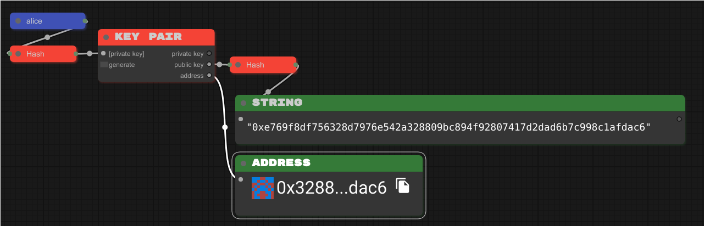
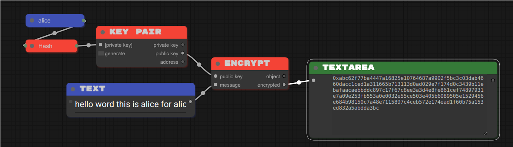
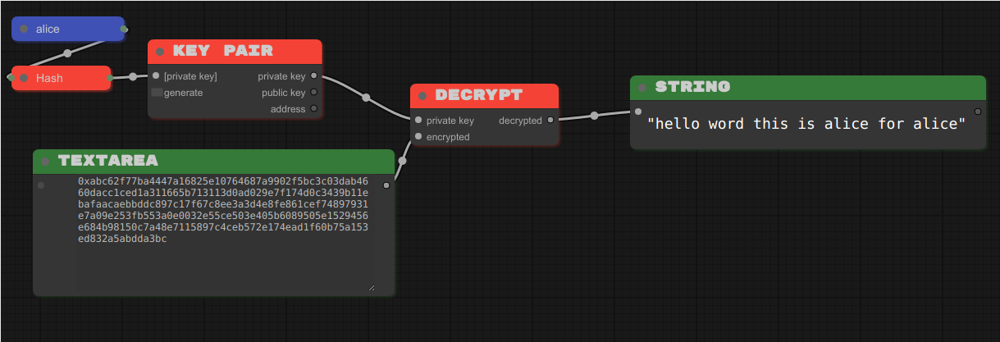
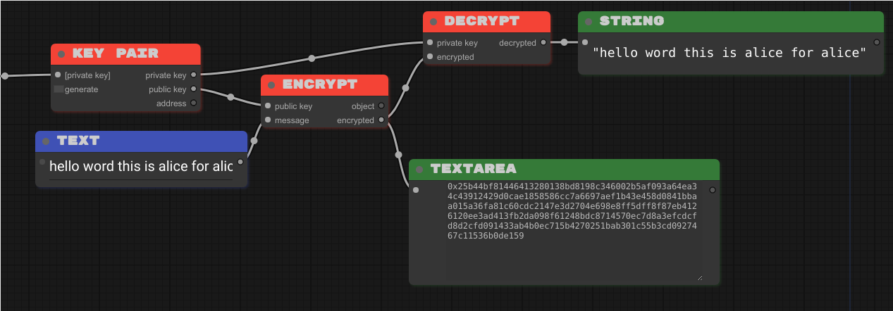
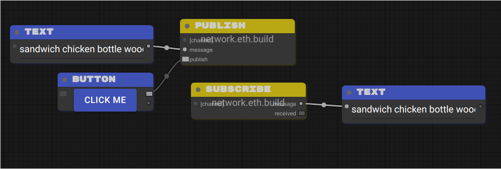
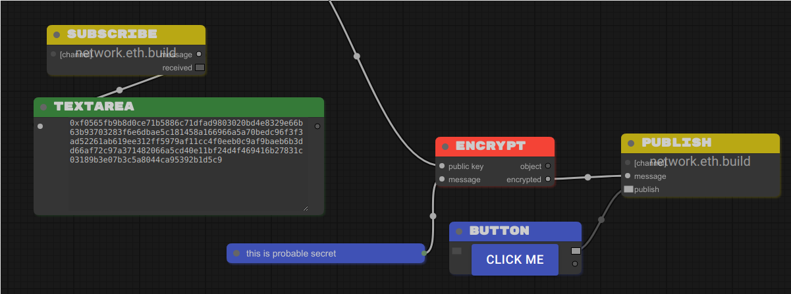

{/* VARIABLED BLOCK */}

[workflow 5]: https://sandbox.eth.build/wofCrGxhc3Rfbm9kZV9pZMONAXHEgcSDxIVsaW5rxIvEjQFQwqXEh8SJc8KWworCosSMxI5pwqR0eXBlwqpJbnB1dC9UZXh0wqNwb3PCkijDjMKWwqRzaXplwpLEjiwywqVmxIJnc8KBwqljb2zEgnBzZWTDg8Klb3LEiXIAwqRtxIhlAMKmxJXErnRzwpHCg8KkbmFtZcKgxKbEqMWgwqTElMSWw4DCp2_Er8WkxabFqMWqxazFrsSnxKnCpsSEcsSVZ8KlxbNrxabEjknCqnByb8SpcnRpZXPChMKrYmxvY2vGk1PFgGUywqtwxIJjZWjFj8Wawq9lbnRlciDGrcS0IGjGrmXCpcaSdGxlwqTEssS0wqV2YWx1xrbHgWnGpcShxKMBaMWvxKnCq0NyxKh0by9IxINoxLbEuMS6w4zDksS-xp_CkngexYfFicWLxY3Fj8WRxZPFlcWXxZnGrgHFncWfxaHFo8SvxbrFqcWrxrbHsXTHjGXCrcaCxoQsbnVtYsauxbLElWvGisW2xbjHssWnx7TFrMKkaMeWx7nGgXTGg27GhcaHxokBS8aMxo7GkMaSxpTCgMeIxJlrx7nCr8ePx5HHk0tleSBQYWlyx5jEucOMw4jDjMK0x53FgcKCwqEww4pDU8KZwprCoTFCx6JhxYrCgMeqxZoCx67EicewxK3HssKSxbvHtcKtW8aNaceAxq0ga8iqXciRx7zIlciExJbEjkvJkcWswqhnxqvGrmHGrce5w7_JoGvFtcW3dMW5wpPJpGXGosaDyZdlyZnIqsmdyJPGhMaGyIVzw4DJtcaMdcaYx4bJu3nJvciUyJbKgcKRxI5OybXCp2FkZHLGlHPKi8m_yJfKjwFMyJvGj8auyJ5zyKDEosSZb8e5x47HkHDHkseUx5bIscWDAcK4w4zDpsi3xYLHoMmExYrFjMWOxZBhxZLFlMWWxZjFmgPJi8WgxaLJjsWlyIvFvMe2y4jHuce7yb7Ilce-yIDIgnLJrsqQyIjJssiKybXIjsiQxb9lyJLKjMqAxJbImE_KoMidxpPKpMihxI5wy45EaXPGo2F5L1fJqmPHl8S3xLnEjsOCxYTKtsWDAzE8yrnKpMmIxq4Fy4XJjcW5wpHChMiMxa3HucWcxofEjk_GhmHIgmzCoMuYzIrMjMuLxb7FsADLosaIw4DMlMyWwqDLpsqiy6jCgca3aca5xrbLtXTLt8KJyqbEjmzIpMuuy7DEgsuzQcqVypdzc8qwy7vEjsKay77EjlTEm8WIyYXMhMuCxq4EzIjLh8yKybXMncSpzJDIhcSOyp_GjcqhxpHLqMKDxpfGmcabxp3Gn8ahy7HGpcanbMWawqDMqsyswqfMusqWypjMoHPClcKWxorEpADEjmgAy4_KjMuSyIHGrs2xyJnNtc20AWvFocmeZ829TMSOawLMswAAzb1OzogBxI5vzbfOhM26y5TNvU_Oks6AcM6MwqZnxo51xZLCkMKmxY5uZmlnwoDCp3bGrsS_b27Diz_DmcKZzrTOtMKa
[workflow 6]: https://sandbox.eth.build/wofCrGxhc3Rfbm9kZV9pZMONAXrEgcSDxIVsaW5rxIvEjQFYwqXEh8SJc8KWworCosSMxI5pwqR0eXBlwqpJbnB1dC9UZXh0wqNwb3PCknLDjMKewqRzaXplwpLEjiwywqVmxIJnc8KBwqljb2zEgnBzZWTDg8Klb3LEiXIAwqRtxIhlAMKmxJXErnRzwpHCg8KkbmFtZcKgxKbEqMWgwqTElMSWw4DCp2_Er8WkxabFqMWqxazFrsSnxKnCpsSEcsSVZ8KlxbNrxabEjknCqnByb8SpcnRpZXPChMKrYmxvY2vGk1PFgGUywqtwxIJjZWjFj8Wawq9lbnRlciDGrcS0IGjGrmXCpcaSdGxlwqTEssS0wqV2YWx1xrbHgWnGpcShxKMBaMWvxKnCq0NyxKh0by9IxINoxLbEuMS6w4zDmsS-xp_CkngexYfFicWLxY3Fj8WRxZPFlcWXxZnGrgLFncWfxaHFo8SvxbrFqcWrxrbHsXTHjGXCrcaCxoQsbnVtYsauxbLElWvGisW2xbjHssWnx7TFrMKkaMeWx7nGgXTGg27GhcaHxokBS8aMxo7GkMaSxpTCgMeIxJlrx7nCr8ePx5HHk0tleSBQYWlyx5jEucSOGMOMwrrHncWBwoLCoTDDikNTwpnCmsKhMULHomHFisKAx6rFmgPHrsSJx7DErceywpLFu8e1wq1bxo1px4DGrSBryKpdyJHHvMiVyITElsSOS8mRxazCqGfGq8auYcatx7nDv8mga8W1xbd0xbnCk8mkZcaixoPJl2XJmciqyZ3Ik8aExobIhXPDgMm1xox1xpjHhsm7ecm9yJTIlsqBwpHEjljJtcKnYWRkcsaUc8qLyb_Il8KQyJvGj8auyJ5zyKDEosSZeMe5wq7IpnDHki9FbmPHkMqqyLHFgwImxI4EyLfFgsOMwrQtyYTJhsmIxq7Kt8WeyYzFosmOxaXJkMiMxKrErsqHY8qJyprJn8aHypDKksWsc3PJhca7xb9lyJLKjMmuxI5WyIjJssmPybXCpm9iamVjx7jLmMujy6XLp3TKgMSWyoLJtcKpxqvKr8eRxZTLjsqNy7DKjwFXyp7IncaTyqLIocSOyorLmMSry4XEscSzxLXEt8S5w4zDksSOQMq4xYMBxYXKvcqiyr9yAcmLxaDLhMW5yIvFvMWtx7nFnMaHybDIicWlzJ7HtcW-xbDLmsqbyo7Lncu-yqDMgMaWxpjGmsacZcaexYHGocajYcalxqdsxqnGq8atxq_GsXTGs8a1xrdpxrnGu8a9y67HgMeCZcOZIsa0xZBvIHfFmGTGsGhpcyDNmyDHhcalIGbFmM2fxJTHh8qkxI56x7nCsETNm8y6ecyIxLRBypdhyrLDjQMMxI4OzJHEjsK4w4zClcyVxYzFjsWQYcWSxZTDgsyXBcyayY3Mncm1zKnGgMmeZ8ucy7zLn86Ny4jOj8uZzpHLr8aIw4DMr8aRzIDCgc2HzYnCqM2LzbNlYc6bc8KVwpbGisSkAMSOaADHu8m-yJXHvsiAyIJyzqzImc6wzq8Ba8WhzpHOulbMg869eAHMq8iVzrpXxI7Phs2pz4DOtGfOuljEjmsBz4zPj8qMwqZnxo51xZLCkMKmxY5uZmlnwoDCp3bGrsS_b27Diz_DmcKZz7DPsMKa
[workflow 7]: https://sandbox.eth.build/wofCrGxhc3Rfbm9kZV9pZMONAcKKxIHEg8SFbGlua8SLxI0BZsKlxIfEiXPClsKKwqLEjMSOacKkdHlwZcKqSW5wdXQvVGV4dMKjcG9zwpJCw4zCvMKkc2l6ZcKSxI4sMsKlZsSCZ3PCgcKpY29sxIJwc2Vkw4PCpW9yxIlyAMKkbcSIZQDCpsSVxK50c8KRwoPCpG5hbWXCoMSmxKjFoMKkxJTElsOAwqdvxK_FpMWmxajFqsWsxa7Ep8SpwqbEhHLElWfCpcWza8WmxI5Jwqpwcm_EqXJ0aWVzwoTCq2Jsb2NrxpNTxYBlMsKrcMSCY2VoxY_FmsKvZW50ZXIgxq3EtCBoxq5lwqXGknRsZcKkxLLEtMKldmFsdca2x4FpxqXEocSjAWjFr8SpwqtDcsSodG8vSMSDaMS2xLjEusOMw7jEvsafwpJ4HsWHxYnFi8WNxY_FkcWTxZXFl8WZxq4CxZ3Fn8WhxaPEr8W6xanFq8a2x7F0x4xlwq3GgsaELG51bWLGrsWyxJVrxorFtsW4x7LFp8e0xazCpGjHlse5xoF0xoNuxoXGh8aJAUvGjMaOxpDGksaUwoDHiMSZa8e5wq_Hj8eRx5NLZXkgUGFpcseYxLnDjMOow4zDmMedxYHCgsKhMMOKQ1PCmcKawqExQseiYcWKwoDHqsWaA8euxInHsMStx7LCksW7x7XCrVvGjWnHgMatIGvIql3Ikce8yJXIhMSWxI5LyZHFrMKoZ8arxq5hxq3HucO_yaBrxbXFt3TFucKTyaRlxqLGg8mXZcmZyKrJnciTxoTGhsiFyJhkybXGjHXGmMeGybt5yb3IlMiWyoHCkMm1wqdhZGRyxpRzyovJv8iXwpDIm8aPxq7InnPIoMSixJnCice5wq7IpnDHki9EZWPHkMqoyLHFgwIoxI4OyLfFgsOMwrQtyYTJhsmIxq4EyYvFoMWiyY7FpcmQyIzJtsmVybnKicqYyZ_Gh8SOyoPLhsKpxqvKrceRxZTLi2fJrsSOZciIybLIism1wqnEicuTyqjLlcW_ZcKmb2Jqyqx0yoDElsiYZsqcyJ3Gk8qgyKHEjnrHucKwRGlzxqNhecSxxLN0QcqVYcqwXMSOXsq2xYMBwrjDjMKVyrvHpMWOxZBhxZLFlMOCyr1yAcuAyY3FuciLxbzFrcuWya7JsMiJxaXMnce1xb7FsMiSyozLrMaIwpHLmcuwyp7LssKBxrdpxrllwqjGvcyBzIPLtMSPx7nCrcu5y7vEgsu-V8mqY8eXxLfEucONAzTEjsq_xL_FgcyKwrE8zI_Jh8WYxZoFzJrLgsycwoTLhsynxKnFnMuNxJrGhmHIgmzCoMubzZrNnMe5AMyrc8OAzaLNpMKgzK_GkcyxzLPMtcKlzYN0zYXNrMKVwpbGisSkAMSOaADHu8m-yJXHvsiAyIJyzb3Imc6BzoABa8WhyZ5nzovIos6OwonOkc6FzpPLmcu1zpYBzKnGhM6LZsSOzpfEjsKKAMWhZ8aOdcWSwpDCpsWObmZpZ8KAwqd2xq7Ev29uw4s_w5nCmc6-zr7Cmg
[workflow 8]: https://sandbox.eth.build/wofCrGxhc3Rfbm9kZV9pZMONAcKQxIHEg8SFbGlua8SLxI0BbcKlxIfEiXPCmMKKwqLEjMSOaMKkdHlwZcKrQ3LEqHRvL0jEg2jCo3Bvc8KSw6TDjMO5wqRzaXplwpJ4HsKlZsSCZ3PCgcKpY29sxIJwc2Vkw4PCpW9yxIlyAsKkbcSIZQDCpsSVcHV0c8KRwoPCpG5hbWXCpcWhxaPEpsSoZcKtxIRyxJVnLG51bWJlcsKkxJTElsSOScKnb8WjxaLFpMWmxajFqmXCpGjEs8WwxKnCpsW0xbbCpcaAa8WlxI5Lwqpwcm_EqXJ0aWVzwoDEocSjAWnGkGXCqkluxocvVGV4dMS1xLfCksOiw4zCvsS9xL_FgcSOLDLFhcWHxYnFi8WNxY_FkcWTxZXFl8W9AMWbxZ3Fn8WuxojFp8WpxavCoMaqx4zGlsOAxoTGhsWjxaXHksaLx5XEp8aRxpNuZ8aVxJXGl8KRxoLGm8adxp_GocajwoTCq2Jsb2NrxqJTxrwywqtwxIJjZWjFjcWYwq9lbnTFvSDIhsazIGjFvcWsxqF0bMaMxrHGs8KldmFsdcWsyJdpx77GpsSZwo3Gqsasxq7Fo8awxrLGtMS2xLjDjMOSxI5UxrvFgMKSxr7HgMWGYcWIwoDHicWYAceNxInHj8ijx5HGiseUx5bFv8enx5nGhXTGh8edyL9lx6DFscaSdMW1x6THpsSWxpgBaMerxp7Fvceuc8ewx7LHtMe2Zce4xYDHuse8Yce-yIBsyILIhMiGcsiIyKbIi8iNwqXIj8iRwqTIk3TIlciXyJnDmSLIjMWObyB3xZZkyIhoaXMgyoQgyJvHviBmxZbKiMSUyJ3EosSZwozGqsKuxKzErsSwRW5jxK1wyKfGtsONAhLEjgTIrsWBw4zCtC3Hgci0xqTIt8W9yqTFnMi7xaDIvcS4x57Fq8abdceyyJwga2V5xqrJjcmPZ8mCxoHGqMq1ZcKnxatzc8i0xozHoWXLgMW2y4NrxKTHmsmGx5zCksuGwqZvYmplY3TKv8uby53Ln8mRxpfDgMuGwqnIhMqbxK7Fksq_x6PHpcaWxLjEjmrEjmvJlsetxqLGpMiexI7Cj8aqwrBEyoTJo3nIpcazQXJlYca1y7ICw6TEjnzKpciwAcK4w4zClcqqyLXKrXIFyLrFnsqyyYfGiceTyYrLrsmOy5HGlsuzy5XMnsuGyYvHosyjyZDLscOAy7fJmMu5woHJsGnIkGXCqMm0zIbMiMu7AWvGqsKvypbKncSwS8q9IFBhaXLMisKSw4zDqMOMw5jKpcKCwqEww4pDU8KZwprCoTFCzJbKrMqAxb0DzJvIvMmHy5jJicKtW8acaciWyIbKu8q9Xcyiy4HLksaZy4bCqGfIhMW9YciGxqrDv8uSyYTHm8WkwpPLhse7xbXNq2XNrcq-y47LkMytx6fJk2zLhsq3yrljzofNsMaUy7HHqcuFyYnCp2FkZMyHy4rOlM6LyZLCkMywxqDLucalypHEjsKOypTNgcSvL0TLnsqcyp7Mi8O4w4zCqsyQyqfKqcizzJfNn3IGzaLMncuXzoLNqc6FzpPOicuvzbIBzo7JicupyprOscutz4bMrMuCzKXMvcynx5zMn8aLwqnEicuryp3Pj8mMy6LLnsm1zpbEjm3OpMmZzqfGp8KQxqrCrcyAc8yCL1fNuWPEtMioyLADw5TOtcyQxI7CsTzNnci2zrwHzr_HkMWlwoTJicyqxZ7PiMSbxILFvGzCoM-VxojQhMyg0IYAy6Vzw4DGlWHQi8Kgz6XMssy0zLbCpc-wdM-y0JTCmMKWxoLEjmkAxKQAxbPPkcW4xbrFvHLQpQFL0KrLtcWfy6_QsmjEjsKN0KkBwowBzopn0LJpy7UBxI7CjNC3z5HQssu00L7RhgHCj9GJy4HQssuT0Y3OqdGA0LjEjmzQts6p0ZHFttCybdGcxI7CkADFn2fGnXXFkMKQwqbFjG5maWfCgMKndsW9xL5vbsOLP8OZwpnRu9G7wpo
[workflow 9]: https://sandbox.eth.build/wofCrGxhc3Rfbm9kZV9pZMONAcKZxIHEg8SFbGlua8SLxI0BdcKlxIfEiXPCmsKKwqLEjMSOaMKkdHlwZcKrQ3LEqHRvL0jEg2jCo3Bvc8KSLcORw79awqRzaXplwpJ4HsKlZsSCZ3PCgcKpY29sxIJwc2Vkw4PCpW9yxIlyBMKkbcSIZQDCpsSVcHV0c8KRwoPCpG5hbWXCpcWixaTEpsSoZcKtxIRyxJVnLG51bWJlcsKkxJTElsSOScKnb8WkxaPFpcWnxanFq2XCpGjEs8WxxKnCpsW1xbfCpcaBa8WmxI5Lwqpwcm_EqXJ0aWVzwoDEocSjAWnGkWXCqkluxogvVGV4dMS1xLfCkivEux_EvsWAxYLEjiwyxYbFiMWKxYzFjsWQxZLFlMWWxZjFvgDFnMWexaDFr8aJxajFqsWswqDGq8eNxpfDgMaFxofFpMWmx5PGjMeWxKfGksaUbmfGlsSVxpjCkcaDxpzGnsagxqLGpMKEwqtibG9ja8ajU8a9MsKrcMSCY2VoxY7FmcKvZW50xb4gyIfGtCBoxb7FrcaidGzGjcayxrTCpXZhbHXFrciYace_xqfEmcKSxqvGrcavxaTGscazxrXEtsS4ccSOB8a8xYHCksa_x4HFh2HFicKAx4rFmQHHjsSJx5DIpMeSxovHlceXxoDHqMeaxoZ0xojHnsi_ZcehxbLGk3TFtselx6fElsaZAW7HrMafxb7Hr3PHscezx7XHt2XHucWBx7vHvWHHv8iBbMiDyIXIh3LIicinyIzIjsKlyJDIksKkyJR0yJbImMiawr9zYW5kd8idaCBjaMida8iFIGJvdMiRZSB3b8qPypDIn8SOwpPGq8Ksxq7GsELFpMSvbsa2xLjDjMOVxI5ryK7FgsOMw4jIsseDxYvFjcWPYcWRxZPDgsi3xb4CyLrFn8WhyL3JiMeUyYrGq8O_yYLElsmEx5zFpcKSx5_JgMeiZcO_yZHHqcSOcMuCyrnLhMKuxbrFvMW-LMqIxY5lybvLh3PDgMmWx67Go3PCg8m2yJllwqhjxJTHtiDFrMmwacqLwqbKmcqKb27CpcWNdciGCMqSAcqiy4TCr8SsxK7EsEtleSBQYWlyyp3CksqfxLs9yqPCgsKhMMOKQ1PCmcKawqExQseCyLTGpcqwcsitxZ3Iu8q1yYfLgcmJwq1bxp1pyJfIhyDKhXldxqvJjcmPZ8q8a8aay4vCqGfIhcW-YciHyrrMsMq-yYbHncKTy4vHvMW2zKbKjMypzKzHpMemxpfJk2zLi8acdcezyJ3MqMu-zYbJjsaVzYnCkMuLwqdhZGRyxqRzzZPMrsuXwpDLmsmYy5zGpsSixJnCjsarwq7LunDEry9EZWPErc2uzIXEjsOczIjKo8yGwrQtzJbItcyZCMqzyLzMn82AzKTNg82Rec2gxbfMsMSOzYvJicKpyIXNs8SuxZPOiselzLvHm8y9yL7KuMKpxInOks2uzpTLhMKmb2JqzbLJtc2Jx6oBbc2kxqHNpsu1wpXGq8KxTmV0yo5yay9TzY5zzbNpxb3NtgHDrcSOwoDMisyMw4zDsMyTLs2-zJjFl8WZA86CzJ7HncaKzptbyoLJu25lbMyrzqHNh86XyYXOhMmJwqfFrHPJusy1zpXNiMeoyZNyzLPNnce_zKXOoMWyy4bNls6syZnCgsKnz5Zuz5hswrHPmM61xZdrLs60aC5idWnJp8Knz73OtmvDmciMyorFkTovL9CKz7_QgXTQg9CF0IdkOjQ0Mzg2L8u1wpDGq8KtRGlzyaN5L1fMuMqCzbYCwrLEu0LNusSOwrE8z4vIts-Nxb4Jz5DHkcWmwoTJicmLxKnHmMeoxI5txpZhxb1swqDOmMmHwpHRgcq40YPFn8uXw4DRidGLwqDPtMucwoHLqMqLwqXQrXTKgsKJzajEjsKRxqvCr86zz77Oty9QzY7ElHPEtMipyLABw5bDjMO6z4Uwz4fMk8yVyLPNv9C7cgXQvsq2zL_Oj8-Vxo_Puc-Zz5vJjM-dx5nNmM-jz6XGjc-czZTOlsaXxI5uzZjFo82P0bDMutKVAXDRmsakz7bPuM-6z7zOtNCL0JbQmNCG0IjQlM630I1o0I9z0JHQk9Km0JXQgtCE0qrQm9Cd0J_Qocu1wpfIosqXyKXJtM22AyrEjsKG0LUBx4DQucyZBtKC0Y_Li9GT0YXGggFy0Y7PktOQz6fRldKgyZrHsse0x7bHuMe6x7zHvsiAyILFvsiEyIbIiMiKdMmuzZ3RncmyybTLn8iaw5kveyLEryI6IsqIYiIsImbGnm3TuCLInMe_070iyJfLoNO4NdO-xIdu1IY6MH3Ll8KXwpbGg8SOaQDEpADFtNKTxbjLj8W9ctSWAUvUm8qhxaDNh9SjbNSnxI7CjtSo1J7Uo23UrdSaAcKQAADUo27EjsKS1LTCkQHMrcW31KNwypPUvQLDv9SjcsSOwpXUtMKX1LfCpmfGnnXFkcKQwqbFjW5maWfCgMKndsW-xL_LrsOLP8OZwpnVpNWkwpo
[workflow 10]: https://sandbox.eth.build/wofCrGxhc3Rfbm9kZV9pZMONAcKlxIHEg8SFbGlua8SLxI0BwoLCpcSHxIlzwpvCisKixIzEjmjCpHR5cGXCq0NyxKh0by9IxINowqNwb3PCksOMwoPDjMKwwqRzaXplwpJ4HsKlZsSCZ3PCgcKpY29sxIJwc2Vkw4PCpW9yxIlyBMKkbcSIZQDCpsSVcHV0c8KRwoPCpG5hbWXCpcWixaTEpsSoZcKtxIRyxJVnLG51bWJlcsKkxJTElsSOScKnb8WkxaPFpcWnxanFq2XCpGjEs8WxxKnCpsW1xbfCpcaBa8WmxI5Lwqpwcm_EqXJ0aWVzwoDEocSjAWnGkWXCqkluxogvVGV4dMS1xLfEucKBdcS-xYDFgsSOLDLFhsWIxYrFjMWOxZDFksWUxZbFmMW-AMWcxZ7FoMWvxonFqMWqxazCoMarx4zGl8OAxoXGh8WkxabHksaMx5XEp8aSxpRuZ8aWxJXGmMKRxoPGnMaexqDGosakwoTCq2Jsb2NrxqNTxrwywqtwxIJjZWjFjsWZwq9lbnTFviDIhsa0IGjFvsWtxqJ0bMaNxrLGtMKldmFsdcWtyJdpx77Gp8SZwo7Gq8KuxKzErsSwRGVjxK1wxrXEtsS4w40CMsOMwpPGu8WBxLnCtC3HgWHFicKAx4nFmQfHjcSJx4_Gr8ecwpLHnsWsx7vFtsiWyIYga2V5xqvGk3TFtsekxoDHp8SObMmFZcKpyITIqMSuxZPJj8ejZ8mUxJbHmcaGdMaIx53Gi8WswqnEicmcyKrJnsehZcKmb2JqyKd0x6bElsaZAW3Hq8afxb7HrsalyJ7EjsegxbLCrMauxrBCxaTEr27GtsitAwPIrsa6xL_ItMOMw4jHgMWHyLnHg8WNxY9hxZHFk8OCyLzFvgHIv8WfxaHJgseRyallyoTEqcO_yaJryaTHm8WlyYTKqcqrZcO_ybjHqMSOe8mYyrXCrsW6xbzFvixib8WOZWFuyrhzw4DJvcetxqNzwoPIlciXyJnCqGPElMe1IMWswqXIj8iRwqbKiXTKi8KlxY11yIURyoIBa8arwq_Io8iqxLBLyY0gUGFpcsqNwpLEjivIscizZcKCwqEww4pDU8KZwprCoTFCyLjIusqhcgbKpMmByafKs8eTxbNbxp1pyYllyYvJjV3Jn8mRxbfKrsaayZjCqGfIhMW-YciGxqvKrceYx5rJpsecwpPJmMmHzJTMpMyWyYzJjsmwyZDJkselxpfJusmXyqnGnHXHssiczJfMs8WyzLXGlcy4x6kBf8mYwqdhZGRyxqRzzJrMtsuJwpDLjMm_y47CgMKJxKLEmcKey6lOZXR3xZdrL1DMvcSUc8S0yKzLtgQIxI7Dr8u6y7www4zDsMyEzIbKmMyIxZfFmQrMjMqmyafMrMqpwqlbY8aPbm5lbMyZzLTJoMquw4DNicWsc3PIucaNzorMm8mTxpfEjn7NicWjzL7NqMymzJ0Be82VxqHLjsKCwqfOg8uHzoZswrHOhs2gzaIuzZ9oLmJ1aWxkwqfOrM2hcmvDmciLy5_FkTovL865zq7OsM6yzrTOtjo0NDM4Ni_LpsKhyKHLq8SvL0Vuya3Iq8a3yK7DrsSOw7TLusi1yLfNt8alzIkIzbzHkMS4yZjMvMy-Y82AzZHMnM6XzYfOjs2PzpLPr86WyZUBfcypzI7JmMmyybTJtsmPybPJtWPJt8y4zo3OgMmbyKnIhmTPtsy3x6fJun7OosqAxqbNmsSOwp_Gq8atyqfGscazz5rIrQHCsciuwpbPoMa-ypfHgsWLypvHhsWTxZXNucW-As-nyqfJqMyQyrXHl8enyrDMqsqo0LLQjcuJzYZ90JLLjsewx7LHtMe2Zce4xYHHuse8Yce-yIDOtsW-yIPIhciHyIl0yIvIjcuaaciQyJLQnMuRyJhlwrh0aGlzINGgIMadybNhx7LMlsWSyKjNnyDLpsKlxqvCsETRoNGIedCbxrRBzY5hy7XDjMKMxI7CuNCjAcK4w4zClcyHz6TQrHIF0K_Jp8aK0LnOlMy2zp_Opcml0ovKvNC60IbQvsakwoHRldGXwqjIk3TRuMuGy6bCkMarwq3RsnPRtC9XzKTOg8u1w40DDMOM0KLKk8a90J880oXIu9KHCdKKx5zCkcKEyrTHls6fbcaW0afOh8Kgz7vSu9K90o3FsgDLicOA04LFvWzCoNKXxYrSmsiRwqXSqXTOg8umwqPGq8KxzZ7Orc67L1PMvXPIqGnFvdG7wqDEjkrNsMu9zbPMhC7ShdCnx4XKnceHyqDShwPSutC4xozOgc6nzoXOh86JzYLOi8yo0pLJg8-zzpDPtdKOzYTQj82GwoLMn82Ox77MlMmvxbLKt9KW0aXLjcakzqXTvc6pzqvNn866a86v0Z7Ph861zrfPhM67zr1ozr9zz4HPg9Sdz4XUoc6z1KPPis-Mz44vy4nCmcKWxoPEjmkAxKQAxbTOlcW4yr_FvXLUuAFL1L3EjmvFoMmg1YVs1YnUvAHCjtWL1YDVhW3EjtWSxI7CkAAA1YV7yoPVkMKeAsO_1YV90JbVkMKhAc2Dx6TVhX7EjtWoxI7CntWp1YzEjn_ViQHVrtWTzLbVhcKCxI7Co9WQwqXVucW3wqZnxp51xZHCkMKmxY1uZmlnwoDCp3bFvsS_b27Diz_DmcKZ1pnWmcKa
[workflow 11]: https://sandbox.eth.build/wofCrGxhc3Rfbm9kZV9pZMONAcKlxIHEg8SFbGlua8SLxI0BwoPCpcSHxIlzwpvCisKixIzEjmjCpHR5cGXCq0NyxKh0by9IxINowqNwb3PCksOMwoPDjMKwwqRzaXplwpJ4HsKlZsSCZ3PCgcKpY29sxIJwc2Vkw4PCpW9yxIlyBMKkbcSIZQDCpsSVcHV0c8KRwoPCpG5hbWXCpcWixaTEpsSoZcKtxIRyxJVnLG51bWJlcsKkxJTElsSOScKnb8WkxaPFpcWnxanFq2XCpGjEs8WxxKnCpsW1xbfCpcaBa8WmxI5Lwqpwcm_EqXJ0aWVzwoDEocSjAWnGkWXCqkluxogvVGV4dMS1xLfEucKBdcS-xYDFgsSOLDLFhsWIxYrFjMWOxZDFksWUxZbFmMW-AMWcxZ7FoMWvxonFqMWqxazCoMarx4zGl8OAxoXGh8WkxabHksaMx5XEp8aSxpRuZ8aWxJXGmMKRxoPGnMaexqDGosakwoTCq2Jsb2NrxqNTxrwywqtwxIJjZWjFjsWZwq9lbnTFviDIhsa0IGjFvsWtxqJ0bMaNxrLGtMKldmFsdcWtyJdpx77Gp8SZwo7Gq8KuxKzErsSwRGVjxK1wxrXEtsS4w40CMsOMwpPGu8WBxLnCtC3HgWHFicKAx4nFmQfHjcSJx4_Gr8ecwpLHnsWsx7vFtsiWyIYga2V5xqvGk3TFtsekxoDHp8SObMmFZcKpyITIqMSuxZPJj8ejZ8mUxoLEmseadMaIx53Gi8WswqnEicmcyKrJnsehZcKmb2JqyKd0x6bElsaZAW3Hq8afxb7HrsalyJ7EjsegxbLCrMauxrBCxaTEr27GtsitAsKdxI7DnMizxYLDjMOIx4DFh8i5x4PFjcWPYcWRxZPDgsi8xb4ByL_Fn8WhyYLHkcmpZcqExKnDv8mia8eZxobJpsmDyZjKq2XDv8m4x6jEjnvKtMihxbrFvMW-LGJvxY5lYW7KuHPDgMm9x63Go3PEm8iWyJhlwqhjxJTHtSDFrMKlyI_IkcKmyol0yovCpcWNdciFEcqCAWvGq8KvyKPIqsSwS8mNIFBhaXLKjcKSxI4ryLHKk8KCwqEww4pDU8KZwprCoTFCyLjIusqhcgbKpMmByafJhMqpwq1bxp1pyYllyYvJjV3Jn8mRxbfKrsaayZjCqGfIhMW-YciGxqvKrceYyaXJp8KTyZjJh8ySzKLMlMmMyY7JsMmQyZLHpcaXybrJl8qpxpx1x7LInMyVzLDFssyyxpXMtcepAX_JmMKnYWRkcsakc8yYzLPLiMKQy4vJv8uNwoDCicSixJnCnsuoTmV0d8WXay9QzLrElHPEtMisy7UDwqLEjlbLucu7w4zDsMyCzITKmMyGxZfFmQrMisqmzKjJmMKpW2PGj25uZWzMl8yxyaDKrsOAzYbFrHNzyLnGjc6FzJnJk8aXxI5-zYbFo8y7zaXMpMybAXvNksahy43CgsKnzb7Lhs6BbMKxzoHNnc2fLs2caC5idWlsZMKnzqfNnnJrw5nIi8uexZE6Ly_OtM6pzqvOrc6vzrE6NDQzODYvy6XCkMarwq1EaXPHvGF5L1fMos2-y7TDjQMMw4zClsqTy7UBwrE8zIXGpcyHCc24x5DFpsKEyqnKtceXyZXJu8aWYcW9bMKgzKfHnMKRz6zHk8qqx5bLiMOAz7LPtMKgzp3KgMKBy5lpyJDFrc-XdM2-y6XCo8arwrHNm86ozrYvU8y6c8ioacW9y7RQw4zDps2tMM2vzIIuz6XFi8qbx4bFk8WVzbXFvgPPqcqnyajPu828zqLOgM6CzoTMv86GzKbKscyMzonNjM6NzY7NgcenybrCgsydzYvHvsySya_Fssq3zLXLisadyb7OnsakzqDQss6kzqbNnM61a86qdM6szq7OsM6yzr_Ots64aM66c868zr7RlM-A0ZjPgtGbz4XPh8-Jz4vNl8SOwqXGq8Kwz5DPksSCz5XIk3RBzYthy7RaxI4iz6DEjsK4w4zClc-lyLvQqnIF0K3Jp8aKz7vKtc2AzpHPsM6g0LnPuMq8zo_Nj82CxI7Cg9CDy43Qhcuay5LRt9G5y4XLpcKhyKHLqsSvL0Vuya3Iq8a3yK7CisSOXs-gw4zIttKFzIcI0orKs8y4zpbLlcy90L7SkMmjzYXKqcKnzorOjMyf0r7Joc6SAX3Pt8WlzI3Pu8myybTJtsmPybPJtWPJt9GKzbvJm8ipyIZk04fLiM2DftKbxqTGptGuAcKfxqvGrcqnxrHGs9KsyK0BSsSOw77SgAHGv9Ckx4TKnMqeZMqg0ocC0rjKqNKNx5bOh9OM0K_Hn9Oe0pjTitOic8ewx7LHtMe2Zce4xYHHus-Tx77IgM6xxb7Ig8iFyIfIiXTIi8iN0IbQiMKk0bfIlciXyJnCuNGYz5Eg1KjRjGLPs8iRIMWSyKjNnCDLiMKawpbGg8SOaQDEpADFtM6QxbjKvsW9ctS2AUvUu8SOa8WgyaDVg2zVh9S6AcKO1YnUvtWDbcSO1ZDEjsKQAADVg3vKg9WOwp4Cw7_Vg33EjsKf1Y7CoQHSj2fVg37EjtWnxI7CntWo1YrEjn_VhwHVrdWRzLPVg8KCxI7Co9WOwqXVuMW31YPCg9Gv1Y7CjtWx1L7CpmfGnnXFkcKQwqbFjW5maWfCgMKndsW-xL9vbsOLP8OZwpnWn9afwpo

{/* VARIABLED BLOCK */}

## Encryption (side quest)

[_click here to edit this workflow on eth.build_][workflow 5]

disclaimer: Todos esses blocos ja são conhecidos portando não vou reexplica-los, se quiser revisar veja o [primeiro post](/post/learn-with-ethereum) da série.

O legal desse workflow é pra notar algo, o endereço gerado pelo **KEY PAIR**. Se você notar, o _address_ são os 42 últimos caracteres da _hash_ da _public key_.

### Encrypt a message

[_click here to edit this workflow on eth.build_][workflow 6]

O bloco **ENCRYPT** é o bloco que consegue criptografar uma mensagem usando uma _public key_, ele recebe como parâmetro a _public key_ e a _message_. Semelhante ao funcionamento da criptografia [PGP](/posts/pgp).

Parâmetros usados:

Public Key: `0x5eed5fa3a67696c334762bb4823e585e2ee579aba3558d9955296d6c04541b426078dbd48d74af1fd0c72aa1a05147cf17be6b60bdbed6ba19b08ec28445b0ca`

Message: `hello word this is alice for alice`

E devolve a mensagem criptografada: `0xabc62f77ba4447a16825e10764687a9902f5bc3c03dab4660dacc1ced1a311665b713113d0ad029e7f174d0c3439b11ebafaacaebbddc897c17f67c8ee3a3d4e8fe861cef74897931e7a09e253fb553a0e0032e55ce503e405b6089505e1529456e684b98150c7a48e7115897c4ceb572e174ead1f60b75a153ed832a5abdda3bc`

### Decrypt a message

[_click here to edit this workflow on eth.build_][workflow 7]

O bloco **DECRYPT**, como o próprio nome diz, faz o inverso do bloco **ENCRYPT**. Ele recebe como parâmetro a _private key_ e _encrypted_ (a mensagem criptografada no bloco **ENCRYPT**).

Private Key usada: `0x9c0257114eb9399a2985f8e75dad7600c5d89fe3824ffa99ec1c3eb8bf3b0501`

Este bloco devolve como retorno a mensagem inicial descriptografada (`"hello word this is alice for alice"`).

### Full Encrypt/Decrypt Workflow

[_click here to edit this workflow on eth.build_][workflow 8]

### Publish/Subscribe messages

[_click here to edit this workflow on eth.build_][workflow 9]

O bloco **PUBLISH** serve pra enviar uma determinada mensagem em uma rede, tipo um canal [IRC](/posts/irc) (no caso a rede padrão é network.eth.build). E o bloco **SUBSCRIBE** é o bloco que recebe a mensagem. A cada envio no **PUBLISH** o **SUBSCRIBE** recebe automaticamente, de qualquer um que enviar uma mensagem.

#### Encrypt messages on the network

[_click here to edit this workflow on eth.build_][workflow 10]

Aqui podemos combinar os blocos **ENCRYPT** e **PUBLISH** para enviarmos uma mensagem criptografada na rede. E depois obtermos a mensagem criptografada com o **SUBSCRIBE**: `0xf0565fb9b8d0ce71b5886c71dfad9803020bd4e8329e66b63b93703283f6e6dbae5c181458a166966a5a70bedc96f3f3ad52261ab619ee312ff5979af11cc4f0eeb0c9af9baeb6b3dd66af72c97a371482066a5cd40e11bf24d4f469416b27831c03189b3e07b3c5a8044ca95392b1d5c9`

#### Decrypt messages on the network

[_click here to edit this workflow on eth.build_][workflow 11]

Combinando o workflow anterior com o bloco **DECRYPT** conseguimos descriptografar a mensagem enviada na rede.

---

## referências

Austin Griffith: [_https://www.youtube.com/playlist?list=PLJz1HruEnenCXH7KW7wBCEBnBLOVkiqIi_](https://www.youtube.com/playlist?list=PLJz1HruEnenCXH7KW7wBCEBnBLOVkiqIi)
