<Warn>
  Esse artigo foi feito no intuito de servir como fixação dos conteúdos que estou estudando no momento, ministrado pelo professor **Gabriel Ribeiro Diniz** para as aulas de **Banco de Dados** no curso de [**Gestão de TI - FAPAM**](https://www.fapam.edu.br/graduacao/project/gestao-de-t-i/).
</Warn>

# Introdução

Em projetos de **banco de dados**, a modelagem de dados é feita através de um modelo de dados **conceitual**, geralmente o Modelo Entidade-Relacionamento (MER) que representa o esquema das visões e de toda a base de dados, especificados em diagramas ER.

O passo seguinte à modelagem dos dados é o mapeamento do diagrama da base de dados, obtido na fase anterior, para um modelo de dados **lógico**, o Modelo Relacional (MR), representado por meio de tabelas.

Para isso, considere o esquema ER mostrado a seguir, que será utilizado para ilustrar o procedimento de mapeamento. Este procedimento é apresentado passo-a-passo, a partir do exemplo do MER de uma **empresa**.

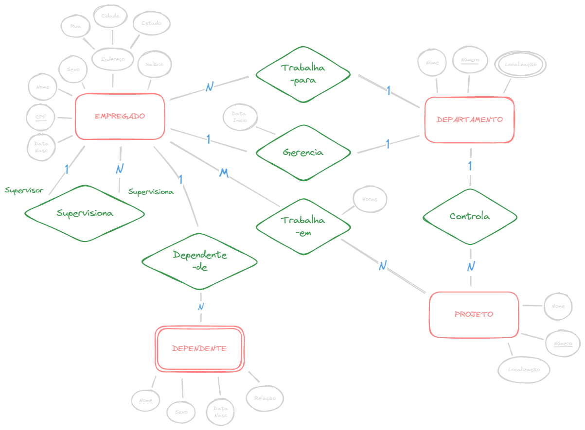
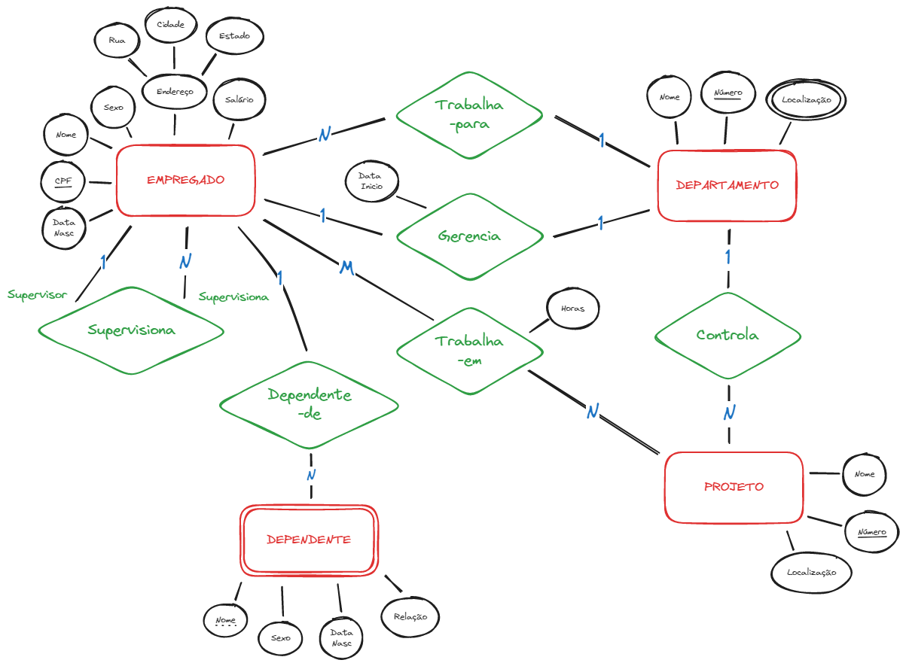

# Regras

## Passo 1: Entidade

Para cada entidade criar uma relação (Tabela) que inclua todos os atributos simples, para atributos compostos, inclua apenas os atributos simples que compõem o atributo composto. Escolha um dos atributos-chave da entidade para constituir a chave primária da relação (se a chave escolhida for composta, então o conjunto de atributos simples que a compõem irão formar a chave primária da relação).

No exemplo, foram criadas as relações EMPREGADO e PROJETO, correspondentes às entidades **`EMPREGADO`** e **`PROJETO`**, presentes no diagrama ER.

Os atributos indicados com chave-estrangeira (`*`) não foram incluídos ainda; eles serão adicionados durante os passo subsequentes.

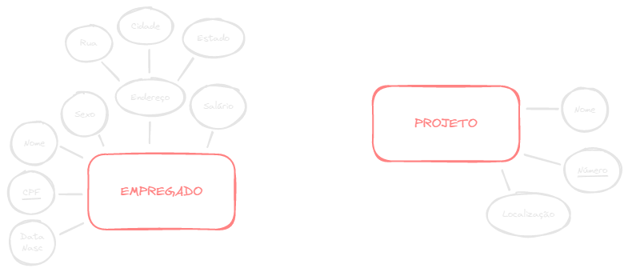
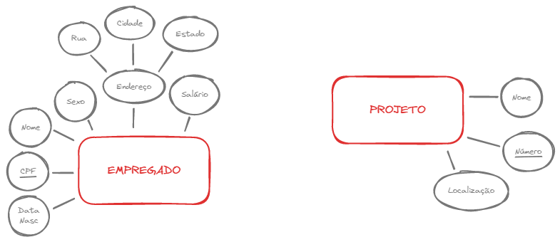

<Tip>

**NOTAÇAO TEXTUAL**

 

EMPREGADO (EmpNome, DataNasc, CPF, Sexo, Rua, Cidade, Estado, Salário)
PROJETO (ProjNome, ProjNúmero, ProjLocalização)

</Tip>

## Passo 2: Atributo multivalorado

Para cada atributo multivalorado, criar uma nova relação que inclua o atributo simples como chave-primária. A relação também deve ter como atributo a chave-primária da relação que representa o atributo multivalorado. A chave-primária da relação será então a combinação das duas chaves.

No exemplo foi criado a relação LOCAL_DEPTO. O atributo "Localização" representa o atributo multivalorado `Localização` de **`DEPARTAMENTO`**, enquanto DeptoNúmero - como chave estrangeira - representa a chave-primária da relação DEPARTAMENTO. A chave primária de LOCAIS_DEPTO é a combinação de \{ DeptoNúmero, Localização \}.

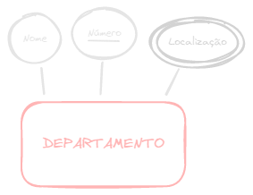
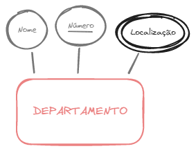

<Tip>

**NOTAÇAO TEXTUAL**

 

DEPARTAMENTO (DeptoNome, DeptoNúmero)
**LOCAL_DEPTO (DeptoNúmero\*, Localização)**

</Tip>

## Passo 3: Entidade Fraca

Para cada entidade fraca, criar uma relação e incluir todos os atributos simples (ou os componentes simples de atributos compostos) como atributos da relação. Além disso, incluir como chave-estrangeira a chave-primária da relação que corresponde ao tipo de entidade dependente. A chave-primária então é a combinação da chave da entidade "forte" e a chave parcial do tipo de entidade fraca.

No exemplo, foi criada a relação DEPENDENTE correspondente ao tipo de entidade fraca DEPENDENTE. Foi incluída a chave-primária da relação EMPREGADO como atributo de DEPENDENTE (chave estrangeira). A chave-primária da relação DEPENDENTE é a combinação \{ EmpCPF*, DependNome \}, porque **DependNome** é a chave-parcial da entidade DEPENDENTE.

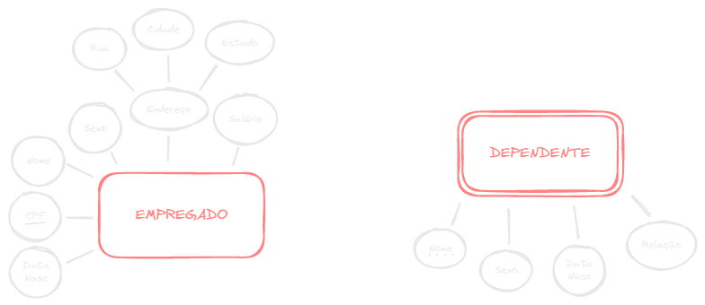
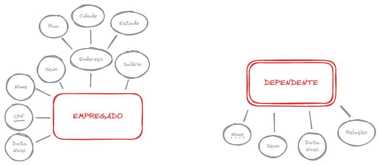

<Tip>

**NOTAÇAO TEXTUAL**

 

DEPENDENTE (EmpCPF*, DependNome, DependSexo, DepDTNasc, RelacaoParente)

</Tip>

## Passo 4: Relacionamento 1:1

Para cada tipo de relacionamento 1:1 (um para um), a chave de uma das entidades participantes do relacionamento, vira atributo de outra entidade (como chave estrangeira da relação). Caso o relacionamento tenha atributo(s), este(s) também será(ão) incluídos como atributos na entidade escolhida.

Exemplo: foi mapeado o tipo de relacionamento 1:1 GERENCIA, escolhendo a entidade participante DEPARTAMENTO (**porque sua participação no tipo de relacionamento GERENCIA é total, já que todo o departamento tem um gerente**). Foi incluída a chave-primária da relação EMPREGADO como a chave-estrangeira na relação DEPARTAMENTO, chamada de EmpCPFGerente. Também foi incluído o atributo simples DataInício do tipo de relacionamento GERENCIA na relação DEPARTAMENTO, nomeado como DataInicioGerencia.

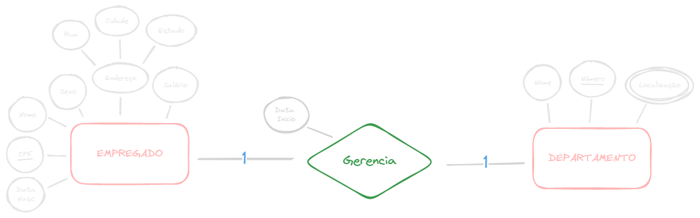
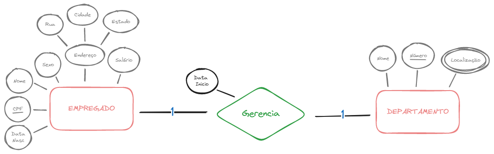

<Tip>
**NOTAÇAO TEXTUAL**
 

EMPREGADO (EmpNome, DataNasc, CPF, Sexo, Rua, Cidade, Estado, Salário)
DEPARTAMENTO (DeptoNome, DeptoNúmero, **EmpCPFGerente\*, DataInicioGerencia**)

</Tip>

## Passo 5: Relacionamento 1:N

Para cada relacionamento 1:N (um para muitos), a chave da entidade participante do relacionamento com cardinalidade "1" vra atributo da entidade com cardinalidade "N". Isto é, incluir como chave-estrangeira da relação N, a chave-primária da relação 1 (isto porque cada instância da entidade do lado 1 está relacionada a mais de uma instância do lado N do relacionamento). Inclua também quaisquer atributos simples do tipo de relacionamento 1:N como atributos da entidade do lado "N".

Exemplo: Foram mapeados os tipos de relacionamento 1:N, CONTROLA, SUPERVISIONA e TRABALHA_PARA.
Para CONTROLA incluiu-se a chave-primária da relação DEPARTAMENTO como a chave estrangeira na relação PROJETO, e foi chamado **DeptoNum**.
Para SUPERVISIONA, incluiu-se a chave-primária da relação EMPREGADO como a chave-estrangeira na relação EMPREGADO, e foi denomido **NumCPFSuper**.
No relacionamento TRABALHA-PARA, foi incluída a chave-primária da relação DEPARTAMENTO como a chave-estrangeira na relação EMPREGADO, e foi denominado **DeptoNum**.

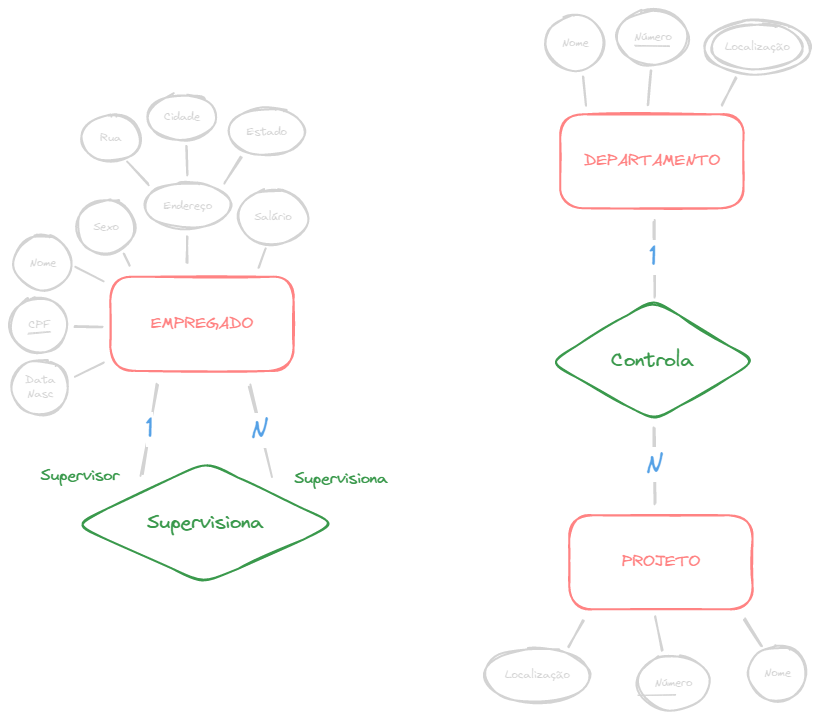
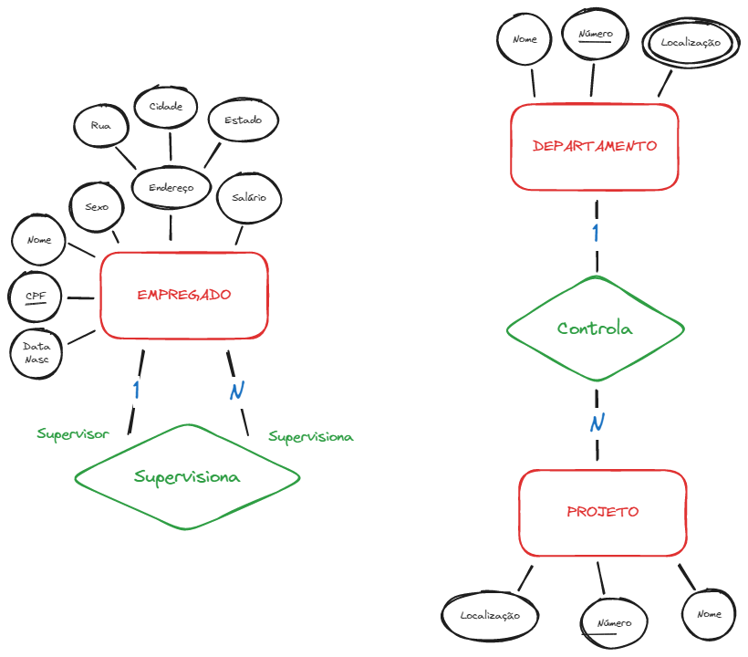

<Tip>
**NOTAÇAO TEXTUAL**
 

DEPARTAMENTO (DeptoNome, DeptoNúmero, EmpCPFGerente, DataInicioGerencia)
PROJETO (ProjNome, ProjNúmero, ProjLocalização, **DeptoNum\***)
EMPREGADO (EmpNome, DataNasc, CPF, Sexo, Rua, Cidade, Estado, Salário, **NumCPFSuper\***)
</Tip>

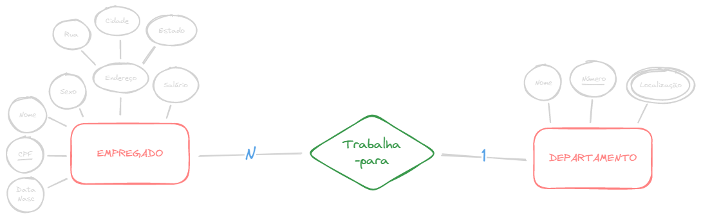
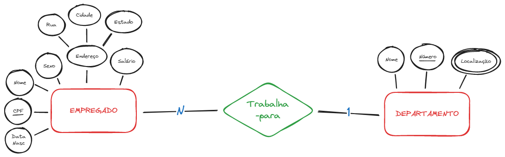

<Tip>
**NOTAÇAO TEXTUAL**
 

EMPREGADO (EmpNome, DataNasc, CPF, Sexo, Rua, Cidade, Estado, Salário, NumCPFSuper*, **DeptoNum\***)
DEPARTAMENTO (DeptoNome, DeptoNúmero, EmpCPFGerente, DataInicioGerencia)
</Tip>

## Passo 6: Relacionamento N:M

Para cada tipo de relacionamento M:N (muitos para muitos), criar uma nova relação. Incluir como chave-estrangeira na nova relação as chaves-primárias das relações que representam os tipos de entidade participantes. As chaves-primárias será a combinação das chaves estrangeiras, neste caso. Inclua também qualquer atributo simples do tipo de relacionamento M:N (ou componentes simples dos atributos compostos) como atributo da nova relação. **Relacionamentos N:M sempre geram uma nova relação.

No exemplo foi mapeado o tipo de relacionamento M:N, TRABALHA_EM criando-se a relação TRABALHA_EM. Incluiu-se as chaves-primárias das relações PROJETO e EMPREGADO como chaves-estrangeiras na relação TRABALHA_EM, chamadas de **ProjNúmero** e **EmpCPF**. Também foi incluído o atributo NumHoras para representar o atributo horas do tipo de relacionamento.

A chave-primária da relação TRABALHA_EM é a combinação das chaves-estrangeiras \{ EmpCPF, ProjNúmero \}.

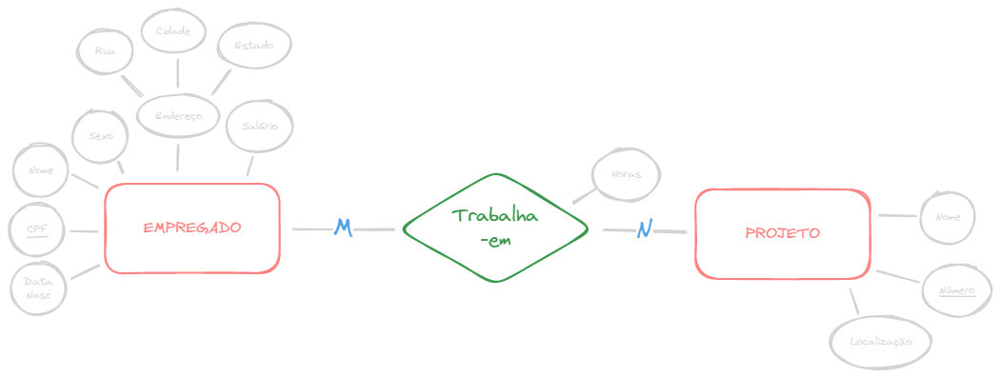
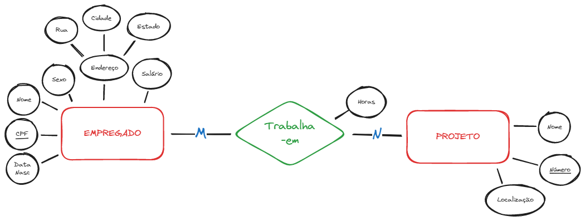

<Tip>
**NOTAÇAO TEXTUAL**
 

EMPREGADO (EmpNome, DataNasc, CPF, Sexo, Rua, Cidade, Estado, Salário, NumCPFSuper*, DeptoNum*)
PROJETO (ProjNome, ProjNúmero, ProjLocalização, DeptoNum*)
**TRABAHA_EM (EmpCPF\*, ProjNúmero\*, NumHoras)**
</Tip>

## Modelo Relacional (Resultado)

**EMPREGADO** (_EmpNome, DataNasc, CPF, Sexo, Rua, Cidade, Estado, Salário, NumCPFSuper*, DepNum*_)
**PROJETO** (_ProjNome, ProjNumero, ProjLocalização, DeptoNum*_)
**TRABALHA_EM** (_EmpCPF*, ProjNúmero*, NumHoras_)
**DEPARTAMENTO** (_DeptoNome, DeptoNumero, EmpCPFGerente*, DataInicioGerencia_)
**DEPENDENTE** (_DependNome, EmpCPF*, DependSexo, DependDataNasc, Relação_)
**LOCAL_DEPTO** (_DeptoNumero*, Localização_)

<Tip>
6 tabelas relacionais (no MER haviam 4 entidades)
</Tip>

# Especialização e Generalização

Vamos agora levar em consideração uma generalização/especialização para converter do MER para MR.

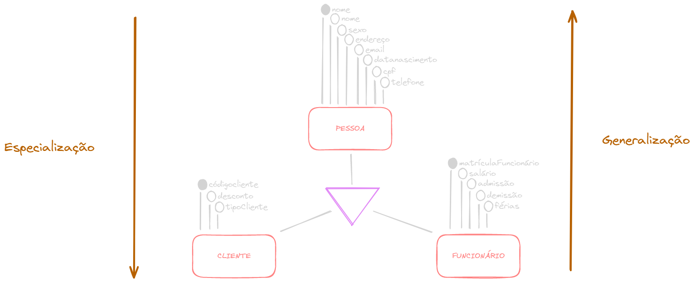
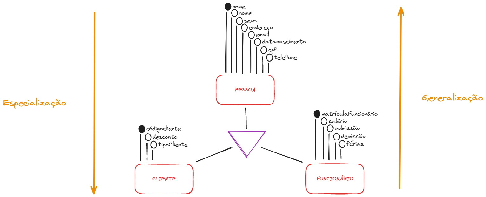

Existem 3 formas de se converter um generalização/especialização de MER para MR:
- Criar uma única tabela para toda a hierarquia de generalização/especialização.
- Criar uma tabela para a entidade genérica e uma tabela para cada entidade especializada.
- Criar uma tabela para cada entidade especializada.

## 1 - Uma tabela para toda a hierarquia

Você tem uma única tabela para todos os atributos iguais e específicos das entidades anteriores.

Quando tempos a especialização abaixo, podemos ter uma única tabela Cliente com todos os atributos possíveis.

## 2 - Uma tabela para cada entidade
Você tem a tabela genérica no exemplo acima, Pessoa, e as tabelas especializadas no exemplo Cliente e Funcionário.

As tabelas Funcionário e Cliente recebem uma chave estrangeira da tabela Pessoa.

Essa é uma das melhores formas (lembrar que, não se aplica a todos os cenários) de se modelar uma generalização/especialização, pois, ao invés de cadastrar todos iguais em diferentes tabelas, você cadastra na genérica, e apenas informa a FK na tabela especializada que o registro ficará.

Lembrando que nesta segunda maneira, você cadastra uma Pessoa e ela pode ser tanto cliente quanto funcionário, assim, evitando cadastrar as mesmas informações em duas tabelas diferentes.

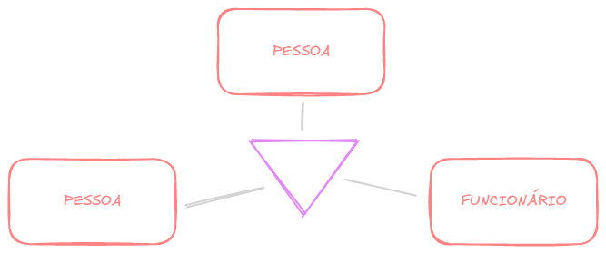
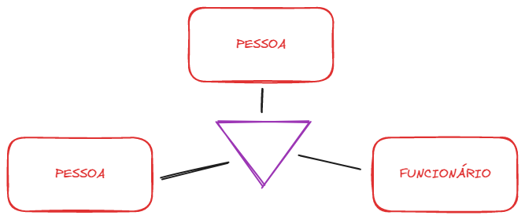

## 3 - Uma tabela para cada entidade especializada

Você tem apenas as tabelas especializadas com os atributos repetidos

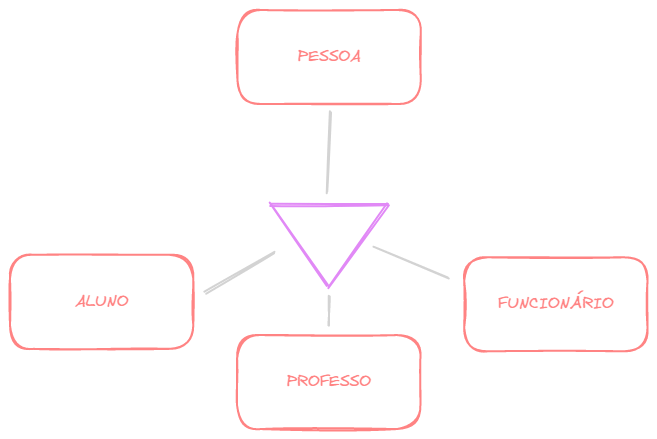
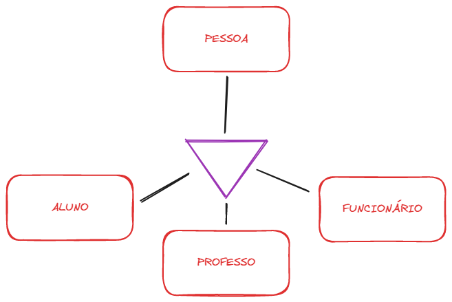

# Considerações

O principal ponto a ser considerado em um esquema relacional, quando comparado ao esquema do MER, é que os tipos de relacionamento não são representados explicitamente, mas sim através de atributos incluídos em relações pela chave estrangeira.

O número final de relações nem sempre corresponde ao número de entidades do modelo ER, pois além de cada entidade (MER) constituir uma tabela (MR), atributos multivalorados e relacionamentos N:M também geram tabelas no MR.

**Sugestão**: Siga as etapas na sequência sugerida para realizar o mapeamento. Em caso de dúvidas, volte às etapas anteriores.
