<Warn>
  Esse artigo foi feito no intuito de servir como fixação dos conteúdos que estou estudando no momento, ministrado pelo professor **Gabriel Ribeiro Diniz** para as aulas de **Banco de Dados** no curso de [**Gestão de TI - FAPAM**](https://www.fapam.edu.br/graduacao/project/gestao-de-t-i/).
</Warn>

# Introdução

**MER** - **M**odelo **E**ntidade-**R**elacionamento

> Baseia-se na percepção de um universo constituído por um grupo básico de objetos chamados **entidades** e por **relacionamentos** entre estes objetos.
> \- Peter Chen, 1976

O MER é um modelo de dados conceitual de alto-nível, ou seja, seus conceitos foram projetados para serem compreensíveis a usuários, descartando detalhes de como os dados são armazenados.

## Vantagens
- Simplicidade
- Independe do [SGDB](https://pt.wikipedia.org/wiki/Sistema_de_gerenciamento_de_banco_de_dados) a ser utilizado
- Mundo real a ser mapeado (mini-mundo) pode ser visto como um conjunto de entidades e de relacionamentos entre as mesmas.
- Desenvolvido para facilitar o projeto de banco de dados
- Especifica "**quais**" os dados serão representados (O QUE) e não "**como**" os dados serão armazenados.
- Elementos do modelo:
  - Entidades
  - Relacionamentos
  - Atributos

# Entidade

Qualquer objeto, pessoa, lugar, conceito ou "coisa" no mundo real com uma existência própria/independente e sobre a qual seja necessário armazenar informações ou características.

Pode ter uma **existência física** (_um rio, uma estrada, uma casa, um aluno, um carro, um cantor..._) ou uma **existência conceitual** (_um cargo, um curso, um evento.._).

**SÍMBOLO**: _Utiliza-se um **retângulo** para representar uma entidade, geralmente o nome é escrito no singular._

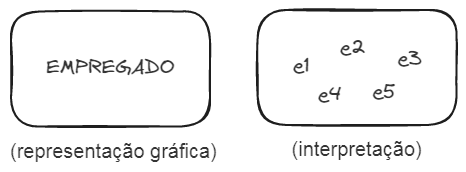
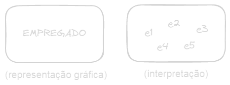

## Entidade Fraca

Caracterizada pela sua dependência da existência de outra entidade.
Uma entidade fraca não possui características o suficiente para existir "sozinha".

<Tip>
**Exemplo**
A entidade **`EMPREGADO`**, possui relacionamento com a entidade **`DEPENDENTE`**, isto é, filhos, cônjugue podem ser dependentes do plano de saúde de um funcionário de uma empresa. E a entidade **`DEPENDENTE`** depende da existência da entidade **`EMPREGADO`** para existir.
</Tip>

**SÍMBOLO**: _Utilizamos um retângulo inscrito em outro retângulo para representarmos uma entidade fraca_

# Relacionamento

Um relacionamento descreve um associação entre suas ou mais entidades **(ação)**

**SÍMBOLO**: _Utilizamos um **lozango** para representarmos um relacionamento_

## Relacionamento dependente

O relacionamento dependente é usado quando queremos relacionar uma ENTIDADE com uma [ENTIDADE FRACA](#entidade-fraca).

**SÍMBOLO**: _Utilizamos um losango inscrito a outro losango para representar um relacionamento dependente_

# Atributo

O atributo é cada característica, propriedade ou qualidade específica que descreve e/ou relacionamento.

**Isto é...**
- A entidade **`EMPREGADO`** poderia ter os atributos: `nome`, `endereço`, `data de nascimento`, `salário` e `profissão`.
- A entidade **`EMPRESA`** poderia ter os atributos: `nome`, `razão social`, `CNPJ`, `matriz`, `presidente`, `endereço`, `telefone`.
- A entidade **`CARRO`** poderia ter os atributos: `fabricante`, `modelo`, `ano de fabricação`, `cor`, `número de portas`, `placa`, `chassi`.

**SÍMBOLO**: _Utilizamos uma elípse (círculo ovulado) para representarmos um atributo._

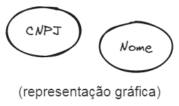
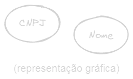

Representação gráfica dos atributos da entidade **`CLIENTE`**:
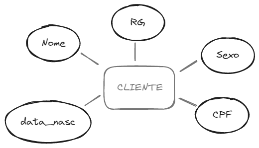
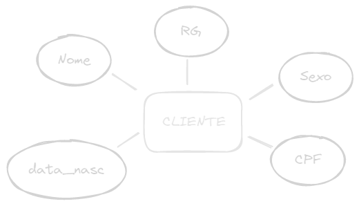

<Tip>
[Relacionamentos](#relacionamento) também podem conter atributos que os caracterizem:
</Tip>

## ATRIBUTO CHAVE ou CHAVE

São atributos ou conjunto de atributos que identifica **unicamente** e **exclusivamente** uma entidade, ou seja, não há valores repetidos desse atributo na entidade. Sendo assim, o seu valor pode ser usado para identificar cada entidade.

Alguns tipode de entidades podem ter mais que um atributo-chave, exêmplo: CPF, identidade, matrícula, CIU.

O atributo chave deve aparecer <ins>sublinhado</ins> em sua simbologia.

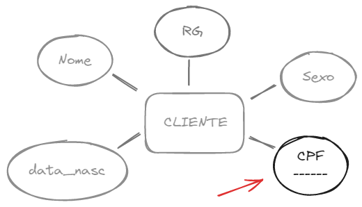
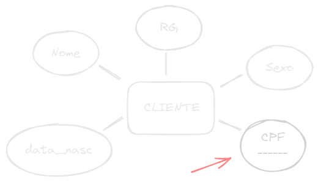

### ATRIBUTO CHAVE PARCIAL ou CHAVE PARCICAL

**TL;DR**: chamamos de chave-parcial o atributo chave de uma [entidade-fraca](#entidade-fraca)

Uma [entidade-fraca](#entidade-fraca) tem uma **chave-parcial**, que é um atributo (ou conjunto de atributos) que podem univocadamente identificar entidades-fracas relacionadas à uma entidade (forte).

Um tipo de entidade-fraca pode, algumas vezes, ser representado como atributo composto (endereço).

A escolha de qual representação usar é determinada pelo projetista do banco de dados.

## Atributo simple ou atômico

São atributos que não são divisíveis, representam uma informação exata e direta, e que não são possíveis de serem decompostos em mais atributos.

## Atributo composto

É um atribusto que pode ser composto de outros atributos mais básicos.

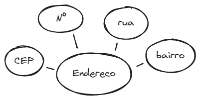
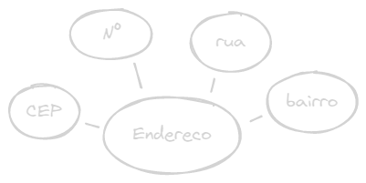

## Atributo multivalorado

São atributos que possuem um ou mais valores **de um mesmo tipo**

**SÍMBOLO**: _Um círculo ovalado dentro de outro círculo ovalado_

<Tip>
**Exemplo 1**
O atributo `telefone`, de uma entidade **`ALUNO`**, pode receber um ou mais números de telefones (residencial, celular, trabalho).

**Exemplo 2**
Um atributo `idioma` de uma entidade **`ALUNO`** pode conter os valores inglês e francês. Para um outro aluno poderia conter apenas um valor, como espanhol. Para um terceiro aluno, poderíamos ter 3 valores para esse atributo: inglês, francês e espanhol.
</Tip>

<Error>
**ATENÇAO**: Atributo MULTIVALORADO **é diferente de** atributo COMPOSTO
</Error>

## Atributo derivado

Este tipo de atributo é derivado de outros atributos.

Não necessitam serem armazenados na base de dados, podendo ser calculados apartir de um consulta através da aplicação.

<Tip>
**Exemplo**

O atributo `idade` de uma **`PESSOA`**. Para uma pessoa em particular, podemos determinar o valor atual de idade através do atributo `data_nascimento` e da data atual do sistema operacional.

Então a `idade` é chamada atributo derivado, pois pode ser obtida de outros atributos.
</Tip>

**SÍMBOLO**: _Círculo ovalado com contorno pontilhado._

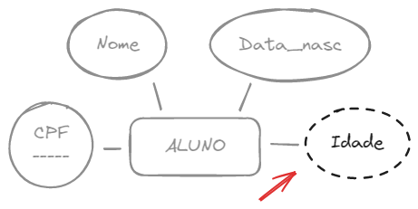
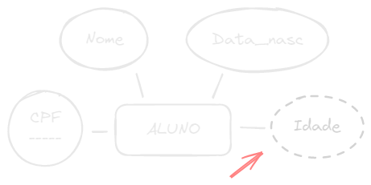

# Boas práticas: Sujestão para nomes
A literatura não define um padrão, mas algumas práticas são usadas:

## Entidades
- Nomes breves e objetivos, com letras maiúsculas que identifique facilmente o conteúdo da entidade;
- No singular, já que a pluralidade decorre, naturalmente, do número de ocorrências, característica própria de toda entidade;
- Nomes compostos separados por hífen `-`, eliminando-se o uso de preposições ou outros termos de ligação.

## Relacionamentos
- Palavras escritas com letras minúsculas;
- Palavras compostas use _underline_ `_`.

## Atributos
- Primeira letra do nome maiúscula e o restante mínúscula;
- Palavras compostas use _underline_ `_`;
- Palavras repetidas em outras entidades, use a inicial da entidade no início e continue com o nome. Ex.: `Empr_Nome` para o nome da **`EMPRESA`**, `Dept_Nome` para o nome do **`DEPARTAMENTO`**.

# Praticando

## Controle de professores FAPAM

A FAPAM precisa ter controle de seus professores e quais turmas eles estão lecionando. Para isso ela precisa saber do professor o nome, CPF e o salário. Já de suas turmas, a faculdade precisa saber a descrição, quantos alunos possui e a carga horária.

<Spoiler>
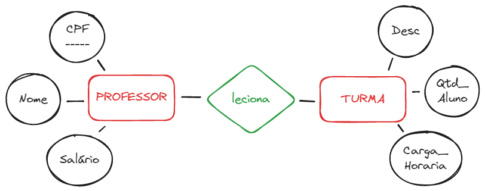
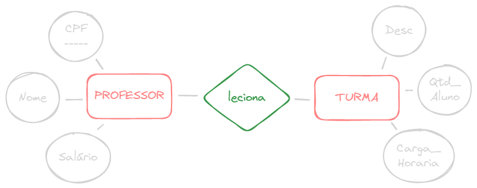
</Spoiler>

## Instituição de Ensino

Fomos contratados por uma instituição, e a mesma, precisa ter um sistema para controle de cursos, sabemos que precisamos ter informações dos alunos, dos cursos e de professores. De cada aluno, será necessário armazenar: seu nome, matrícula, data de nascimento e idade. De cada curso será necessário armazenar a descrição e quantidade de alunos inscritos. Do professor, o seu nome e CPF.

<Spoiler>
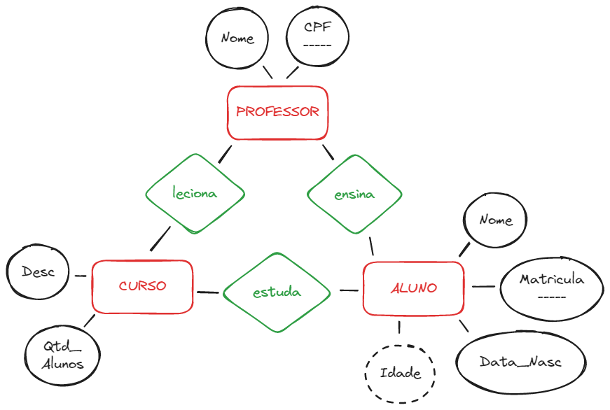
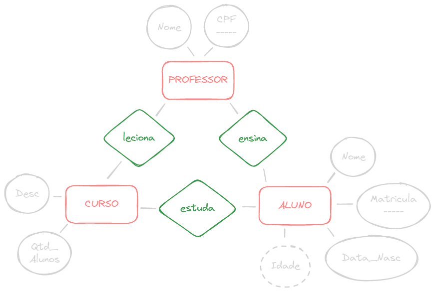
</Spoiler>

# Tipos de relacionamento

Os tipos de relacionamento estão associados ao conceito denominado **cardinalidade**.

A **cardinalidade** é a quantidade de ocorrências que uma entidade pode ter em relação a outra entidade.

**Cardinalidade nos RELACIONAMENTOS**:
- Relacionamento **1:1** _Lê se UM PARA UM_
- Relacionamento **1:N** _Lê se UM PARA MUITOS_
- Relacionamento **N:M** ou **N:N** _Lê se MUITOS PARA MUITOS_

## Relacionamento 1:1

Um relacionamento 1:1 é um relacionamento onde UMA entidade está associada a UMA outra entidade, e vice-versa.

<Tip>
**Exemplo**
O relacionamento entre a entidade **`PRESIDENTE`** e a entidade **`PAÍS`**. Cada país tem UM presidente e cada presidente é de UM país, portanto, é um relacionamento 1:1.
</Tip>

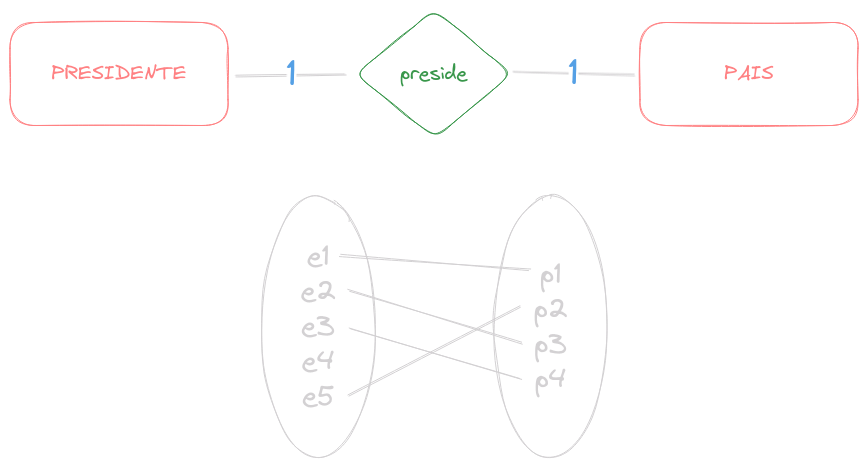
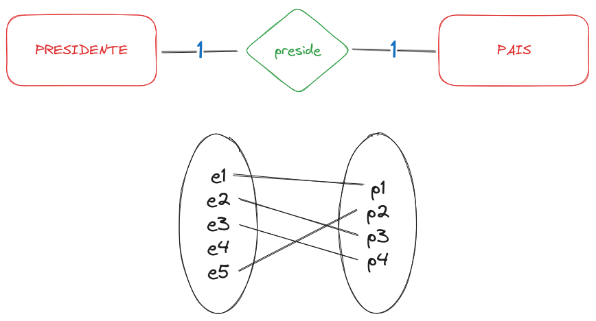

## Relacionamento 1:N

Um relacionamento 1:N é um relacionamento onde UMA entidade está associada a MUITAS outras entidades, mas as entidades associadas estão associadas a apenas UMA entidade.

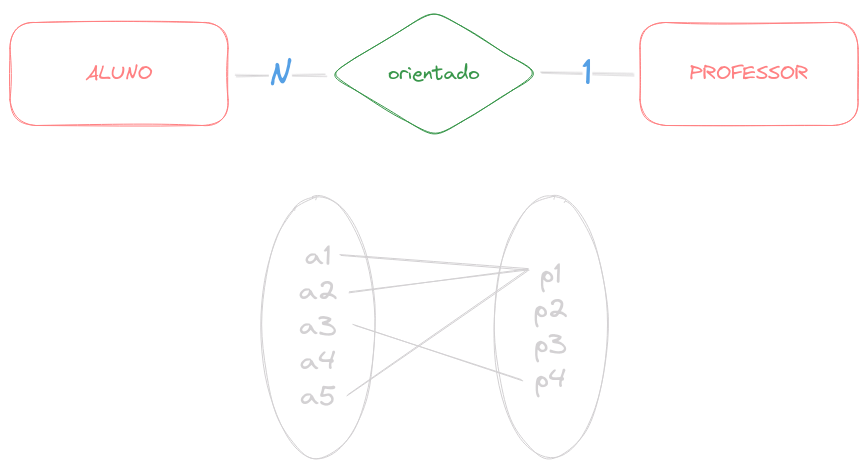

## Relacionamento N:M

Um relacionamento N:M é um ripelacionamento onde MUITAS entidades estão associadas a MUITAS outras entidades.

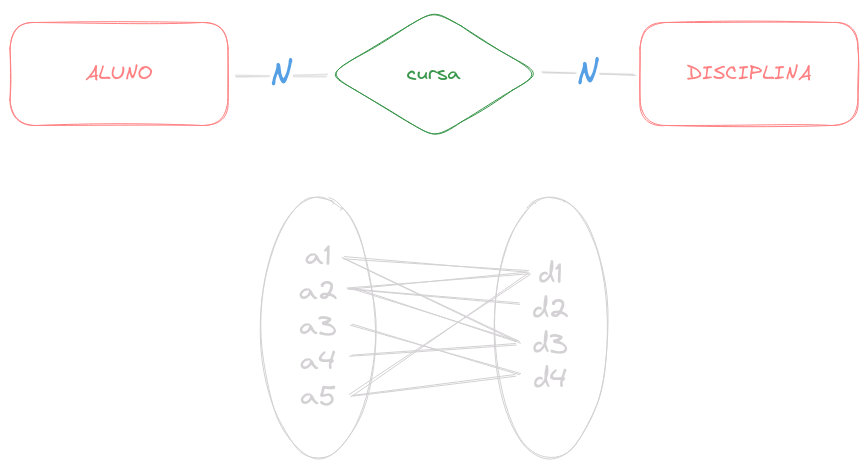

## Par de cardinalidades

Alguns livros trazem a notação de par de cardinalidade, que de define através da atribuição de um valor mínimo e um valor máximo para os tipos de relacionamentos existentes.

<Tip>
Notação de par de cardinalidades: (_mínima, máxima_)
</Tip>

> Um empregado **obrigatóriamente está** lotado no máximo em 1 departamento. Um departamento **pode ter** até N empregados lotados nele.

## Atributos em relacionamentos

Os relacionamentos também podem ter atributos. Por exemplo: pode haver a necessidade de representar a quantidade de **horas semanais** trabalhadas pode um empregado em um dado projeto. Isto pode ser representado no relacionamento `trabalha_em` na forma do atributo denominado `Horas`

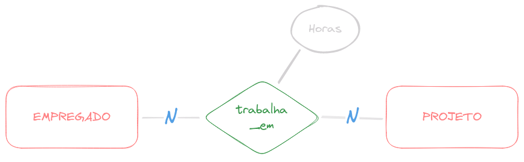

# Praticando

## Projetos de uma empresa
Numa empresa os funcionários são descritos por um nome, número do CPF, salário, endereço (logradouro, número, bairro, cidade), data de nascimento e sexo. Tanto o número do CPF possui valor exclusivo para cada funcionário.

Os funcionários pertencem a departamentos da empresa. Cada departamento possui um nome, um número, uma localização e uma sigla que o identifica. Esta sigla é exclusiva de cada departamento.

Cada departamento é supervisionado por um funcionário da empresa. É necessário saber a data de início da supervisão, para que a cada dois anos haja substituições.

Os departamentos possuem projetos associados. Cada projeto é identificado por um nome, um código e um número de funcionários alocados. O código do projeto é exclusivo para cada um deles.

Os funcionários da empresa trabalham em projetos, e o número de horas dedicadas a um determinado projeto deve ser armazenado no BD.

<Spoiler>
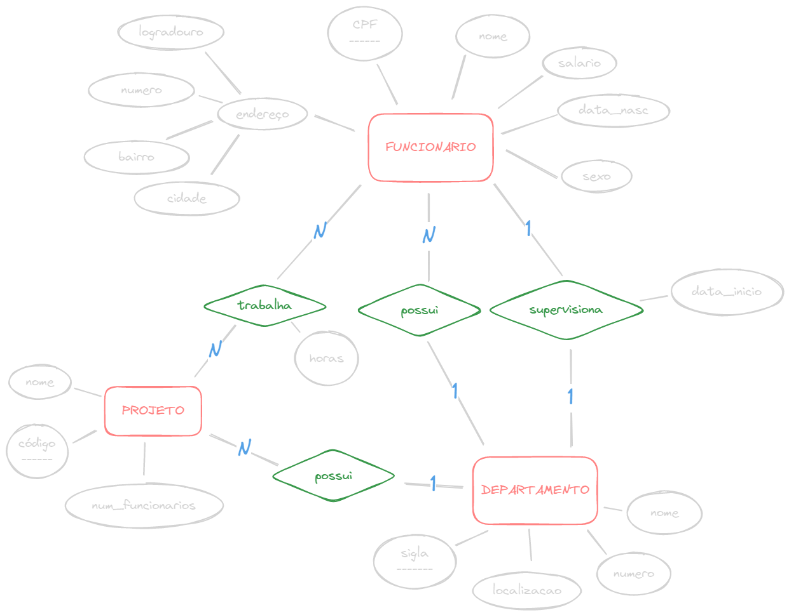

</Spoiler>

## Cia de seguros de automóveis
Uma **cia de seguros de automóveis** possui vários cliente (nome, endereço, CPF, e telefone(s)), cada um deles são proprietários de um ou mais veículos (fabricante, modelo, ano, placa, estado).

Cada carro está associado a nenhum ou vários registros de acidentes (data, número do BO). Um acidente pode evolver não apenas um, mas vários carros.

<Warn>
**Faça você mesmo!**
</Warn>

# Multi Relacionamentos

Um relacionamento liga duas entidades, porém, é possível que uma entidade se relacione com outra entidade mais de uma vez.

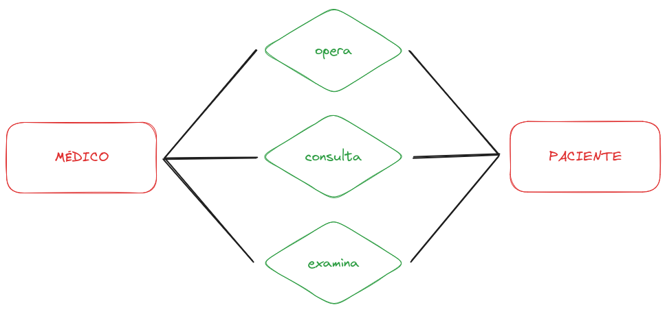
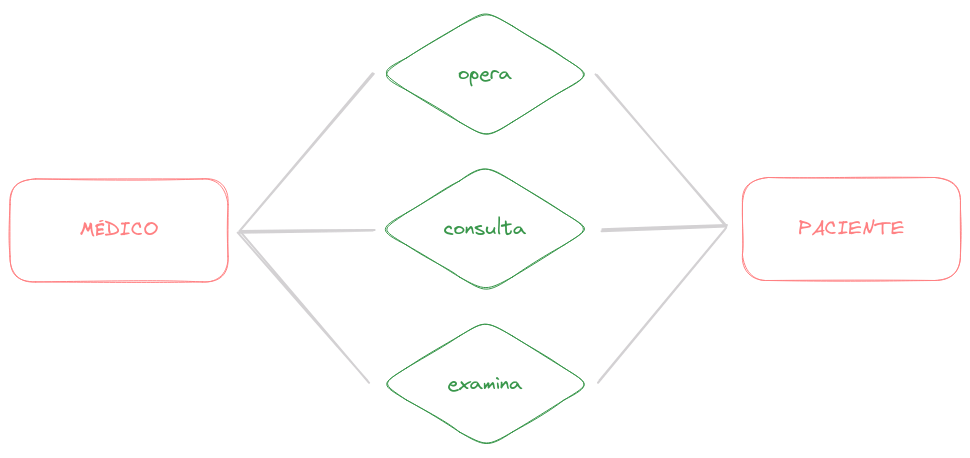

# Auto relacionamento

O auto relacionamento, também chamado de **relacionamento recursivo**, ocorre quando uma entidade se relaciona consigo mesma.

## Auto relacionamento (1:N)

O relacionamento `supervisiona` relaciona um empregado com o seu supervisor, onde ambas entidades são membros do mesmo tipo de entidade **`EMPREGADO`**. Assim, o tipo de entidade EMPREGADO participa duas vezes: uma vez no papel de supervisor e outra no papel de supervisionado. Assim, `e1` supervisiona `e2`, `e2` supervisiona `e3` e `e1` supervisiona `e4`.

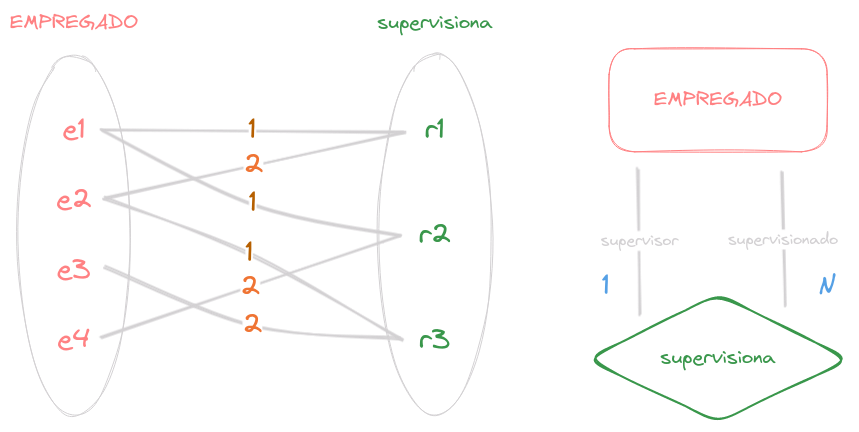
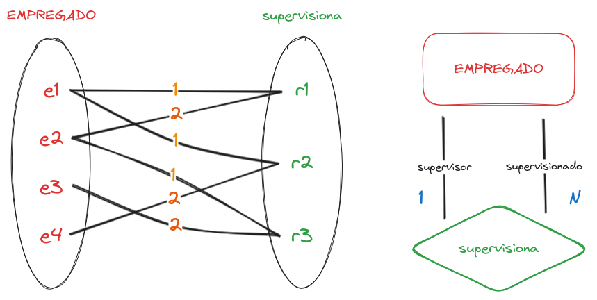

## Auto relacionamento (N:N) e (1:1)

> Cada disciplina pode ter um ou mais pré-requisitos (disciplinas), e cada disciplina pode ser pré-requisito de uma ou mais disciplinas.

> Cada pessoa casa com uma pessoa, e cada pessoa é casada com uma pessoa. ~na maioria dos casos~

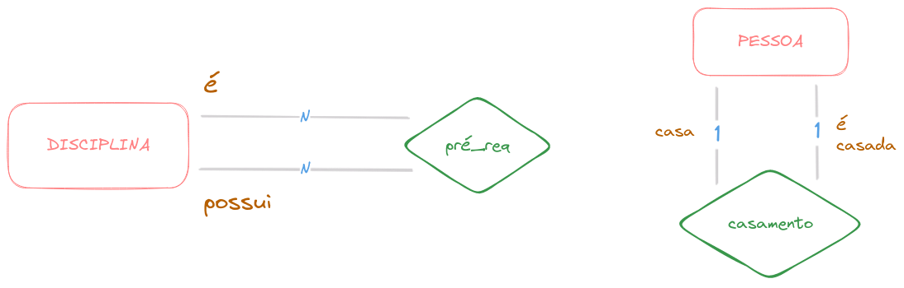
