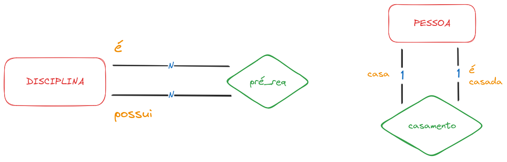

<Warn>
Esse artigo foi feito no intuito de servir como fixação dos conteúdos que estou estudando no momento, é uma transcrição do slide [Aula 03 - MER parte 2](assets/Aula_03_MER_parte_2.pdf), feito pelo professor **Gabriel Ribeiro Diniz** para as aulas de **Banco de Dados** no curso de **Gestão de TI - FAPAM**.
</Warn>

<Tip>
Parte 2 das aulas de Entidade-Relacionamento, continue apenas se já tiver lido a [**Parte 1**](/blog/post/mer---modelo-de-entidade-relacionamento-1).
</Tip>

# Multi Relacionamentos

Um relacionamento liga duas entidades, porém, é possível que uma entidade se relacione com outra entidade mais de uma vez.

# Auto relacionamento

O auto relacionamento, também chamado de **relacionamento recursivo**, ocorre quando uma entidade se relaciona consigo mesma.

## Auto relacionamento (1:N)

O relacionamento `supervisiona` relaciona um empregado com o seu supervisor, onde ambas entidades são membros do mesmo tipo de entidade **`EMPREGADO`**. Assim, o tipo de entidade EMPREGADO participa duas vezes: uma vez no papel de supervisor e outra no papel de supervisionado. Assim, `e1` supervisiona `e2`, `e2` supervisiona `e3` e `e1` supervisiona `e4`.

## Auto relacionamento (N:N) e (1:1)

> Cada disciplina pode ter um ou mais pré-requisitos (disciplinas), e cada disciplina pode ser pré-requisito de uma ou mais disciplinas.

> Cada pessoa casa com uma pessoa, e cada pessoa é casada com uma pessoa. ~na maioria dos casos~

# Generalização e Especialização

Generalização e Especialização são técnicas de modelagem que permitem representar um conjunto de entidades de forma mais abstrata. Ocorre herança de atributos entre as entidades, isto é, as entidades de nível inferior herdam todos os atributos e relacionamentos da entidade a qual estão ligadas.

**SÍMBOLO:** _Um **triângulo** de "cabeça para baixo"_

<Tip>
Generalização e especialização são abstrações inversas e são representadas no esquema ER da mesma forma (mésmo símbolo)
</Tip>

## Especialização

Usada quando um conjunto de entidades possui subgrupos com características próprias.

Especificação de subgrupos dentro de um conjunto de entidades que são distintas, isto é, possuem casacterísticas específicas em um vez que possuem atributos ou relacionamentos que não se aplica ao conjunto entidade de nível superior.

<Tip>
**Exemplo**
**`EMPREGADO`** pode ser **`HORISTA`** ou **`DIARÍSTA`**.
</Tip>

## Generalização

Usada quando entidades distintas possuem características (atributos) em comum, possibilitando a criação de uma entidade mais genêrica que as represente.

Combina conjuntos de entidades, que compartilham as mesmas características (atributos/relacionamentos), em uma entidade de mais alto nível.

## Redundância

A generalização/especialização é muito útil para evitar **redundâncias**, por exemplo:

Poderíamos refazer o modelo ER da seguinte forma:

## Conselhos práticos

### ATRIBUTO vs GENEREALIZAÇÃO/ESPECIALIZAÇÃO

**Questão**: modelar um determinado objeto, por exemplo, a categoria funcional de cada empregado de uma empresa.

Como **atributo**?
- Categoria funcional como atributo da entidade **`EMPREGADO`**.

Como **generalização/especialização**?
- Cada categoria funcional corresponderá a uma especialização da entidade **`EMPREGADO`**.

<Warn>
Artigo em desenvolvimento...
</Warn>
