<Warn>
  Esse artigo foi feito no intuito de servir como fixação dos conteúdos que estou estudando no momento, ministrado pelo professor **Gabriel Ribeiro Diniz** para as aulas de **Banco de Dados** no curso de [**Gestão de TI - FAPAM**](https://www.fapam.edu.br/graduacao/project/gestao-de-t-i/).
</Warn>

# Histórico

O Modelo Relacional (MR) foi proposto por **Edgar Frank Codd** em meados da década de **1970**. Se trata de um conceito abstrato que define maneiras de: **armazenar**, **manipular** e **recuperar dados** estruturados.

Fortemente baseada na [teoria dos conjuntos](https://pt.wikipedia.org/wiki/Teoria_dos_conjuntos), oferecendo assim uma representaão simples e natural da informação.

O modelo relacional representa os dados em um banco de dados como uma **coleção de tabela** (relações). Cada tabela terá um **nome**, que será **único**, e um **conjunto de atributos** com seus respectivos nomes e domínios.

Esses astributos são as colunas da tabela, todos os valores da coluna são do mesmo tipo de dados.

# Conceitos

**Relações (tabelas)**: Os SGBDs relacionais representam os dados sob a forma de TABELAS bidimensionais (linhas x colunas), denominadas **RELAÇÕES**. É composto por 2 partes:
- Cabeçalho: _conjunto fixo de atributos_
- Corpo: _conjunto variável de tuplas (valor de atributo)_

**Tuplas**: são as linhas da relação (tabela), representam uma instância da relação.

**Atributos**: são as colunas ou campos da relação (tabela), representam as características da relação.

**Célula**: A interseção de uma linha x coluna, ou seja, um valor de atributo. Cada célula de uma tabela contém um único valor, característica a qual designa-se por ATOMICIDADE (valor atômico).

**Domínio**: Conjunto de valores atômicos, a partir do qual, um ou mais atributos extraem seus valores. Por exemplo: o domínio do atributo `idade` é um número inteiro entre 13 e 70, e o domínio do salário seria um número real entre 953,00 e 5300,00.

Domínio é um conceito semântico, exemplos:
- Peso, qte, valor - _São números reais (double, float)_
- Nome, Cidade - _São caracteres (string/varchar)_
- Data de nascimento - _São datas (date)_

Alguns domínios estão associados a um tipo de dados ou formato. Exemplo:
- CPF: `ddd.ddd.ddd-dd` onde `d` = $\{0, 1, 2, ...9\}$ (inteiros)
- Idade Empregado: inteiro entre 18 e 65 ($18 \leq idade \leq 65$)
- Data: `dd/mm/aaaa`

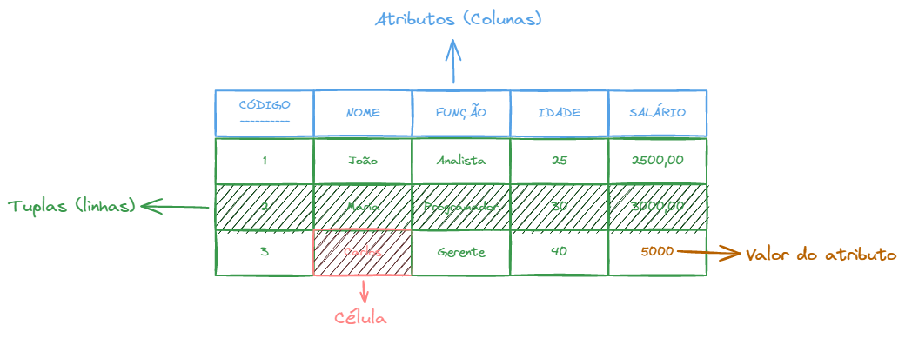
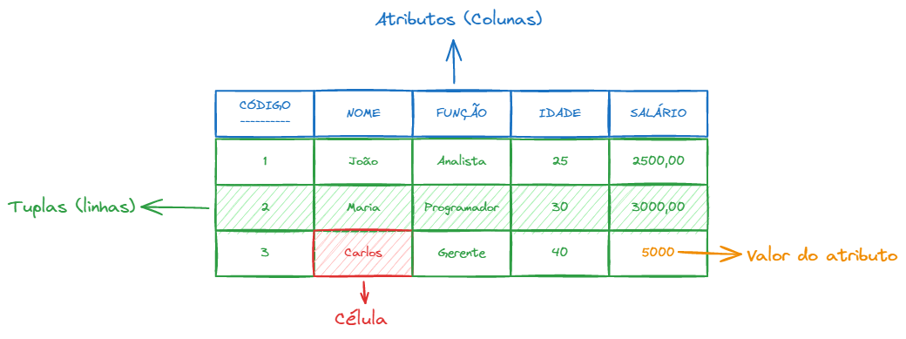

# Descrição física e semântica

**Descrição física**: serve para identificar o tipo e o formato dos valores que compõem o domínio
Ex.: `char(14)`, "(dd)ddddd-dddd".

**Descrição semântica**: serve para ajudar na interpretação dos seus valores.
Ex.: Números de telefones da FAPAM

# Chaves

As tabelas relacionam-se umas comas outras atravez de **chaves**. Uma chave é um conjunto de um ou mais atributos que determinam a unicidade de cada registro. As chaves aparece sublinhadas.

**Chave candidata**: Conjunto de atributos que definem unicamente e minimamente cada tupla em uma relação.
Ex.: Empregado (Código, nome, CPF). Código e CPF são chaves candidatas.

**Chave Primária (Primary Key - PK)**: É uma chave candidata escolhida para identificar unicamente cada tupla em uma relação. O valor deve ser único em cada linha (tupla) da relação.
Ex.: Empregado (Código, nome, CPF). Código foi escolhido como a chave primária.

**Chave alternativa**: São as chaves candidatas não escolhidas para chave primária.
Ex.: Empregado (Código, nome, CPF). CPF é a chave alternativa.

**Chave estrangeira (Foreing Key - FK)**: É um atributo de uma relação que constitui chave primária de uma outra relação. As chaves estrangeiras funciona como um elo de ligação entre relações (nas operações de consulta/acesso do bando de dados).

A chave estrangeira aparece com o símbolo aterísco após seu nome `*`.

Exemplo:
- Empregado (CodEmp, NomeEmp, CodDep*)
- Departamento (CodDepto, NomeDep, CodGerente*)

Na relação Empregado, CodEmp é a chave primária e CodDep é a chave estrangeira.
Na relação Departamento, CodDepto é a chave primária e CodGerente é a chave estrangeira, pois o gerente deve estrar cadastrado na tabela Empregados, ou seja, `CodDep = CodDepto` e `CodGerente = CodEmp`.

<Tip>
**OBSERVAÇOES**

 

Convenciona-se sublinhar os atributos que compõem a chave primária. Ex.: Empregado (Matrícula, Nome, Endereço, Função, Salário).

 

Um mesmo atributos pode ter nomes diferentes nas diversas relações em que participa. Exempo:
- Empregado (Matrícula, Nome, Endereço, Função, Salário, _NumDep_*).
- Departamento (_CodDep_, Nome, Endereço).

 

Atributos que representam diferentes conceitos podem ter o mesmo nome. Ex.: Ver os atributos _Nome_ dos exemplos anteriores.
</Tip>

# Propriedades

No modelo relacional, podem ser observadas as seguintes propriedades:

A - **Uma tabela não deve possuir duas linhas iguais (tuplas duplicadas).** Isso se explica pelo fato de que as linhas são componentes de um conjunto (a tabela) e se faz necessário poder distinguir os elementos de um conjunto. Assim, pelomenos um atributo componente da linha deve possuir um valor que a diferencie das demais.

B - **Cada tabela ou relação deve possuir um nome prórprio, distinto das demais tabelas do mesmo banco de dados (similar às ENTIDADES, no MER).** Ressalta-se que em banco de dados distintos duas tabelas podem ter o mesmo nome.

C - **Cada atributo de uma mesma tabela deve possuir um nome diferente** (valores de atributos são atômicos, sem repetição, ou seja, ocorrência de apenas um valor de atributo para cada célula da tabela). Por outro lado o mesmo atributo pode aparecer em outra tabela com o mesmo nome ou com nome diferente (sinônimo).

D - **Toda tabela de um banco de dados deve possuir chave primária**

E - **A ordem das linhas e colunas na tabela são inrrelevants (não altera o resultado)**

F - **Os SGBD-R deve ser capazes de tratar, de maneira diferenciada, o valor NULO (NULL)**, que indica a ausência de valor para um atributo em determinada linha. Nulo correspode na teoria de conjuntos, o conjunto vazio, e é diferente de zero ou branco. Os atributos podem ter diferentes nulos, sendo que nulo significa inexistência de valor.

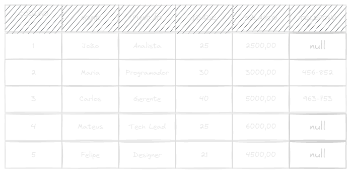
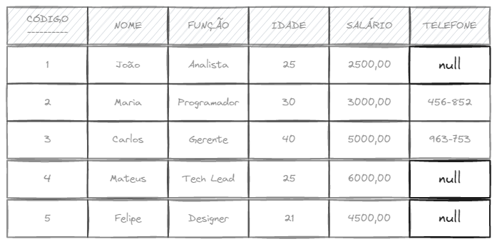

# Restrições

Condições restritivas do modelo relacional:

A - **Restrição de integridade de chave**
Toda tupla tem um atributo (ou uma combinação deles) que a identifica de maneira única na relação -> Chave Primária

B - **Restrição de integridade de entidade**
Nenhum valor da chave primária poderá ser nulo

C - **Restrição de integridade referencial**

Não são permitidos valores de chave estrangeira em uma relação que não tenham sido cadastrados previamente como chave primária em outra relação.

Em outras palavras, estabelece que um conjunto de atributos de uma relação R1, é uma chave estrangeira se satisfaz as seguintes regras:
- Os atributos da chave estrangeira tem o mesmo domínio dos atributos da chave primária de outra relação R2.
- Um valor da chave estrangeira numa tupla de R1 possui o mesmo valor da chave primária para alguma tupla em R2 ou é NULO.

Exemplo: Empregado (matrícula, nome, salário, m_supervisor*).

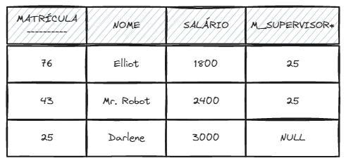

# Operações de atualização em relações

Considere as seguintes relações:

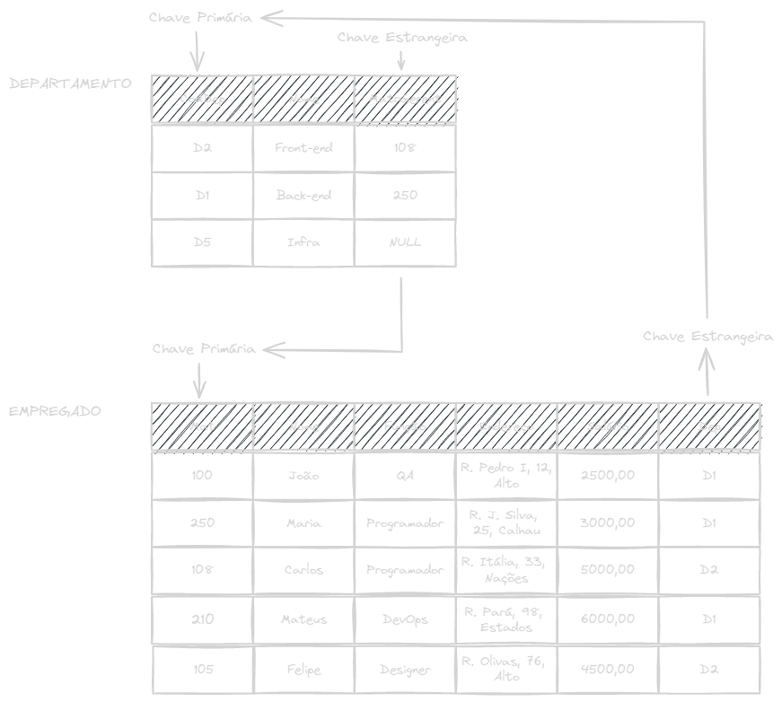
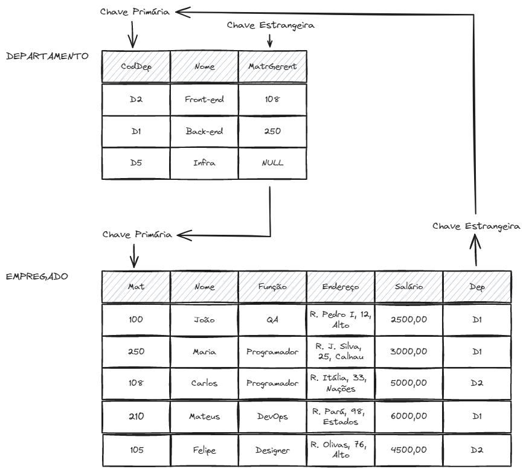

## Inserção

**Inserção (_Insert_)**: Inserir uma nova tupla na relação.

  
Tabela simplificada

  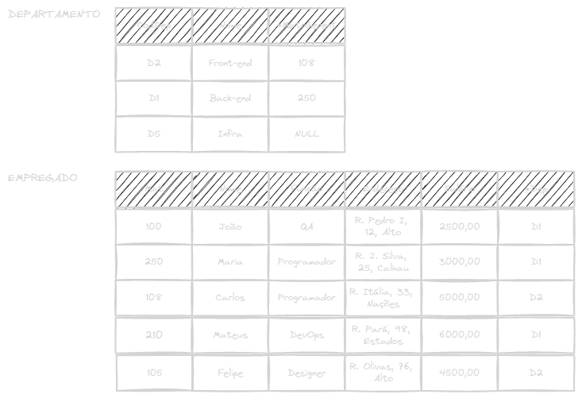
  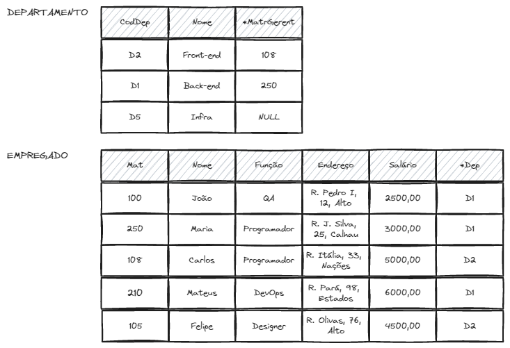

<Wrong message="Viola a restrição de chave!">
Inserir `<"100", "Maria", "DBA", null, "2000", "D1">` em EMPREGADO
</Wrong>

<Wrong message="Viola a restrição de integridade de entidade!">
Inserir `<null, "Célia", "Estagiária", null, "1950", "D1">` em EMPREGADO
</Wrong>

<Wrong message="Viola a restrição de integridade referencial!">
Inserir `<150, "Célia", "Estagiária", null, "1950", "D6">` em EMPREGADO
</Wrong>

<Wrong message="Viola a restrição de integridade referencial!">
Inserir `<150, "Célia", "Estagiária", null, "1950", "B6">` em EMPREGADO
</Wrong>

<Correct>
Inserir `<"102", "Andre", "UX/UI", null, "1980", "D2">` em EMPREGADO
</Correct>

**O que fazer quando detectar uma violação de integridade?**
- Rejeitar a inserção
- Tentar corrigir a anomalia para depois inserir

## Exclusão

**Exclusão (_Delete_)**: Remover uma tupla da relação.

  
Tabela simplificada

  
  

<Wrong message="Viola a restrição de integridade referencial! Pois existem empregados que estão alocados neste departamento.">
Remover da tabela DEPARTAMENTO a tupla com o `CodDep = 'D1'`
</Wrong>

<Correct message="Remoção aceita sem problemas.">
Remover da tabela EMPREGADO a tupla com `matrícula = '100'`.
</Correct>

**O que fazer quando uma violação ocorrer numa remoção?**
- Rejeitar a remoção
- Dar o efeito cascata na remoção, removendo todas as tuplas referenciadas por aquela tupla que está sendo removida.
- Modificar os atributos referenciados para novos valores ou nulos (caso não façam parte da chave primária).

<Tip>
**Obs.:** Dos 3 tipos de restrição de integridade discutidas, uma operação de remoção poderá violar apenas a **integridade referencial**.
</Tip>

## Atualização

**Atualização (_Update_)**: Alterar os dados em uma tupla da relação.

<Correct message="Atualização aceita sem problemas.">
Modificar o salário do EMPREGADO com `matrícula='250'`.
</Correct>

<Correct message="Atualização aceita sem problemas.">
Modificar o número do departamento da tupla de EMPREGADO com `matrícula = '210'` para `'D1'`.
</Correct>

<Wrong message="Viola integridade referencial.">
Modificar o número do DEPARTAMENTO de empregado `'108'` para `'D9'`
</Wrong>

<Wrong message="Viola integridade de chave.">
Modificar a matrícula do EMPREGADO `'100'` para `'250'`
</Wrong>

# Notações do modelo relacional

## Notação tabular (tabelas)

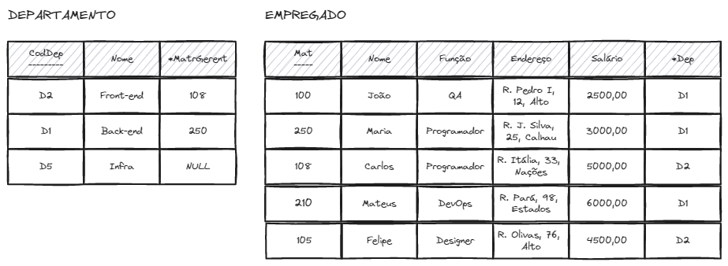
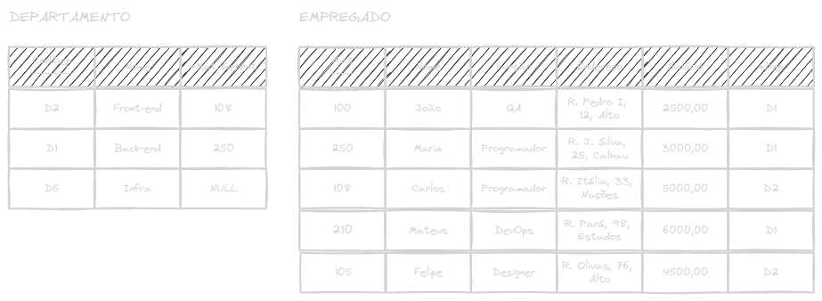

## Notação textual

Empregado (Mat, Nome, Função, Salário, Dep*)
Departamento (CodDep, Nome, MatrGerent*)
