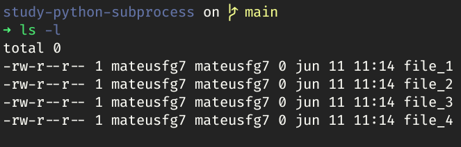
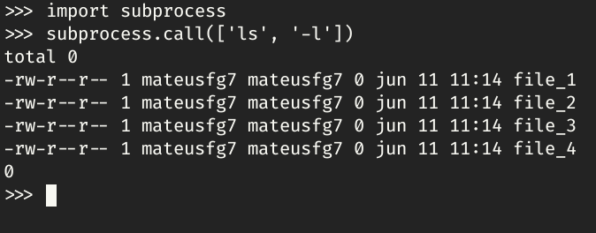
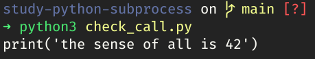
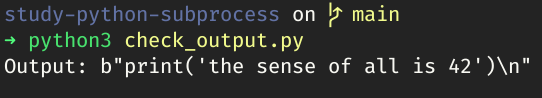

# Introduction

A subprocess is OS process that runs inside of another process father. The `subprocess` module allows to run subprocess with Python.

We can use `subprocess` to run shell commands in a better way than `os.system` module.

# Execute a command

Now, we can just run a command to see the files in the current folder. In Linux we will run the `ls` command, like this:



_The `-l` option is to show the details of the files._

To run this with `subprocess` we need to run the `call()` function. The first param of the function is an list, with the command, where each value of the list is an option of the command:

```python
subprocess.call(['ls', '-l'])
```

_Otherwise we can use a simple string. e.g.: `'ls -l'`_



# Check command output

To check the output of the command we will use the function `check_call()`. Why not use `call()`, again? If occurs an error in the command execute, the `call()` will just show the error, without the possibility of handling this error. The same not occurs with `check_call()`, we can get the error, and handling it.

```python
import subprocess

try:
    subprocess.check_call(['cat', 'file_1.py'])
except Exception as E:
    print(E)
```



# Get the command output

To save the output of the command in a variable, we will use `check_output()`.

```python
import subprocess

o = subprocess.check_output(['cat', 'file_1.py'])

print("Output:", o)
```



# Popen: icing on the cake

The function `Popen` is like `call()`, but their return an object with several object to handler the output, error, etc.

Lets run a python program:

```python
subprocess.Popen('python3 file_1.py', stdout=subprocess.PIPE, shell=True).stdout.read()
```

The `stdout=subprocess.PIPE` param defines that the output of the subprocess is not the terminal, but the own process. The `shell=True` defines that the process will run in the own command line.

We are getting the `stdout` object of `Popen`, and running the `read()` function to read the output of the command.

---

# referencies

Aulas Python - 114 - Ferramentas de Sistema X: Módulo subprocess: [https://www.youtube.com/watch?v=jgmIUa2_wSY](https://www.youtube.com/watch?v=jgmIUa2_wSY)
