# Introdução

Esse artigo é um resumo feito no intuito de servir como fixação dos conteúdos da matéria de **Banco de Dados**, no curso de [**Gestão da T.I - FAPAM**](https://www.fapam.edu.br/graduacao/project/gestao-de-t-i/) 2º Período.

_Aulas ministradas pelo professor [**Gabriel Ribeiro Diniz**](https://www.linkedin.com/in/gabriel-r-diniz/)._

Os comandos SQL serão em sua grande maioria voltados ao SGBD **PostgreSQL**, já que é o SGBD estudado no curso.

<Tip>
Esse artigo assume que você já tenha domínio do conteúdo passado anteriormente, caso não tenha, recomendo que leia o artigo [SQL - Structured Query Language #1](/posts/sql---structured-query-language-1) e seus antecessores.
</Tip>

# Visão (`VIEW`)

A "Visão" é uma tabela virtual, na qual os dados não estão fisicamente armazenados. É uma forma de visualizar os dados de uma ou mais tabelas, sem a necessidade de armazenar esses dados em uma tabela física, ela usa dados de tabelas físicas para criar uma tabela virtual, como se fosse um "atalho" para uma consulta complexa nas tabelas físicas.

**TABELAS BASE X TABELAS VIRTUAL**

- **Tabela Base**: Tuplas (linhas) estão fisicamente armazenadas no banco de dados.
- **Tabela Virtual**: Somente a estrutura (esquema) da tabela é armazenada no banco de dados, e não as tuplas.

## Para que usar visão?

Deve-se usar visões quando for frequente consultas com junção de várias relações (tabelas), bastando definir estas junções como uma visão e posteriormente consulta-la, na claáusula FROM.

Desse modo, o objetivo principal de uma visão é simplificar as consultas frequentes de dados, ocultando a complexidade dessas consultas SQL.

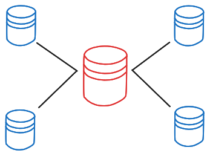
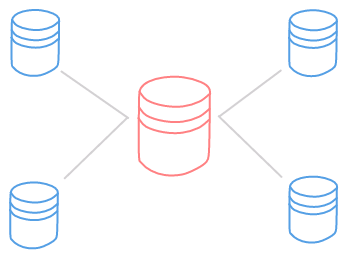

## Criando uma visão

Podemos usar o comando `CREATE VIEW{:sql}` antes de uma consulta convenvional no banco.

```sql caption="<consulta> se refere a uma consulta SQL no formato convencional: SELECT/FROM/WHERE por exemplo." /CREATE VIEW nome_da_visao AS/#r /<consulta>/#b
CREATE VIEW nome_da_visao AS <consulta>;
```

Exemplo:

```sql /CREATE VIEW vw_contato_cliente AS/#r /SELECT id, nome, email, telefone FROM Cliente/#b
CREATE VIEW vw_contato_cliente AS SELECT id, nome, email, telefone FROM Cliente;
```

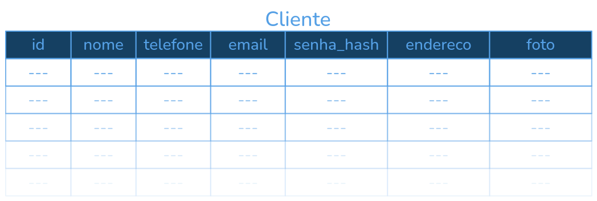
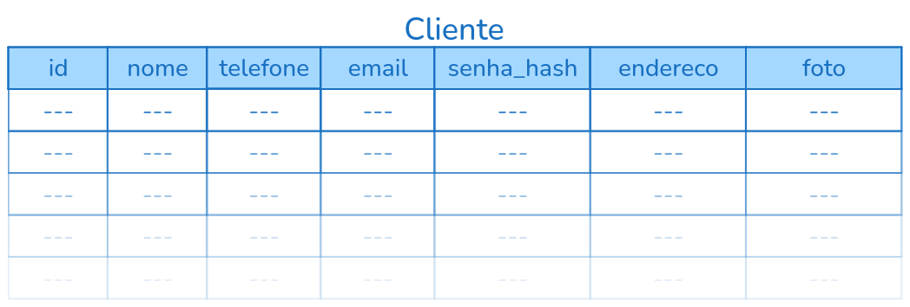

<div className="w-full flex justify-center">
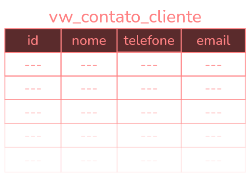
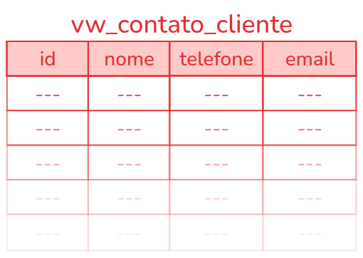
</div>

Fisicamente, os dados em `vw_contato_cliente` são os mesmos que em `Cliente`, mas a visão `vw_contato_cliente` é uma forma mais simples de acessar esses dados.

Após ser criada, uma visão pode ser consultada normalmente, com a cláusula `FROM`, como se fosse uma tabela base.

```sql /SELECT * FROM vw_contato_cliente/#r /SELECT * FROM vw_contato_cliente/#b
SELECT nome, email FROM vw_contato_cliente;
```
<div className="w-full flex justify-center">
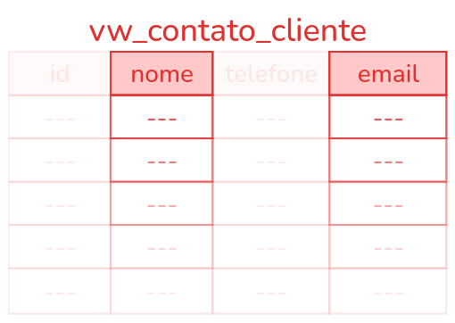
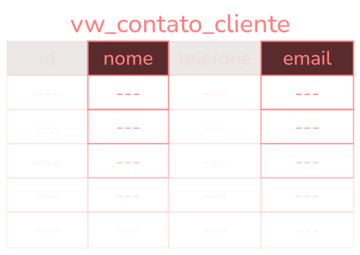
</div>

Sendo assim, se você atualizar os dados da tabela `Cliente`, a visão `vw_contato_cliente` também será atualizada, pois ela é uma "referência" para a tabela `Cliente`.

Outras visões podem ser criadas a partir de visões existentes, e assim por diante (visões sobre visões).

Podemos criar também visões apartir do resultado de múltiplas tabelas. Considere as seguintes tabelas:

**`CIA_AEREA`**
<span className="underline">Codigo_Cia</span> | Nome | Sede | Presidente
--- | --- | --- | ---
1 | Varig | Vitória | Raul Sidnei
2 | Air France | Paris | Etoile Arns
3 | Tam | São Paulo | Cida Faria
4 | Gol | Rio de Janeiro | Bia Falcão

**`VOO`**
<span className="underline">Num_Voo</span> | Tarifa | Partida | Destino | Codigo_Cia*
--- | --- | --- | --- | ---
AF234 | 726.20 | Brasília | Paris | 2
VG893 | 254.30 | BH | RS | 1
AF875 | 541.00 | São Paulo | Paris | 2
VG487 | 189.40 | Brasília | Curitiba | 1
GO142 | 349.00 | RJ | Recife | 4
TA961 | 99.00 | BH | Brasília | 3


**Exemplo 1** - Recuperar o nome da companhia aérea, e os voos que cada um oferece.

```sql
SELECT CA.NOME, V.NUM_VOO FROM VOO V INNER JOIN CIA_AEREA CA
ON V.CODIGO_CIA = CA.CODIGO_CIA;
```

Isso vai nos dar o seguinte retorno:

_resultado da consulta_
Nome | Num_Voo
--- | ---
Varig | VG487
Varig | VG893
Air France | AF234
Air France | AF875
Tam | TA961
Gol | GO142

Podemos facilitar essa consulta criando uma "tabela virtual" apartir desse retorno, ou seja, uma visão!

```sql /CREATE VIEW vw_voos_por_cia AS/#r
CREATE VIEW vw_voos_por_cia AS
SELECT CA.NOME, V.NUM_VOO FROM VOO V INNER JOIN CIA_AEREA CA
ON V.CODIGO_CIA = CA.CODIGO_CIA;
```

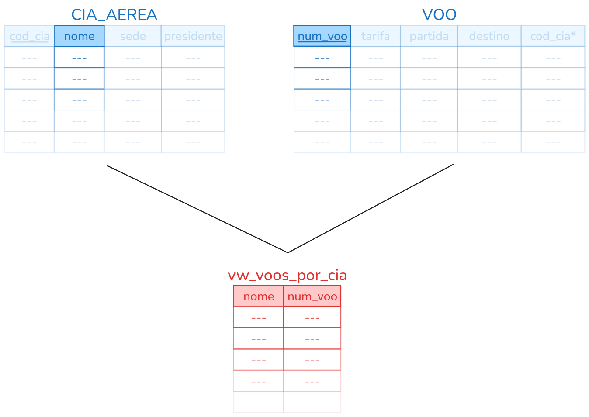


Agora é só consultar a visão `vw_voos_por_cia` que vamos obter o mesmo resultado da nossa primeira consulta:

```sql /vw_voos_por_cia/#r
SELECT * FROM vw_voos_por_cia;
```

**`vw_voos_por_cia`**
Nome | Num_Voo
--- | ---
Varig | VG487
Varig | VG893
Air France | AF234
Air France | AF875
Tam | TA961
Gol | GO142

Podemos também criar visões renomeandos as colunas da tabela base na _view_, por exemplo:

**Sintaxe**
```sql /(coluna1, coluna2, coluna3, ...)/#r /<consulta>/#b
CREATE VIEW nome_da_visao (coluna1, coluna2, coluna3, ...) AS <consulta>
```

**Exemplo** - Recuperar o nome da companhia aérea e o número de voos que cada uma oferece. Seguindo o exemplo dos voos, considere as seguintes tabelas:

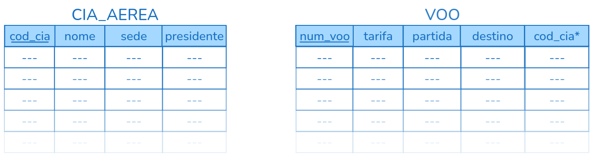
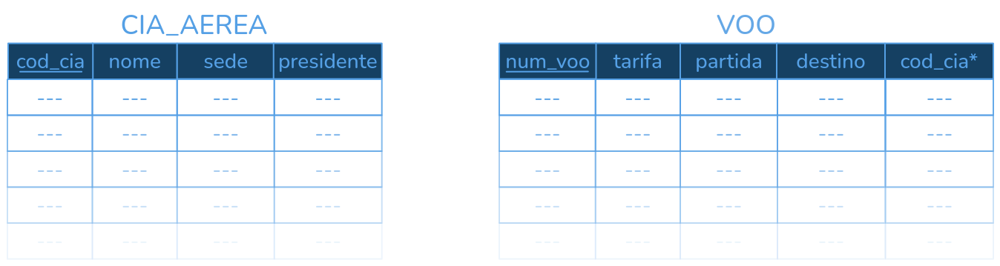

```sql caption="numero_voos é o nome da coluna COUNT(num_voo) renomeada!" /(cia_aerea, numero_voos)/#r /nome, COUNT(num_voo)/#b
CREATE VIEW total_voos (cia_aerea, numero_voos) AS
SELECT nome, COUNT(num_voo)
  FROM VOO V INNER JOIN CIA_AEREA CA
  ON V.CODIGO_CIA = CA.CODIGO_CIA
GROUP BY nome;
```

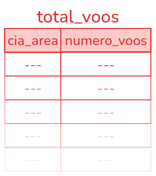
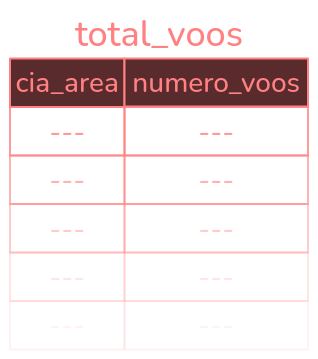

```sql
SELECT * FROM total_voos;
```

cia_aerea | numero_voos
--- | ---
Air France | 2
Gol | 1
Tam | 1
Varig | 2

```sql
SELECT * FROM total_voos WHERE numero_voos >= 2;
```

cia_aerea | numero_voos
--- | ---
Air France | 2
Varig | 2


## Vantagens

As _views_ sãi uma simplificação das **consultas que são frequente na aplicaçao**, e auxilia no processo de **autorização/segurança**.

<Tip>
**Exemplo**: a empresa poderia não querer que o público tivesse acesso às tarifas dos voos (devido a uma promoção), na qual vários voos teriam o mesmo preço anunciado separadamente.
<br />
**Solução**: para "esconder" a coluna `Tarifa`, eu poderia criar uma visão da tabela **`VOO`** que contém todos os dados, esceto `Tarifa`.
</Tip>

Assim, o acesso não será mais à tabela base VOO e sim, à visão criada a partir da tabela VOO.

## Atualização de uma VIEW

O SGBD não garante que uma visão sempre atualizará. Uma _view_ com uma única tabela de definição é atualizável.

```sql
UPDATE <nome da visão> SET <valores> WHERE <condição>;
```

As _views_ definidas sobre **múltiplas tabelas** usando junções, **geralemnte não são atualizáveis**.

As _views_ definidas com funções de agrupamente (`GROUP BY{:sql}`) e agregação (`SUM{:sql}`, `AVG{:sql}`, `COUNT{:sql}`, `MAX{:sql}`, `MIN{:sql}`) **não são atualizáveis**.

**Considerações**:

A visão **não é montada** no instante de sua **definição**, mas sim no momento em que alguma **consulta** for realizada sobre ela (pois é uma tarefa custosa, em termos de desempenho, manter todas as tuplas se elas não estão sendo usadas em nenhuma consulta).

Em outras palavras, **apenas o esquema da visão é armazenado** no banco de dados. Todas as vezes que a visão é consultada, o SGBD calcula quais tuplas seriam retornadas por aquela consulta e exibe na tela.

**Exemplo** - Considerando a seguinte visão:

```sql
CREATE VIEW vw_voos_sem_tarifa AS
SELECT NUM_VOO, PARTIDA, DESTINO FROM VOO;
```

num_voo | partida | destino
--- | --- | ---
AF234 | Brasília | Paris
AF875 | São Paulo | Paris
GO142 | RJ | Recife
GO542 | Brasília | Belém
TA961 | BH | Brasília
VG487 | Brasília | Curitiba
VG893 | BH | RS

Se tentarmos atualizar essa _view_ diretamente, a tabela base **`VOO`** será atualizada, porém o campo `Tarifa` da tabela **`VOO`** terá o valor `NULL` pois ela não esta sendo referenciada na _view_.

## Exclusão de uma VIEW

Podemos usar o comando `DROP VIEW{:sql}` para excluir uma visão.

```sql
DROP VIEW <nome_da_visao>;
```

Ela ficará disponível até que seja executado o comando para deletá-la. É possível excluir visões quando elas não forem mais necessárias, desta forma elas não farão parte do SGBD.

**Exemplo**

```sql
DROP VIEW vw_voos_por_cia;
DROP VIEW vw_voos_sem_tarifa
```

## Alterar o nome da VIEW

Comando para renomear uma visão:

```sql
ALTER VIEW <nome_da_visao> RENAME TO <novo_nome_da_visao>;
```

**Exemplo**

```sql
ALTER VIEW vw_voos_por_cia RENAME TO vw_voos_por_companhia;
```

## Mudar o código (consulta) da VIEW

Comando para alterar o código de uma visão:

```sql
CREATE OR REPLACE VIEW <nome_da_visao> AS <nova_consulta>;
```

**Exemplo**

```sql
CREATE OR REPLACE VIEW vw_teste AS
SELECT * FROM VOO
WHERE tarifa >= 500.00;
```

# Procedimentos (`PROCEDURES`)

As _Stored Procedures_ são rotinas definidas no banco de dados, indentificadas pelo por um nome pelo qual podem ser invocadas. Um procedimento pode executar uma série de de instruções e receber parâmetros.

**Para que usar _stored procedures_?**

Muitas vezes é requerido várias consultas e atualizações no DB, o que acarreta um maior consumo de recursos pela aplicação (desempenho, memória, etc.). No caso de aplicações web, isso se torna mais visível, devido a maior quantidade de informações que precisam trafegar pela rede e de requisições ao servidor.

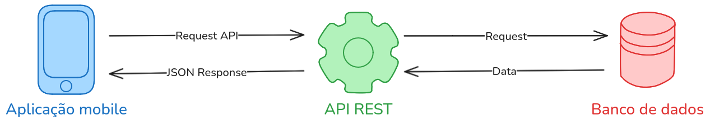
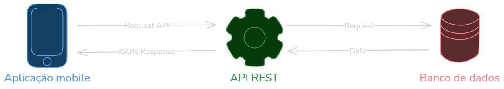

Uma boa forma de contornar e atenuar esses consumo de recurso diretamente pela aplicação, é transferir parte do processamento para o DB. Assim, considerando que as máquinas servidoras geralmente têm configurações de hardware mais robustas (e nada se pode garantir com relação às máquinas clientes), essa pode ser uma "saída" a se considerar.

**Usar ou não usar procedures?**

Como exemplo para o funcionamento dos _Stored Procedures_, iremos comparar a execução de uma rotina utilizando e outra não utilizando essa técnica.

Considere o seguinte contexto de uma aplicação comercial:
- O cliente fez um pedido no qual são inseridos itens
- O pedido (bem como os itens) permanecem com status "PENDENTE" até ser confirmado.
- O operador confirma o pedido e faz o registro no livro caixa.

Até o pedido ser confirmado, nenhum lançamento é feito no livro caixa, então é preciso ter uma rotina de confirmação de pedido, que deve executar as seguintes ações:

1. **`UPDATE{:sql}`** Atualizar o _status_ do pedido (**fechado, pendente**)
2. **`UPDATE{:sql}`** Atualizar o _status_ dos itens do pedido (**vendido, pendente**)
3. **`INSERT{:sql}`** Lançar o valor do pedido no caixa (**preço**)

Temos então pelo menos 3 instruções de atualiação e/ou inserção. Poderíamos representar essa sitação graficamente pela figura:


Por outro lado, poderíamos agrupar essas três instrulções no corpo de um procedimento e chamá-lo a partir da aplicação uma única vez.

As ações de `UPDATE{:sql}`/`INSERT{:sql}`/`DELETE{:sql}`, apartir daí, ficariam por conta do servidor. A representação gráfica desse modelo é mostrada a seguir (Através do procedimento chamado "CONFIRMAR PEDIDO"):


<Correct>
**Vantagens**:
- Simplificação da execução de instruções SQL pela aplicação.
- Transferência de parte da responsabilidade de processamento para o servidor.
- Facilidade na manutenção, reduzindo a quantidade de alterações na aplicação.
</Correct>

<Wrong>
**Desvantagens**:
- Necessidade de maior conhecimento da sintaxe do banco de dados para escrita de rotinas em SQL (nível avançado).
- As rotinas ficam mais facilmente acessíveis. Alguém que tenha acesso ao banco de dados poderá visualizar e alterar o código.
</Wrong>

## Criando uma PROCEDURE

**Sintaxe**

```sql
CREATE PROCEDURE nome_da_procedure(parametro1 tipo, parametro2 tipo, ...)
LANGUAGE SQL AS
$$
  <corpo da procedure>
$$;
```

Onde, `parametro1`, `parametro2`, ... são os parâmetros que a procedure pode receber (opcionais, caso não ouver, deve se passar parênteses vazios `nome_da_procedure()`), `LANGUAGE SQL` indica que a procedure será escrita em SQL, `$$` é um delimitador de bloco de código e `<corpo da procedure>` é o código SQL que será executado.

**Exemplo**

```sql
CREATE PROCEDURE insert_cliente(nome VARCHAR(39), cpf VARCHAR(11), celular VARCHAR(11))
LANGUAGE SQL AS
$$
  INSERT INTO CLIENTE (nome, cpf, celular)
  VALUES ((SELECT MAX(codigo_cliente) + 1 FROM cliente), nome, cpf, celular);
$$;
```

Tendo criado a _procedure_, chamá-lo é bastante simples. Para fazer isso fazemos o uso da palavra reservada CALL, como mostra o código a seguir:

```sql
CALL <nome procedimento>(<parâmetros>);
```

**Exemplo**

```sql
CALL insert_cliente('Mateus Felipe', '00000000000', '37999999999');
```

## Atualizando PROCEDURES

Para atualiza o código de uma procedure, basta usar o comando `CREATE OR REPLACE PROCEDURE{:sql}`.

```sql /OR REPLACE/
CREATE OR REPLACE PROCEDURE update_preco(novo_preco NUMERIC, codigo_produto INTEGER)
LANGUAGE SQL AS
$$
  UPDATE PRODUTO SET preco = novo_preco WHERE codigo_produto = codigo_produto;
$$;
```

## Excluindo PROCEDURES

Assim como outras estruturas no banco de dados, para exclusão de procedures basta fazer:

**Sintaxe**

```sql
DROP PROCEDURE nome_da_procedure;
```

**Exemplo**

```sql
DROP PROCEDURE insert_cliente;
DROP PROCEDURE update_preco;
```

# Funções (`FUNCTIONS`)

Funções (_Function_) são rotinas definidas no banco de dados, identificadas por um nome, pelo qual podem ser invocadas, parecidos com uma _procedure_, recebendo parâmetros, executando instruções, mas com o diferencial de que uma função **sempre retorna um valor**.

Outro diferencial das funções em relação aos procedimentos, é que ela não precisa da palavra resrvada `CALL` para ser invocada, basta chamar a função no meio de uma consulta SQL.

**Sintaxe**

```sql
CREATE FUNCTION nome_da_funcao(parametro1 tipo, parametro2 tipo, ...)
RETURNS tipo_retorno
LANGUAGE plpgsql AS
$$
  DECLARE
    -- declaração de variáveis
  BEGIN
    -- lógica
  END;
$$;
```

**Exemplo**

```sql
CREATE FUNCTION getNumeroFilmes(dataInicial DATE, dataFinal DATE)
RETURNS INTEGER
LANGUAGE plpgsql AS
$$
  DECLARE
    contadorFilmes INTEGER;
  BEGIN
    SELECT COUNT(*) INTO contadorFilmes FROM FILME
    WHERE data_lancamento BETWEEN dataInicial AND dataFinal;

    RETURN contadorFilmes;
  END;
$$;
```

<Tip>
`plpgsql` **PL/pgSQL** é a abreviatura de **Procedural Language/PostgreSQL Structured Query Language**. É uma linguagem procedural suportada pelo PostgreSQL, usado para escrever lógicas complexas e controle de fluxo, como loops, condicionais, etc. Adicionando poderes extras às funcionalidades do SQL.
<br />
**Mais referências**:
- Chapter 43. PL/pgSQL — SQL Procedural Language: [**EN**] https://www.postgresql.org/docs/current/plpgsql.html
- PLPGSQL: [**PT**] https://pt.wikipedia.org/wiki/PLPGSQL
- PostgreSQL PL/pgSQL: [**EN**] https://www.postgresqltutorial.com/postgresql-plpgsql/
Capítulo 43. PL/pgSQL - Linguagem procedural SQL: [**PT**] https://halleyoliv.gitlab.io/pgdocptbr/plpgsql.html
- PostgreSQL Prático/Funções Definidas pelo Usuário e Triggers/PlpgSQL: [**PT**] https://pt.wikibooks.org/wiki/PostgreSQL_Pr%C3%A1tico/Fun%C3%A7%C3%B5es_Definidas_pelo_Usu%C3%A1rio_e_Triggers/PlpgSQL
</Tip>

**Observações**

A declaração de novas variáveis pode ser necessária no corpo da função!

Tendo criado a funcion, como executa-la? Como na maioria das vezes haverá um tipo de retorno, a chamada da mesma poderá ser feita **após o `SELECT{:sql}`**, ou **após a cláusula `WHERE{:sql}`**, sendo, para este último caso, o valor retornado deve ser comparado a alguma condição.

**Exemplo**

```sql /contar_filmes('AÇÃO')/
SELECT contar_filmes('AÇÃO') FROM Filmes;
```

```sql /pegar_tipo_com_mais_filmes()/
SELECT * FROM Filmes
WHERE tipo = pegar_tipo_com_mais_filmes();
```

## Atualizando FUNÇÕES

Para atualizar o código de uma função, basta usar o comando `CREATE OR REPLACE FUNCTION{:sql}`.

```sql /OR REPLACE/
CREATE OR REPLACE FUNCTION getNumeroFilmes(dataInicial DATE, dataFinal DATE)
RETURNS INTEGER
LANGUAGE plpgsql AS...
```

## Excluindo FUNÇÕES

Para exclusão de funções, basta fazer:

**Sintaxe**

```sql
DROP FUNCTION nome_da_funcao;
```

**Exemplo**

```sql
DROP FUNCTION getNumeroFilmes;
```
