# Introdução

Esse artigo é um resumo feito no intuito de servir como fixação dos conteúdos da matéria de **Banco de Dados**, no curso de [**Gestão da T.I - FAPAM**](https://www.fapam.edu.br/graduacao/project/gestao-de-t-i/) 1º Período.

_Aulas ministradas pelo professor [**Gabriel Ribeiro Diniz**](https://www.linkedin.com/in/gabriel-r-diniz/)._

Os comandos SQL serão em sua grande maioria voltados ao SGBD **PostgreSQL**, já que é o SGBD estudado no curso.


# Linguagem SQL

**SQL** (**S**tructured **Q**uery **L**anguage) é uma linguagem de consulta estruturada, que é usada para manipular e recuperar dados de um banco de dados relacional. SQL é uma linguagem padrão para acessar e manipular bancos de dados.

Tem como base a **álgebra relacional** e o **cálculo relacional**.

O SQL é dividido em três partes principais:

**DDL** (Data Definition Language) - _Linguagem de Definição de Dados_
Define esquemas e tabelas, chaves primárias, chaves estrangeiras, exclusão de esquemas, tabelas e colunas, alteração de tabelas.
Diz respeito à **estrutura** das tabelas e esquemas no DB.

**DML** (Data Manipulation Language) - _Linguagem de Manipulação de Dados_
Consulta, inserção de dados no DB, exclusão de dados, alteração de dados. Diz respeito aos **dados** das tabelas do BD - CRUD [^crud]

[^crud]: **CRUD** é a abreviatura de **C**reate, **R**ead, **U**pdate e **D**elete. É um acrônimo que se refere às quatro funções básicas de um sistema de banco de dados: Criar, Ler, Atualizar e Excluir.

**DCL** (Data Control Language) - _Linguagem de Controle de Dados_
Define permissões.


<Tip>
**SQL** = DDL **+** DML **+** DCL
</Tip>

## Principais comandos

**DDL** - **Definição** de dados:  `CREATE{:sql}`, `DROP{:sql}`, `ALTER{:sql}`.
**DML** - **Manipulação** de dados: `SELECT{:sql}`, `INSERT{:sql}`, `UPDATE{:sql}`, `DELETE{:sql}`.
**DCL** - **Controle** de dados: `GRANT{:sql}`, `REVOKE{:sql}`.

## Conceitos

Termo | Descrição
--- | ---
Table | Relação (_tabela_)
Row | Tupla (_linha_)
Column | Atributo (_coluna_)

# DDL - Data Definition Language

**DDL** - **D**ata **D**efinition **L**anguage (_Linguagem de Definição de Dados_) é usada para definir a estrutura que armazenará os dados. **Define** a estrutura das tabelas, índices, chaves primárias, chaves estrangeiras, etc.

## Propriedades

A **DDL** permite não só a especificação de um conjunto de relações (tabelas), como também informações acerca de cada uma das relações, incluindo:

- O esquema de cada relação (estrutura)
- O domínio dos valores associados a cada atributo (`int`, `float`, `varchar`, etc)
- As regras de integridade de cada uma das relações
  - O conjunto de índice para manutenção de cada uma das relações
  - Informações sobre segurança e autoridade sobre cada relação
  - A estrutura de armazenamento físico de cada relação no disco.

## Criar banco de dados/esquema

Antes de qualquer tabela, é necessário criar um _database_ (banco de dados) ou um _schema_ (esquema). Em SQL uma base de dados (ou esquema) é identificada atravez de um **nome**. Os elementos do esquema incluem tabelas, restrições, etc.

**Sintaxe:**

```sql
CREATE DATABASE nome_do_banco;
```
_ou_
```sql
CREATE SCHEMA nome_do_esquema;
```

**Exemplos**:

```sql
CREATE SCHEMA Empresa;
CREATE SCHEMA Universidade;
CREATE DATABASE Hospital;
```

## Tipos de domínios

### Numéricos

`INTEGER{:sql}`: É um inteiro, originado da palavra **_integer_** (em inglês).

`NUMERIC(p,d){:sql}`: É um número de ponto fixo cuja precisão é definida pelo usuário. O número consiste de $p$ dígitos (mais o sinal), sendo que $d$ dos $p$ dígitos estão à direita do ponto decimal.
**Ex.** `NUMERIC(4,2){:sql}`: `42,00`

`SERIAL{:sql}`: Números inteiros auto incrementados.

### Caracteres (Strings)

`CHAR(n){:sql}`: É uma cadeia de caracteres de tamanho fixo, com o tamanho $n$ definido pelo DBA[^dba]. Abreviação de **_character_** (em inglês).
**Ex.** `CHAR(12){:sql}`: `Jack Sparrow`

[^dba]: **DBA** é a abreviatura de _**D**ata**b**ase **A**dministrator_ (Administrador de Banco de Dados.)

`VARCHAR(n){:sql}`: É uma cadeia de caracteres de tamanho variável, com o tamanho $n$ definido pelo DBA. Abreviação de **_character varying_** (em inglês).

### Booleano

`BOOLEAN{:sql}`: É um tipo de dado que pode ter um dos dois valores possíveis: `TRUE` ou `FALSE` (verdadeiro ou falso).

### Data/Tempo

`DATE{:sql}`: É um tipo de dado que contém um ano (com 4 dígitos) mês e dia do mês sendo o formato "**aaaa**/**mm**/**dd**" o padrão do _MySQL Workbench_.
- **ano (date)** - retorna o ano de uma data
- **Month (date)** - retorna o mês de uma data
- **Day (date)** - retorna o dia de uma data

`TIME{:sql}`: Representa um horário, com o formato "**hh**:**mm**:**ss**" (00:00:00).

<Tip>
Alguns SGBDs oferecem o domínio `TIMESTAMP{:sql}` que contém a data (ano, mês e dia) e o horário (hora, minuto, segundo e milissegundos). Como é o caso do [PostgreSQL](https://www.postgresql.org/docs/current/datatype-datetime.html).
</Tip>

### Observações

- Uma **chave estrangeira** deve possuir o **mesmo típo de domínio** da **chave primária** correspondente.
- O valor _nulo_ `NULL{:sql}` é um membro de todos os tipos de domínio, isto é, **qualquer atributo** pode receber o valor `NULL{:sql}` **exceto** aqueles que são **chaves primárias** ([restrição de integridade de entidade](https://mateusf.com/blog/post/mr---modelo-relacional#restri%C3%A7%C3%B5es)).
- O SQL permite que a declaração de domínio de qualquer atributo inclua a especificação de `NOT NULL{:sql}` (não nulo), proibindo assim, a inserção de um valor nulo para esse tipo de atributo (obrigatório na _PK_).

## Criar tabela

`CREATE TABLE{:sql}` define a estrutura de uma tabela, suas restrições de integridade e cria uma tabela vazia.

**Sintaxe:**

```sql
CREATE TABLE nome_tabela (...);
```

**Exemplos:**

```sql
CREATE TABLE empregado (atributo1 tipo, atributo2 tipo, ...);
```

```sql showLineNumbers {3-7,9-19} caption="Definição de banco de dados e tabelas"
CREATE DATABASE EMPRESA;

CREATE TABLE DEPARTAMENTO (
  CodDep SERIAL NOT NULL,
  NomeDepVARCHAR(30),
  PRIMARY KEY (CodDep)
);

CREATE TABLE FUNCIONARIO (
  Matricula INTEGER NOT NULL,
  Nome VARCHAR(30) NOT NULL,
  Salario NUMERIC(8,2),
  Cargo VARCHAR(15) DEFAULT 'Analista',
  Estado CHAR(2),
  Idade INTEGER, CodDepto INT,
  PRIMARY KEY (Matricula),
  FOREIGN KEY (CodDepto) references DEPARTAMENTO (CodDep) ON DELETE
  NO ACTION ON UPDATE NO ACTION
);
```

Criação de um código que gere **códigos automáticos** não e padrão SQL, mas caso seja necessario, pode-se utilizar o `SERIAL{:sql}` na criação do campo. Muito utilizado em relações que possuiem **ID**s.

**Exemplo:**

```sql /SERIAL/
CREATE TABLE cidade (
  id_cidade SERIAL NOT NULL,
  nome_cidade VARCHAR(100) NOT NULL,

  PRIMARY KEY (id_cidade)
);
```


## Remover tabela

`DROP TABLE{:sql}` remove todos os dados e a própria tabela, estando vazia ou não.

**Sintaxe:**

```sql
DROP TABLE nome_tabela;
```

**Exemplo:**

```sql
DROP TABLE empregado;
```

## Alterar tabela

`ALTER TABLE{:sql}` usado para alterar o esquema da tabela, permite modificar a estrutura de uma tabela existente.

<Error>
Para operações de **insersão**, **alteração** e **exclusão**, atenção aos atributos e restrições de integridade.

Atributos chave **não podem** ser removidos!
</Error>

**Sintaxe:**

```sql
ALTER TABLE nome_da_tabela;
```

1. Sintaxe básica para **renomear tabela**:

```sql /RENAME TO/
ALTER TABLE <nome da tabela> RENAME TO <novo nome da tabela>;
```
Ex.:
```sql
ALTER TABLE empregado RENAME TO colaborador;
```

2. Sintaxe básica para **inclusão de uma coluna**:

```sql /ADD COLUMN/
ALTER TABLE <nome da tabela> ADD COLUMN <nome da coluna> <domínio e atributos>;
```
Ex.:
```sql
ALTER TABLE funcionario ADD COLUMN identidade VARCHAR(10);
```

<Tip>
**Observe que...**

- A instrução `ADD COLUMN{:sql}` **adiciona uma nova coluna com o valor vazio** para todas as linhas, isto é, **sem nenhum valor** armazenado.
- O mesmo acontece quando há a criação de uma tabela (`CREATE TABLE{:sql}`). A princípio ela não está "povoada" com dados, está vazia, ausente de valores (em outras palavras: **não há linhas/tuplas na tabela**).
- Os valores para as diversas linhas devem ser adicionadas através de instruções da [DML](#dml---data-manipulation-language) ([`INSERT INTO`](#inserir-dados)).
</Tip>

3. Sintaxe básica para **exclusão de uma coluna**:

```sql /DROP/
ALTER TABLE <nome da tabela> DROP <nome da coluna>;
```

Ex.:
```sql
ALTER TABLE funcionario DROP identidade;
```

4. Sintaxe básica para **alteração do nome de uma coluna**:

```sql /RENAME COLUMN/ /TO/
ALTER TABLE <nom da tabela> RENAME COLUMN <nome da coluna> TO <novo nome da coluna>;
```

Ex.:
```sql
ALTER TABLE empregado RENAME COLUMN sexo TO genero;
```

5. Sintaxe básica para **alteração do tipo de uma coluna**:

```sql /ALTER COLUMN/ /TYPE/
ALTER TABLE <nome da tabela> ALTER COLUMN <nome da coluna> TYPE <novo tipo>;
```
Ex.:
```sql
ALTER TABLE funcionario ALTER COLUMN salario TYPE NUMERIC(10,2);
```

<Warn>
**Cuidado!**
- Se já existir dados na tabela que não correspondem ao novo tipo, não será possível fazer a alteração de tipo.
- Se a coluna modificada for chave estrangeira em outra tabela, é preciso primeiro mudar na tabela que possui chave estrangeira.
</Warn>

## Atributos

**Chave Primária** `PRIMARY KEY{:sql}`: É um atributo ou conjunto de atributos que identifica unicamente uma tupla em uma relação. A **PK** é um atributo ou conjunto de atributos que **não pode** ter valores repetidos.

**Chave Estrangeira** `FOREIGN KEY{:sql}`: É um atributo ou conjunto de atributos que faz referência a uma chave primária ou única em outra tabela. A **FK** é um atributo ou conjunto de atributos que **pode** ter valores repetidos.
A **FK** pode ser declarada com algumas opções de ação para deleção (`ON DELETE{:sql}`) e atualização (`ON UPDATE{:sql}`) de registros:
- `CASCADE{:sql}`
- `SET NULL{:sql}`
- `SET DEFAULT{:sql}`
- `RESTRICT{:sql}`
- `NO ACTION{:sql}`

**Restrição de Atributos** (PostgreSQL):
- `NOT NULL{:sql}` - **NN** - O valor não pode ser nulo.
- `DEFAULT <valor>{:sql}` - O valor padrão para o atributo caso não seja passado.
- `UNIQUE{:sql}` - O valor não pode ser repetido, deve ser único.

### Cláusulas da FK

#### `ON DELETE`

**Cascata** - `CASCADE{:sql}`

Quando um registro é deletado da tabela referenciada, todos os registros que possuem a chave estrangeira referenciando o registro deletado também são deletados.
Sintaxe:
```sql /CASCADE/#g /ON DELETE/#r
FOREIGN KEY cpf_cliente REFERENCES Cliente(cpf) ON DELETE CASCADE
```
Onde `cpf_cliente` é o atributo da tabela atual e `Cliente(cpf)` é a tabela e atributo referenciado.

<br/>

**Restrito** - `RESTRICT{:sql}`

Quando um registro é deletado da tabela referenciada, a operação é restringida (da erro), ou seja, não é permitido deletar o registro pai se houver outros registros filhos á referenciando.
Sintaxe:
```sql /RESTRICT/#g /ON DELETE/#r
FOREIGN KEY cpf_cliente REFERENCES Cliente(cpf) ON DELETE RESTRICT
```

<br/>

**Não faz nada** - `NO ACTION{:sql}` _padrão - default_

Quando um registro é deletado da tabela referenciada, um erro é exibido, e a operação de `DELETE{:sql}` é revertida.
Sintaxe:
```sql /NO ACTION/#g /ON DELETE/#r
FOREIGN KEY cpf_cliente REFERENCES Cliente(cpf) ON DELETE NO ACTION
```

<br/>

**Define como nulo** - `SET NULL{:sql}`

Quando um registro é deletado da tabela referenciada, a chave estrangeira é definida como `NULL{:sql}`.
Sintaxe:
```sql /SET NULL/#g /ON DELETE/#r
FOREIGN KEY cpf_cliente REFERENCES Cliente(cpf) ON DELETE SET NULL
```

<br/>

**Valor Padrão** - `SET DEFAULT{:sql}`

Quando um registro é deletado da tabela referenciada, a chave estrangeira é definida como o valor padrão `DEFAULT{:sql}`.
Sintaxe:
```sql /SET DEFAULT/#g /ON DELETE/#r
FOREIGN KEY cpf_cliente REFERENCES Cliente(cpf) ON DELETE SET DEFAULT
```

#### `ON UPDATE`

**Restrito** - `RESTRICT{:sql}`

Quando um registro é atualizado na tabela referenciada, a operação é restringida (da erro), ou seja, não é permitido atualizar o registro pai se houver outros registros filhos á referenciando.
Sinatxe:
```sql /RESTRICT/#g /ON UPDATE/#b
FOREIGN KEY cpf_cliente REFERENCES Cliente(cpf) ON UPDATE RESTRICT
```

<br/>

**Define como nulo** - `SET NULL{:sql}`

Quando um registro é atualizado na tabela referenciada de modo que não exista mais a chave primária da tabela alterada, a chave estrangeira é definida como `NULL{:sql}`.
Sintaxe:
```sql /SET NULL/#g /ON UPDATE/#b
FOREIGN KEY cpf_cliente REFERENCES Cliente(cpf) ON UPDATE SET NULL
```

<br/>

**Define como padrão** - `SET DEFAULT{:sql}`

Quando um registro é atualizado na tabela referenciada de modo que não exista mais a chave primária da tabela alterada, a chave estrangeira é definida como o valor padrão `DEFAULT{:sql}`.
Sintaxe:
```sql /SET DEFAULT/#g /ON UPDATE/#b
FOREIGN KEY cpf_cliente REFERENCES Cliente(cpf) ON UPDATE SET DEFAULT
```

<br/>

**Não faz nada** - `NO ACTION{:sql}` _padrão - default_

Quando um registro é atualizado na tabela referenciada, de modo que a chave primária referenciada não exista mais, um erro é exibido, e a operação de `UPDATE{:sql}` é revertida.
Sintaxe:
```sql /NO ACTION/#g /ON UPDATE/#b
FOREIGN KEY cpf_cliente REFERENCES Cliente(cpf) ON UPDATE NO ACTION
```

## Constraits

_Constraits_ são todas as restrições que uma coluna pode ter (`PRIMARY KEY{:sql}`, `FOREIGN KEY{:sql}`, `NOT NULL{:sql}`, `UNIQUE{:sql}`, etc).

### Adicionar constrait

Quando preciso adicionar uma _constrait_ em uma coluna de uma tabela **já criada**.

**Sintaxe**

```sql title="Tornando uma coluna única"
ALTER TABLE <nome da tabela> ADD CONSTRAINT <nome da restrição> UNIQUE;
```
```sql caption="Exemplo: Tornando o email único na tabela usuário"
ALTER TABLE usuario ADD CONSTRAINT email_unico UNIQUE (email);
```

<Tip>
`email_unico` é um nome arbitrário, ou seja, pode ser qualquer nome que você desejar. Esse nome será usado posteriormente para remover a restrição.
</Tip>

```sql title="Tornando uma coluna obrigatória"
ALTER TABLE <nome da tabela> ALTER COLUMN <nome da coluna> SET NOT NULL;
```
```sql caption="Exemplo: Tornando o campo email obrigatório na tabela usuário"
ALTER TABLE usuario ALTER COLUMN email SET NOT NULL;
```

```sql title="Modificando o valor padrão"
ALTER TABLE <nome da tabela> ALTER COLUMN <nome da coluna> SET DEFAULT <valor padrão>;
```
```sql caption="Exemplo: Modificando o valor padrão do campo email na tabela usuário"
ALTER TABLE usuario ALTER COLUMN email SET DEFAULT '--';
```


### Removendo uma constrait

Quando é necessário remover uma restrição de uma coluna.

**Sintaxe**
```sql title="Removendo uma restrição nomeada"
ALTER TABLE <nome da tabela> DROP CONSTRAINT <nome da restrição>;
```
```sql caption="Exemplo: Removendo a restrição de email único na tabela usuário"
ALTER TABLE usuario DROP CONSTRAINT email_unico;
```

```sql title="Removendo a obrigatoriedade de um campo"
ALTER TABLE <nome da tabela> ALTER COLUMN <nome da coluna> DROP NOT NULL;
```
```sql caption="Exemplo: Removendo a obrigatoriedade do campo email na tabela usuário"
ALTER TABLE usuario ALTER COLUMN email DROP NOT NULL;
```

```sql title="Removendo o valor padrão"
ALTER TABLE <nome da tabela> ALTER COLUMN <nome da coluna> DROP DEFAULT;
```
```sql caption="Exemplo: Removendo o valor padrão do campo email na tabela usuário"
ALTER TABLE usuario ALTER COLUMN email DROP DEFAULT;
```


## Schemas

_Schemas_ são conjuntos de tabelas dentro do banco de dados. Por padrão, o PostgreSQL cria um _schema_ chamado `public`, onde todas as tabelas são armazenadas inicialmente. Porém é possível criar _schemas_ personalizados para organizar melhor as tabelas.

**Criar _schemas_**
```sql
CREATE SCHEMA <nome_do_schema>;
```
_Exemplo:_
```sql
CREATE SCHEMA empresa;
```

**Criar tabela em um _schema_**
```sql
CREATE TABLE <nome_do_schema>.<nome_da_tabela> (...);
```
_Exemplo:_
```sql
CREATE TABLE empresa.departamento (cod_dep SERIAL, nome_dep VARCHAR(30));
```

<Tip>
Repare que para criarmos uma tabela em um _schema_ específico, devemos informar o nome do _schema_ seguido de um **ponto** `.{:sql}` antes do nome da tabela.

<br/>

Toda vez que for necessário referenciar uma tabela em um _schema_ específico, **deve-se informar o nome do _schema_ seguido de um ponto** `.{:sql}` antes do nome da tabela.

<br/>

Isso **não ocorre quando a tabela está no _schema_ padrão `public`**. Se não passarmos o nome do _schema_, o PostgreSQL entende que a tabela está no _schema_ `public`.
</Tip>

**Remover _schemas_**
```sql
DROP SCHEMA <nome_do_schema>;
```
_Exemplo:_
```sql
DROP SCHEMA empresa;
```

## Remover base de dados (DB)

`DROP` remove toda a base de dados, incluindo todas as tabelas, dados, índices, etc.

**Sintaxe:**

```sql
DROP DATABASE nome_do_banco;
```

**Exemplo:**

```sql
DROP DATABASE Empresa;
DROP DATABASE Hospital;
DROP DATABASE Universidade;
```

<Error>
**Atenção!** A instrução `DROP DATABASE{:sql}` remove **todos os dados**, **tabelas** e **relacionamentos** na base de dados, e **não é possível** recuperar os dados após a execução dessa instrução!
</Error>


# DML - Data Manipulation Language

**DML** - **D**ata **M**anipulation **L**anguage (_Linguagem de Manipulação de Dados_) é usada para **gerenciar** os dados armazenados em um banco de dados. **Manipula** os dados de uma tabela, como **inserir**, **atualizar**, **excluir** e **selecionar**.

## Propriedades

A linguagem DML é composta por **4 operações** de manipulação de dados:
- **Inserção** de dados - `INSERT{:sql}`
- **Exclusão** de dados - `DELETE{:sql}`
- **Atualização** de dados - `UPDATE{:sql}`
- **Seleção** de dados (consulta) - `SELECT{:sql}`

## Inserir Dados

`INSERT INTO{:sql}` é usado para inserir novos registros em uma tabela.

**Sintaxe:**

```sql
INSERT INTO <nome da tabela> (coluna1, coluna2, ...) VALUES (valor1, valor2, ...);
```

**Exemplo:**

```sql
INSERT INTO empregado (nome, salario, cargo) VALUES ('João', 2000.00, 'Analista');
```

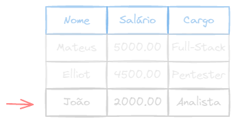


<Tip>
Dependendo da ordem em que os atributos são declarados na tabela, é possível omitir a lista de atributos na instrução `INSERT INTO{:sql}`. Nesse caso, os valores devem ser inseridos na ordem em que os atributos foram declarados na tabela.

Por exemplo, se criarmos a tabela seguindo a ordem nome-salario-cargo:
```sql
CREATE TABLE empregado (
  nome VARCHAR(30),
  salario NUMERIC(8,2),
  cargo VARCHAR(15)
);
```

Poderemos inserir omitindo a lista de atributos, dês de que os valores estejam na ordem correta:
```sql
INSERT INTO empregado VALUES ('João', 2000.00, 'Analista');
```
</Tip>

<Tip>
Mesmo exemplo, porém com uma tabela dentro de um Schema

```sql
INSERT INTO empresa.empregado VALUES ('João', 2000.00, 'Analista');
```
</Tip>

<Warn>
  Para caracteres usamos **aspas simples**!
</Warn>

<Wrong>
```
"Frodo Bolseiro"
```
</Wrong>
<Correct>
```
'Frodo Bolseiro'
```
</Correct>

## Excluir Dados

`DELETE FROM{:sql}` é usado para excluir registros (tupla/linha) de uma tabela (relação).

<Warn>
**Atenção** | `DROP{:sql}` **X** `DELETE{:sql}`
<br/>
`DROP{:sql}` [_Exclui estrutura_](#remover-base-de-dados-db)
`DELETE{:sql}` _Exclui dados_
</Warn>

**Sintaxe:**

```sql
DELETE FROM nome_tabela WHERE condicao;
```

**Exemplo:**

```sql caption="Excluir a peça com o código 200 (toda a linha)"
DELETE FROM peca WHERE cod_peca = 200;
```

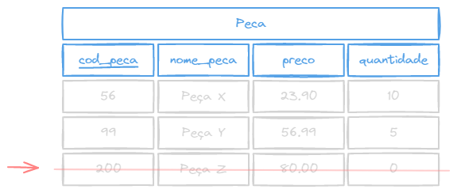
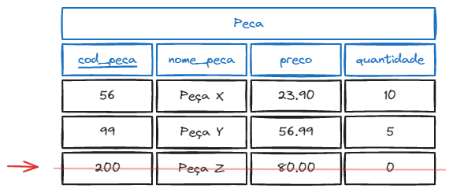

## Atualizar dados

`UPDATE{:sql}`/`SET{:sql}` é usado para atualizar registros existentes em uma tabela. _Quando há mudança de endereço, nome, etc..._

**Sintaxe:**

```sql
UPDATE nome_tabela SET coluna1 = valor1, coluna2 = valor2 WHERE condicao;
```

**Exemplo:**

```sql caption="Alterar o preço da peça de código 200 para 90.00 (antes era 80.00)"
UPDATE peca SET preco = 90.00 WHERE cod_peca = 200;
```

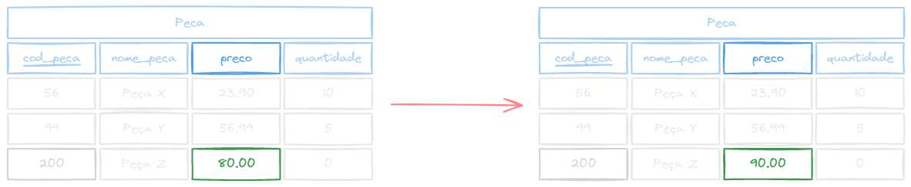


## Selecionar dados

`SELECT{:sql}` é usado para selecionar dados de um banco de dados. A instrução `SELECT{:sql}` é usada para recuperar registros de uma ou mais tabelas.

**Sintaxe:**

```sql
SELECT coluna1, coluna2, ... FROM nome_tabela WHERE condicao;
```

**Exemplo:**

```sql caption="Selecionar o nome e a quantidade de todas as peças que tenham o preço maior que 50"
SELECT nome_peca, quantidade FROM peca WHERE preco > 50;
```
```sql caption="Selectionar todos os dados da tabela peça"
SELECT * FROM peca;
```

<Tip>
O caractere `*{:sql}` é um [_wildcard_ (coringa)](https://pt.wikipedia.org/wiki/Caractere_curinga) usado para selecionar **todos os atributos** de uma tabela.
</Tip>

### Cláusula `WHERE` (condição)

A cláusula `WHERE{:sql}` é usada para **filtrar registros**. A cláusula `WHERE{:sql}` é usada para extrair apenas os registros que atendem a uma **condição específica**.

Usa **conectores lógicos**:
- `AND{:sql}` - E
- `OR{:sql}` - OU
- `NOT{:sql}` - NÃO

Usa **operadores de comparação**:
- `>{:sql}` - Maior
- `<{:sql}` - Menor
- `={:sql}` - Igual
- `<={:sql}` - Menor ou igual
- `>={:sql}` - Maior ou igual
- `!={:sql}` - Diferente (_ou `<>{:sql}`_)
- `BETWEEN{:sql}` - Entre um intervalo (incluindo os extremos). _Facilita a especificação de condições númericas que envolvam um intervalo, ao invés de usar os operadores `<={:sql}` e `>={:sql}`._

#### Exemplos

Iremos fazer algumas operações de **busca** `SELECT{:sql}` usando cláusulas de **condição**/filtro `WHERE{:sql}` na tabela abaixo:

<span className="underline">cod_peca</span> | nome_peca | preco | qtd
---|---|---|---
56 | Peça X | 23.90 | 10
99 | Peça Y | 56.99 | 5
200 | Peça Z | 80.00 | 0

<br/>

**EXEMPLO 1** - Selecionar o código e o nome das peças com o preço menor que $70.00$

```sql
SELECT cod_peca, nome_peca FROM peca WHERE preco < 70.00;
```

_Resultado:_

<span className="underline">cod_peca</span> | nome_peca
---|---
56 | Peça X
99 | Peça Y

<br/>

**EXEMPLO 2** - Selecionar o nome e o preço das peças com preço maior que $50.00$ e menor do que $70.00$

```sql
SELECT nome_peca, preco WHERE preco BETWEEN 50.00 AND 70.00
```

_Resultado:_

nome_peca | preco
---|---
Peça Y | 56.99

<br />

**EXEMPLO 3** - Selecionar todas as informações das peças cuja quantidade em estoque seja maior ou igual a $10$.

```sql
SELECT * FROM peca WHERE qtd >= 10;
```

_Resultado:_

<span className="underline">cod_peca</span> | nome_peca | preco | qtd
---|---|---|---
56 | Peça X | 23.90 | 10

<br/>

**EXEMPLO 4** - Selecionar o código, nome, preço e quantidade de peças no estoque cujo código é $200$.

```sql
SELECT cod_peca, nome_peca, preco, qtd FROM peca WHERE cod_peca = 200;
```

_Resultado:_

<span className="underline">cod_peca</span> | nome_peca | preco | qtd
---|---|---|---
200 | Peça Z | 80.00 | 0

**EXEMPLO 5** - Selecionar o nome e a quantidade de todas as peças que há no estoque.

```sql
SELECT nome_peca, quantidade FROM peca WHERE qtd != 0;
```
_ou..._
```sql
SELECT nome_peca, quantidade FROM peca WHERE qtd <> 0;
```

_Resultado:_

nome_peca | quantidade
---|---
Peça X | 10
Peça Y | 5


### Cláusula `ORDER BY` (ordenação)

A cláusula `ORDER BY{:sql}` é usada para **ordenar o resultado** de uma consulta em ordem crescente ou decrescente. Ela é aplicada somente à operações de **consulta** `SELECT{:sql}`, após a cláusula `WHERE{:sql}`.

Para especificar a forma de ordenação, devemos indicar
- `ASC{:sql}` - Crescente _padrão - default_
- `DESC{:sql}` - Decrescente

**Sintaxe:**

```sql /ORDER BY/#r /ASC/#g /DESC/#b
SELECT coluna1, coluna2, ... FROM nome_tabela WHERE condicao ORDER BY coluna ASC|DESC;
```

**Exemplo:**

```sql /ORDER BY/#r /DESC/#b caption="Selecionar o nome e a quantidade de todas as peças que há no estoque, por ordem descrescente do nome."
SELECT nome_peca, quantidade FROM peca ORDER BY nome_peca DESC;
```

_Resultado:_

nome_peca | quantidade
---|---
Peça Z | 0
Peça Y | 5
Peça X | 10

### Funções de agregação

As funções de agregação são usadas para **calcular** algo a partir de um conjunto de valores. As funções de agregação são usadas com a cláusula `SELECT{:sql}`.

As principais são:
- `COUNT{:sql}` - Conta o número de linhas (tuplas)
- `SUM{:sql}` - Soma os valores da coluna - _apenas em dados numéricos_
- `AVG{:sql}` - Calcula a média dos valores da coluna (_average_[^avg]) - _apenas em dados numéricos_
- `MIN{:sql}` - Retorna o menor valor da coluna
- `MAX{:sql}` - Retorna o maior valor da coluna

[^avg]: _**Average**_ é a palavra em inglês para **média**.

<Warn>
**Atenção** `SUM{:sql}` _é diferente de_ `COUNT{:sql}`
</Warn>

<br/>

**EXEMPLO 1** - Encontrar a soma dos preços de todas as peças, o maior preço, o menor preço e a média dos preços.

```sql
SELECT SUM(preco), MAX(preco), MIN(preco), AVG(preco) FROM peca;
```

_Resultado:_

SUM(preco) | MAX(preco) | MIN(preco) | AVG(preco)
-----------|------------|------------|-----------
160.89     | 80.00      | 23.90      | 53.62999999995

<br/>

**EXEMPLO 2** - Contar o número de peças que há no estoque.

```sql
SELECT COUNT(*) FROM peca;
```
_ou_
```sql
SELECT COUNT(cod_peca) FROM peca;
```

_Resultado:_

| COUNT(*) ||
|----------|-|
| 3        ||

### Cláusula `DISTINCT` (linhas únicas)

Linhas duplicadas podem aparecer nas relações. No caso de desejarmos a eliminação de duplicidade, devemos inserir a palavra `DISTINCT{:sql}` na cláusula `SELECT{:sql}`.

<Warn>
**Observações**
- Funções agregadas normalmente consideram as tuplas duplicadas.
- Não é permitido o uso do `DISTINCT{:sql}` com o `COUNT(*){:sql}`.
- É válido usar o `DISTINCT{:sql}` com `MAX{:sql}` ou `MIN{:sql}`, mesmo não alterando o resultado.
</Warn>

Tabela neste momento:
```sql
SELECT * FROM peca;
```
<span className="underline">cod_peca</span> | nome_peca | preco | qtd
---|---|---|---
1 | Peça A | 15.00 | 10
2 | Peça B | 8.00 | 20
3 | Peça B | 8.00 | 10
4 | Peça A | 8.00 | 30
5 | Peça C | 17.00 | 0
6 | Peça C | 17.00 | <span className="opacity-50">null</span>
7 | Peça A | <span className="opacity-50">null</span> | 15

**Sinatxe:**

```sql
SELECT DISTINCT coluna1, coluna2, ... FROM nome_tabela;
```

**Exemplo:**

_Selecionar o nome de todas as peças, sem o `DISTINCT{:sql}`:_
```sql
SELECT nome_peca FROM peca;
```
| <span className="underline">nome_peca</span> ||
|---|-|
| Peça A |
| Peça B |
| Peça B |
| Peça A |
| Peça C |
| Peça C |
| Peça A |

_Selecionar o nome de todas as peças, com o `DISTINCT{:sql}`:_
```sql /DISTINCT/
SELECT DISTINCT nome_peca FROM peca;
```
| <span className="underline">nome_peca</span> ||
|---|-|
| Peça C |
| Peça A |
| Peça B |

### Cláusula `GROUP BY` (agrupar)

A cláusula `GROUP BY{:sql}` é usada para **agrupar linhas** que possuem o mesmo valor em uma ou mais colunas. É normalmente usada em conjunto com funções de agregação para agrupar os resultados de acordo com um ou mais campos. Desta forma, as funções de agregação será aplicada a **cada grupo**, e não a todas as tuplas.

Tabela neste momento:
```sql
SELECT * FROM peca ORDER BY nome_peca;
```
<span className="underline">cod_peca</span> | nome_peca | preco | qtd | veiculo
---|---|---|---|---
1 | Peça A | 15.00 | 10 | CARRO
2 | Peça B | 8.00 | 20 | MOTO
3 | Peça C | 8.00 | 30 | CAMINHAO
4 | Peça D | 8.00 | 10 | CARRO
5 | Peça E | <span className="opacity-50">null</span> | 15 | CAMINHAO
6 | Peça F | 17.00 | 0 | MOTO
7 | Peça G | 17.00 | <span className="opacity-50">null</span> | CARRO

**Sintaxe:**

```sql
SELECT coluna1, coluna2, ... FROM nome_tabela GROUP BY coluna1, coluna2, ...;
```

<br/>

**EXEMPLO 1** - Selecionar o nome de todas as peças e agrupar por veículo (_contar por grupo_):

```sql
SELECT veiculo, COUNT(1) FROM peca GROUP BY veiculo;
```

_Resultado:_

| veiculo | count |
|---|---|
MOTO | 2
CAMINHAO | 2
CARRO | 3

<br/>

**EXEMPLO 2** - Obter a soma da quantidade de peças por tipo de veículo

```sql
SELECT veiculo, SUM(qtd) FROM peca GROUP BY veiculo;
```

_Resultado:_

| veiculo | sum |
|---|---|
MOTO | 20
CAMINHAO | 45
CARRO | 20

### Cláusula `HAVING` (filtro)

A cláusula `HAVING{:sql}` é usada para **filtrar grupos** de registros que resultam de uma operação de `GROUP BY{:sql}`. A cláusula `HAVING{:sql}` é usada em conjunto com a cláusula `GROUP BY{:sql}`.

**Sintaxe:**

```sql
SELECT coluna1, coluna2, ... FROM nome_tabela GROUP BY coluna1, coluna2, ... HAVING condicao;
```

**EXEMPLO 2** anterior (_alterado_) - Obter a soma da quantidade de peças por tipo de veículo que sejam maiores que 20

```sql /HAVING/
SELECT veiculo, SUM(qtd) FROM peca GROUP BY veiculo HAVING SUM(qtd) > 20;
```

_Resultado:_

| veiculo | sum |
|---|---|
CAMINHAO | 45

### Seleção com Junção

As vezes queremos retornar dados de mais de uma tabela, relacionando os dados de uma tabela com os dados de outra.

Para fazer a junção das tabelas, precisamos definir uma **condição de junção**, na qual os atributos **chave primária** (_primary key_) e **chave estrangeira** (_foreign key_) das relações devem ser relacionados.

**Tabelas de exemplo**

<div className="flex gap-5 flex-wrap">

<u>num_tec</u> | nome | cargo
---|---|---
297 | Marco | Trainee
553 | Hélio | Sênior
062 | Tião | Sênior
718 | Sílvio | Estagiário


<u>num_tecnico</u> | tipo | anos_exp
---|---|---
553 | Secadora | 15
062 | Lavadora | 18
297 | Torradeira | 1
297 | Secadora | 1
718 | Lavadora | 5
062 | Congelador | 10
062 | Secadora | 12


tipo | categoria | taxa
---|---|---
Lavadora | 1 | 20,00
Secadora | 1 | 20,00
Torradeira | 2 | 10,00
Congelador | 1 | 8,00
Batedeira | 2 | 25,00

</div>

**Exemplo 1:** Obter os nomes dos técnicos com experiência em secadora.

_Query_
```sql
SELECT nome FROM tecnicos, experiencia
WHERE num_tec = num_tecnico AND tipo = 'Secadora';
```

_Resultado_
```console
| Nome  |
|-------|
| Hélio |
| Tião  |
```

**Exemplo 2:** Listar o nome dos técnicos e sua experiência em aparelhos da categoria 1

_Query_
```sql
SELECT tecnicos.nome, experiencia.anos_exp, tipos.tipo
FROM tecnicos, tipos, experiencia
WHERE
  tipos.tipo = experiencia.tipo
AND
  experiencia.num_tecnico = tecnicos.num_tec
AND
  tipos.categoria = 1
```

<Tip>
Repare que podemos utilizar a sintaxe `tabela.atributo{:sql}` para especificar de qual tabela estamos selecionando o atributo.

```sql /tecnicos/#b /experiencia/#b /tipos/#b /nome/#g /tipo/#g /categoria/#g /anos_exp/#g /num_tecnico/#g /num_tec/#g caption="Em azul as tabelas e em verde os atributos"
SELECT tecnicos.nome, experiencia.anos_exp, tipos.tipo
FROM tecnicos, tipos, experiencia
WHERE
  tipos.tipo = experiencia.tipo
AND
  experiencia.num_tecnico = tecnicos.num_tec
AND
  tipos.categoria = 1
```
</Tip>

_Resultado_

```console
|  nome  | anos_exp |   tipo    |
|--------|----------|-----------|
| Hélio  |    15    | Secadora  |
| Tião	 |    18    | Lavadora  |
| Marco	 |    1     | Secadora  |
| Sílvio |    5     | Lavadora  |
| Tião	 |    12    | Secadora  |
```

### Uso de aliases (apelido)

_Alias_ são **apelidos** que podemos dar aos atributos na hora de retornar valores no `SELECT{:sql}`, permite associar um "nome de variável" para cada relação, a fim de simplificar comandos SQL, e torna o retorno mais legível.

Para criarmos um _alias_ podemos usar a palavra reservada `AS{:sql}`. Criando um `SELECT{:sql}` com _alias_ temos:

_Alias para tabelas_
```sql /AS/
SELECT T.nome, E.anos_exp, TP.tipo
FROM
  tecnicos AS T,
  tipos AS TP,
  experiencia AS E
WHERE TP.tipo = E.tipo
  AND E.num_tecnico = T.num_tec
  AND TP.categoria = 1;
```

_Alias para atributos_
```sql /AS/
SELECT
  tecnicos.nome AS Tecnico,
  experiencia.anos_exp AS Experiencia,
  tipos.tipo AS Tipo
FROM tecnicos, tipos, experiencia
WHERE tipos.tipo = experiencia.tipo
  AND experiencia.num_tecnico = tecnicos.num_tec
  AND tipos.categoria = 1;
```
```txt
nome | anos_exp | tipo         Tecnico | Experiencia | Tipo
-----|----------|------        --------|-------------|------
 ... |   ...    |  ...           ...   |     ...     |  ...
 ... |   ...    |  ...    ->     ...   |     ...     |  ...
 ... |   ...    |  ...           ...   |     ...     |  ...
 ... |   ...    |  ...           ...   |     ...     |  ...
```


### Limitando o número de linhas

Em alguns casos, é necessário limitar o número de linhas retornadas em uma consulta. Para isso, podemos usar a cláusula `LIMIT{:sql}`.

**Sintaxe:**
```sql
SELECT coluna1, coluna2, ... FROM <tabela> LIMIT <número de linhas>;
```
_Exemplo:_
```sql caption="Selecionar as 5 primeiras peças"
SELECT * FROM peca LIMIT 5;
```

### Pulando linhas

Podemos também pular um número de linhas no início da consulta, usando a cláusula `OFFSET{:sql}`.

**Sintaxe:**
```sql /OFFSET/
SELECT coluna1, coluna2, ... FROM <tabela> OFFSET <número de linhas>;
```
_Exemplo:_
```sql caption="Selecionar as peças, pulando as 3 primeiras"
SELECT * FROM peca ORDER BY nome OFFSET 3;
```

### Comando `LIKE`

Quando desejamos pesquisar uma _substring_ de um texto, podemos usar o comando `LIKE{:sql}` ou `NOT LIKE{:sql}`. Ele é usado para **comparar** um valor de texto com um **padrão**.

Utilizamos o sinal `%{:sql}` para representar **zero ou mais caracteres** e o sinal de `_{:sql}` para representar **um único caractere**.

**Sintaxe:**
```sql
SELECT coluna1, coluna2, ... FROM <tabela> WHERE coluna LIKE <padrão>;
```

**Exemplo**

Imagine que temos a seguinte tabela no banco de dados:

<span className="underline">cod_pessoa</span> | nome | data_nasc | profissao
---|---|---|---
1 | Capitão Jack Sparrow | 1710-01-01 | Comerciante de rum
2 | Anakin Skywalker | 41 ABY | Mestre Jedi
3 | Legolas | 87 - 3ª era | Arqueiro
4 | Elliot Alderson | 1985-09-17 | Engenheiro de segurança
5 | Harvy Specter | 1972-03-12 | Advogado
6 | Anthony Edward Stark | 1970-05-29 | Bilionário, playboy, filantropo
7 | Gustavo Fring | 1958-04-26 | Distribuidor farmacêutico
8 | Batman | 1972-02-19 | Bruce Wayne

E queremos retornar todoas as pessoas que possuem a letra `e` no nome.
```sql
SELECT * FROM pessoa WHERE nome LIKE '%e%';
```

_Resultado:_
```txt
cod_pessoa | nome            | data_nasc    | profissao
-----------|-----------------|--------------|-----------
3          | Legolas         | 87 - 3ª era  | Arqueiro
4          | Elliot          | 1985-09-17   | Engenheiro de segurança
5          | Harvy Specter   | 1972-03-12   | Advogado
```


### Valores condicionais (`CASE`)

O comando `CASE{:sql}` é uma expressão condicional que retorna um valor único com base em uma ou mais condições. Ele é usado para **substituir** valores de uma coluna por outro valor, com base em uma **condição**.

**Sintaxe:**
```sql
SELECT coluna1, coluna2, ...,
  CASE
    WHEN condicao1 THEN valor1
    WHEN condicao2 THEN valor2
    ELSE valor_padrao
  END
FROM <tabela>;
```

_Exemplo_

```sql caption="Selecionar o nome e a idade das pessoas, e classificar a idade em 'Jovem', 'Adulto' ou 'Idoso'"
SELECT
  nome,
  idade,
  CASE
    WHEN idade < 30 THEN 'Jovem'
    WHEN idade < 60 THEN 'Adulto'
    WHEN idade < 200 THEN 'Idoso'
    ELSE 'Imortal'
  END AS faixa_etaria
FROM pessoa;
```
```txt
nome           | idade | faixa_etaria
---------------|-------|-------------
Elliot         | 36    | Adulto
Tony Stark     | 51    | Adulto
Legolas        | 300   | Imortal
Gustavo Fring  | 64    | Idoso
Robbin         | 25    | Jovem
```


### Observações

Uma consulta em SQL pode consistir em até seis cláusulas:

```sql
SELECT [*] [DISTINCT] <lista de atributos> <funções de agregação>
FROM <lista de tabelas>
[WHERE <condição>]
[GROUP BY <lista de atributos para agrupamento>]
[HAVING <condição para agrupamento, aceita funções de agregação>]
[ORDER BY <lista de atributos para ordenação>] [ASC] [DESC]
```

- Apenas as cláusulas `SELECT{:sql}` e `FROM{:sql}` são obrigatórias
- Quando existentes, as cláusulas devem aparecer na ordem específica acima.
- O `ORDER BY{:sql}` só pode ser ultilizado após o último `SELECT{:sql}` (se a linguagem permitir)
- As cláusulas `GROUP BY{:sql}` e `HAVING{:sql}` só podem ser usadas nos comandos `SELECT{:sql}` individuais


## Retornando dados alterados

Em alguns caso, é necessário retornar dados que foram alterados (inseridos, atualizados, deletados). Para isso podemos usar a cláusula `RETURNING{:sql}` ao final da nossa query de alteração.

**Sintaxe:**
```sql /RETURNING/
INSERT INTO <nome da tabela> (...) VALUES (...) RETURNING coluna1, coluna2, ...;
```
_Exemplo:_
```sql caption="Inserir uma nova peça e retornar o código da peça inserida"
INSERT INTO peca (nome_peca, preco, qtd)
VALUES ('Peça H', 10.00, 5)
RETURNING cod_peca;
```
```sql caption="Atualizar o preço da peça de código 200 para 90.00 e retornar o nome da peça"
UPDATE peca SET preco = 90.00
WHERE cod_peca = 200
RETURNING nome_peca;
```
```sql caption="Deletar a peça de código 200 e retornar o nome da peça deletada"
DELETE FROM peca WHERE cod_peca = 200 RETURNING nome_peca;
```

A sintaxe do `RETURNING{:sql}` é a mesma que a do `SELECT{:sql}`, ou seja, podemos retornar qualquer coluna da tabela que foi alterada.

## Valores `NULL` (nulo)

Suponhamos que temos a tabela `Peça` criada anteriormente, estruturada e preenchida da seguinte forma:

Coluna (tupla) | _Data Type_ (Tipo) | _Length/Precision_ (Comprimento) | _Scale_ (Escala) | _Not Null?_ (Não Nulo?) | _Primary Key?_ (Chave Primária?) | _Default_ (Padrão)
---|---|---|---|---|---|---
cod_peca | INTEGER | | | Sim | Sim |
nome_peca | VARCHAR | 30 | | Sim | Não |
preco | NUMERIC | 6 | 2 | Não | Não |
qtd | INTEGER | | | Não | Não | 0

<span className="underline">cod_peca</span> | nome_peca | preco | qtd
---|---|---|---
1 | Peça A | 15.00 | 10
2 | Peça B | 8.00 | 20
3 | Peça C | 8.00 | 30
4 | Peça D | 8.00 | 10

<details>
<summary>Código SQL</summary>

```sql caption="Criação da tabela" showLineNumbers
CREATE TABLE peca (
  cod_peca INTEGER NOT NULL,
  nome_peca VARCHAR(30) NOT NULL,
  preco NUMERIC(6,2),
  qtd INTEGER DEFAULT 0
);
```

```sql caption="Inserção de dados" showLineNumbers
INSERT INTO peca VALUES
  (1, 'Peça A', 15.00, 10),
  (2, 'Peça B', 8.00, 20),
  (3, 'Peça C', 8.00, 30),
  (4, 'Peça D', 8.00, 10);
```

</details>


### Inserindo valores nulos

Quando realizamos um `INSERT{:sql}` e não passamos o campo, o banco de dados vai automaticamente inserir `NULL{:sql}` no valor da célula.

```sql caption="Repare que omitimos a coluna 'preco'"
INSERT INTO peca (cod_peca, nome_peca, qtd) VALUES (5, 'Peça E', 15);
```

_Resultado:_

<span className="underline">cod_peca</span> | nome_peca | preco | qtd
---|---|---|---
1 | Peça A | 15.00 | 10
2 | Peça B | 8.00 | 20
3 | Peça C | 8.00 | 30
4 | Peça D | 8.00 | 10
**5** | **Peça E** | _**`null`**_ | **15**

<Warn>
**Cuidado com o `DEFAULT{:sql}`!**
</Warn>

Lembre-se que colunas que tem o valor `DEFAULT{:sql}` definido, não serão preenchidas com `NULL{:sql}`, mas sim com o valor `DEFAULT{:sql}` especificado no momento da criação da tabela.

```sql
INSERT INTO peca (cod_peca, nome_peca, preco) VALUES (6, 'Peça F', 20.00);
```

_Resultado:_

<span className="underline">cod_peca</span> | nome_peca | preco | qtd
---|---|---|---
1 | Peça A | 15.00 | 10
2 | Peça B | 8.00 | 20
3 | Peça C | 8.00 | 30
4 | Peça D | 8.00 | 10
5 | Peça E | <span className="opacity-50">null</span> | 15
**6** | **Peça F** | **20.00** | **`0`**

Existe um outra forma de definir um valor como `NULL{:sql}`. Deixando explícito no comando `INSERT{:sql}` que a coluna deve receber o valor `NULL{:sql}`.

```sql
INSERT INTO peca (cod_peca, nome_peca, preco, qtd) VALUES (7, 'Peça G', 17.00, NULL);
```

_Resultado:_

<span className="underline">cod_peca</span> | nome_peca | preco | qtd
---|---|---|---
1 | Peça A | 15.00 | 10
2 | Peça B | 8.00 | 20
3 | Peça C | 8.00 | 30
4 | Peça D | 8.00 | 10
5 | Peça E | <span className="opacity-50">null</span> | 15
6 | Peça F | 20.00 | 0
**7** | **Peça G** | **17.00** | <span className="opacity-50 font-bold">null</span>

Repare que mesmo o campo `qtd` possuindo um valor `DEFAULT{:sql}`, foi definido de forma explícita no `INSERT{:sql}` que essa coluna deveria possuir um valor `NULL`.

<Error>
**Atenção!** - Mesmo se você tentar inserir o valor `NULL{:sql}` em uma coluna definida como `NOT NULL{:sql}`, uma exceção (erro) será lançada pelo banco de dados.
</Error>

```sql
INSERT INTO peca (cod_peca, nome_peca, preco, qtd) VALUES (7, NULL, 17.00, 12);
```

_Resultado:_

```output
ERROR:  null value in column "nome_peca" of relation "peca" violates not-null constraint
DETAIL:  Failing row contains (7, null, 17.00, 12).
SQL state: 23502
```

### Selecionando valores nulos

Caso você queira selecionar somente as linhas com valores nulos em uma determinada célula, a forma correta é utilizar o `IS NULL{:sql}`, e não `... = NULL{:sql}`.

```sql /IS/#g caption="Certo"
SELECT * FROM peca WHERE preco IS NULL;
```
```sql /=/#r caption="Errado"
SELECT * FROM peca WHERE preco = NULL;
```

### Selecionando valores não nulos

Caso você queira selecionar apenas as linhas que **não possuem** valores nulos em uma determinada coluna, é só utilizar o c omando `IS NOT NULL{:sql}`.

```sql
SELECT * FROM peca WHERE preco IS NOT NULL;
```

_Resultado:_

<span className="underline">cod_peca</span> | nome_peca | preco | qtd
---|---|---|---
1 | Peça A | 15.00 | 10
2 | Peça B | 8.00 | 20
3 | Peça C | 8.00 | 30
4 | Peça D | 8.00 | 10
6 | Peça F | 20.00 | 0
7 | Peça G | 17.00 | <span className="opacity-50">null</span>

_Repare que a peça de código $5$ não foi incluída no resultado, por possuir o valor `null` na coluna `preco`._

### Ordenando colunas com `NULL`

Por _default_, caso você ordene um `SELECT{:sql}` por uma coluna que possui células com valor `NULL{:sql}`, essas células serão as **últimas** a serem retornadas.

```sql
SELECT * FROM peca ORDER BY preco;
```

_Resultado:_

<span className="underline">cod_peca</span> | nome_peca | preco | qtd
---|---|---|---
4 | Peça D | 8.00 | 10
2 | Peça B | 8.00 | 20
3 | Peça C | 8.00 | 30
1 | Peça A | 15.00 | 10
6 | Peça F | 20.00 | 0
7 | Peça G | 17.00 | <span className="opacity-50">null</span>
5 | Peça E | <span className="opacity-50">null</span> | 15

Caso você deseje que as células com valores `NULL{:sql}` sejam as primeiras a serem retornadas no `SELECT{:sql}`, utilizamos o `ORDER BY ... NULLS FIRST{:sql}`.

```sql
SELECT * FROM peca ORDER BY preco NULLS FIRST;
```

_Resultado:_

<span className="underline">cod_peca</span> | nome_peca | preco | qtd
---|---|---|---
5 | Peça E | <span className="opacity-50">null</span> | 15
2 | Peça B | 8.00 | 20
3 | Peça C | 8.00 | 30
4 | Peça D | 8.00 | 10
1 | Peça A | 15.00 | 10
6 | Peça F | 20.00 | 0
7 | Peça G | 17.00 | <span className="opacity-50">null</span>

### Substituindo valores nulos

Em alguns casos é necessário substituir os valores `NULL{:sql}` por outro valor, quando usarmos o `SELECT{:sql}` ou o `RETURNIG{:sql}`. Para isso, podemos usar a função `COALESCE{:sql}`.

**Sintaxe**
```sql
SELECT COALESCE(<coluna>, <valor substituido>) FROM <tabela>;
```

_Exemplo:_
```sql title="Sem substituição"
SELECT codigo, telefone FROM professor;
```
```txt caption="Saída do código anterior"
| codigo | telefone |
|--------|----------|
|   1    | 37999999 |
|   2    | [null]   |
```

```sql title="Com substituição"
SELECT codigo, COALESCE(telefone, 'NÃO CADASTRADO') FROM professor;
```
```txt caption="Saída do código anterior"
| codigo | telefone       |
|--------|----------------|
|   1    | 37999999       |
|   2    | NÃO CADASTRADO |

```

## Junções (Comando `JOIN`)

Junção é a possibilidade de se criar relacionamentos entre tabelas, de forma a poder recuperar dados de mais de uma tabela em uma única consulta. Um jeito melhor e nativo de se juntar mais de uma tabela, diferente do método apresentado no capítulo [Seleção com Junção](#seleção-com-junção).

Isso é possível atravez do comando `JOIN{:sql}` (_junção_), que é usado para combinar linhas de duas ou mais tabelas com base em uma relação entre elas, e recuperando esses dados usando apenas um `SELECT{:sql}`.

É importante utilizá-lo, porque tira da cláusula `WHERE{:sql}` condições que são estritamente das junções (chave primária igual a chave estrangeira, por exemplo).

Existem as variações de junções **internas** e **externas**.

**Internas**: `INNER JOIN{:sql}` e `NATURAL JOIN{:sql}`
**Externas**: `OUTER JOIN{:sql}` (_`LEFT{:sql}`, `RIGHT{:sql}`, `FULL{:sql}`_)


**Como funciona o comando `JOIN{:sql}`?**

Quando um comando `SELECT{:sql}` especifica campos de duas tabelas **sem nenhumas restrição ou filtro**, o resultado será um número de linhas iguais à multiplicação do total de linhas da primeira tabela ($N$) pela segunda tabela ($M$), ou seja $M\times N$.

Isso ocorre devido ao fato de que, para cada linha da primeira tabela, todas as linhas da segunda são processadas. Operações de junção toma duas relações, e têm como resultado uma outra relação.

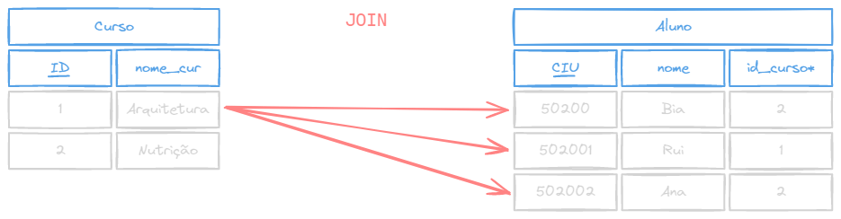
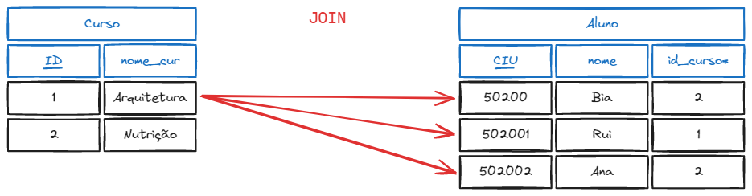

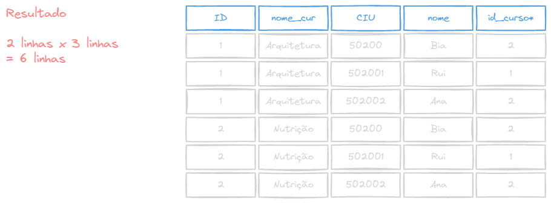
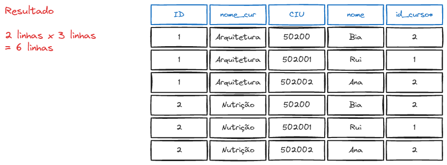


Porém, o benefício do `JOIN{:sql}` só será sentido quando as chaves $PK$ e $FK$ forem equivalentes, ou seja, $id = id\_curso$, usando a palavra reservada `ON{:sql}` (_será explicado mais a frente_).

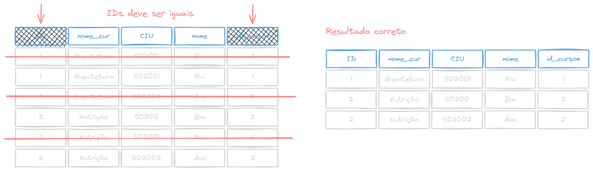


A operção de junção tem algumas variantes, e cada uma dessas variações consiste em um _tipo de junção_ e uma _condição de junção_.

**Sintaxe**

```sql
SELECT coluna1, coluna2, ...
FROM tabela1 <tipo> JOIN tabela2
ON <condição>;
```

_Exemplo_
```sql
SELECT nome, nasc, experiencia
FROM tecnicos INNER JOIN experiencia
ON tecnicos.num_tec = experiencia.num_tecnico;
```

**TIPO DE JUNÇÃO** (`INNER{:sql}` ou `OUTER{:sql}`)
Define como as tuplas em cada relação que não possuam nenhuma conrrespondência com as tuplas da outra relação deve ser tratadas.

**CONDIÇAO DE JUNÇAO** (`ON{:sql}`)
Definem quais tuplas das duas relações apresentam correspondência e quais atributos são apresentados de uma junção.

### `INNER JOIN`

O `INNER JOIN{:sql}` (Ou somente `JOIN{:sql}`) é uma **junção interna**, que junta os registros de uma tabela que tiver um **correspondente** na outra tabela, através da chave primária e estrangeira.

Por exemplo, a tabela abaixo é resultado de um `JOIN{:sql}` de 2 outras tabelas. A segunda tabela possui chaves estrangeiras apontando para valores nulos, e a primeira possui tuplas sem conrrespondência na segunda tabela. O resultado do `INNER JOIN{:sql}` será apenas as linhas que possuem corrêspondência nas duas tabelas:

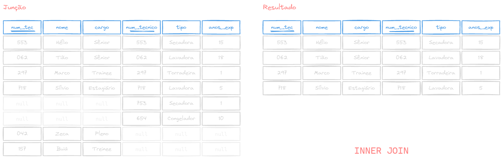
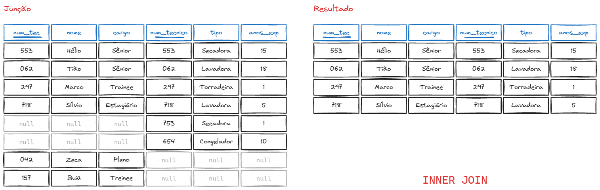

**Sintaxe**
```sql
SELECT coluna1, coluna2, ...
FROM (tabela1 INNER JOIN tabela2
      ON tabela1.chave_primaria = tabela2.chave_estrangeira);
```

<Tip>
A palavra `INNER{:sql}` pode ser omitida

```sql
SELECT coluna1, coluna2, ...
FROM (tabela1 JOIN tabela2
      ON tabela1.chave_primaria = tabela2.chave_estrangeira);
```
</Tip>

#### Usando o `INNER JOIN` com 2 tabelas

**Exemplo**: Liste o nome dos técnicos que possuem experiência em Lavadora

_Tabelas_

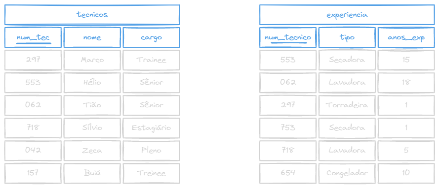
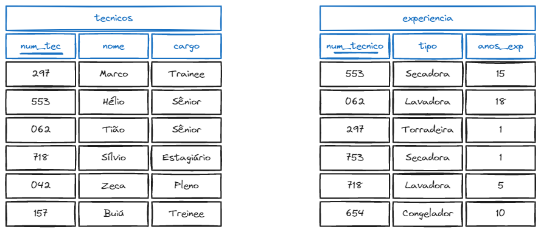

_Query_
```sql
SELECT nome
FROM (tecnicos INNER JOIN experiencia
      ON tecnicos.num_tec = experiencia.num_tecnico)
WHERE experiencia.tipo = 'Lavadora';
```

_Resultado_


#### Usando o `INNER JOIN` com 3 tabelas

**Exemplo**: Liste o nome dos técnicos e sua experiência em aparelhos da categoria 1

_Tabelas_
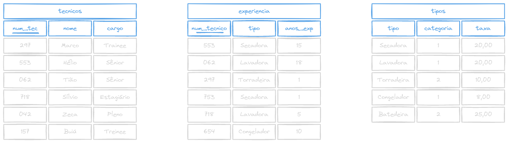
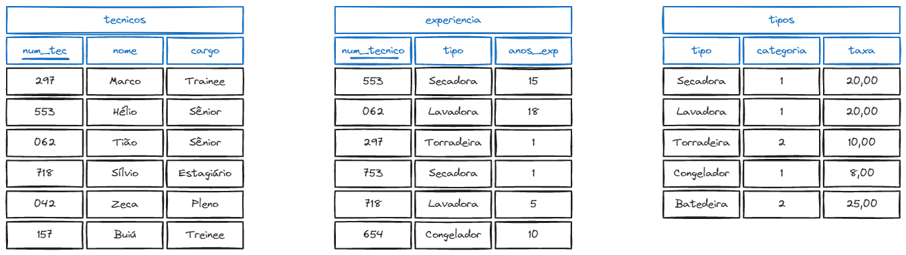

_Query_
```sql
SELECT nome, anos_exp
FROM ((tecnicos INNER JOIN experiencia
       ON num_tec = num_tecnico) INNER JOIN Tipos
       ON tipo = tipo)
WHERE categoria = 1;
```

_Resultado_
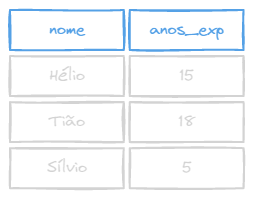
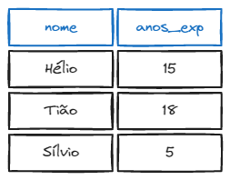


### `NATURAL JOIN`

Com ele você não precisa identificar quais colunas serão comparadas, pois ele fará a comparação entre **campos com o mesmo nome**.

**Sintaxe**

```sql
SELECT coluna1, coluna2...
FROM tabela1 NATURAL JOIN tabela2;
```

_Exemplo_

```sql
SELECT * FROM (tecnicos NATURAL JOIN experiencia);
```

Repare que não precisamos passar a condição de junção com `ON{:sql}`, já que ambas as tabelas possuem a coluna `tipo`.


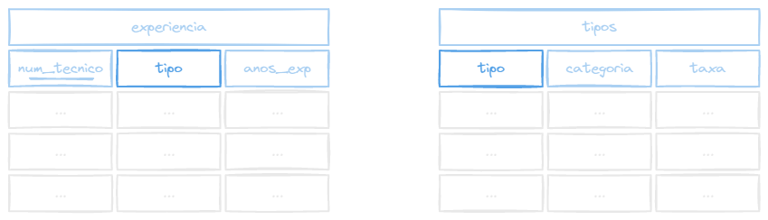
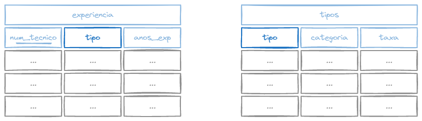

O mesmo não da pra ser feito entre as tabelas `tecnicos` e `tipos`, pois **não possuem** colunas com o mesmo nome.

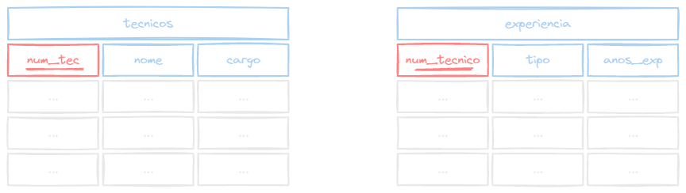
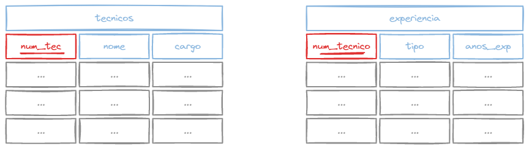

### `OUTER JOIN`

O `OUTER JOIN{:sql}` é a variação de junção **externa**, e é composto por 3 tipos:
- `LEFT OUTER JOIN{:sql}`
- `RIGHT OUTER JOIN{:sql}`
- `FULL OUTER JOIN{:sql}`

<Tip>
A palavra `OUTER{:sql}` pode ser omitida em todos os 3 tipos
</Tip>

Diferente das junções **internas**, como o `INNER JOIN{:sql}`, as junções **externas** podem retornar valores mesmo quando não há conrrespondência entre as tabelas (valores `NULL{:sql}`).

#### `LEFT OUTER JOIN`

No `LEFT OUTER JOIN{:sql}` (ou simplesmente `LEFT JOIN{:sql}`), a prioridade é da tabela da **esquerda**, isto é, todos os registros da primeira tabela serão mostrados independente se houver correspondente nas outra tabela, após a equivalência das chaves usando o `ON{:sql}`.

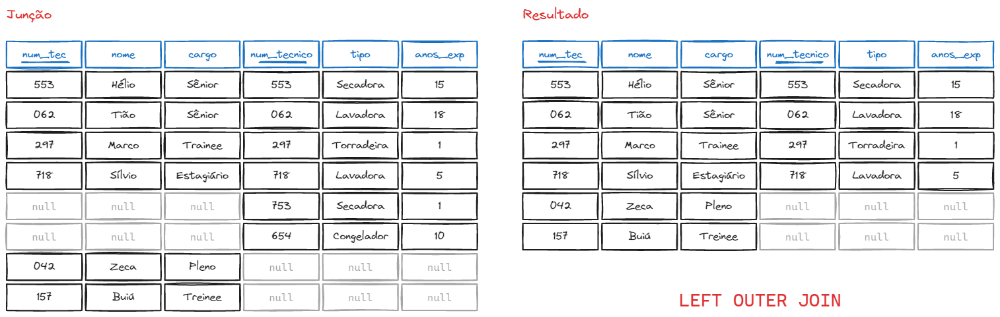
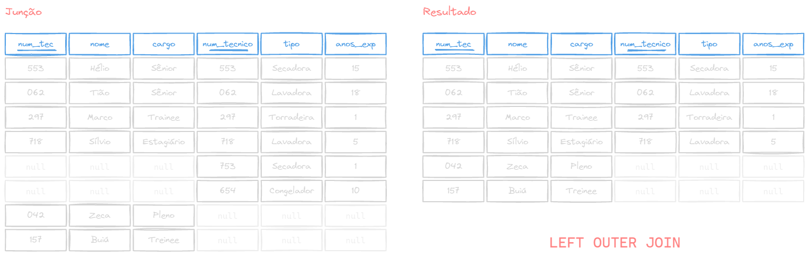

**Sintaxe**

```sql
SELECT coluna1, coluna2...
FROM tabela1 LEFT OUTER JOIN tabela2;
```

_Exemplo_

```sql
SELECT * FROM (tecnicos LEFT OUTER JOIN experiencia);
```

#### `RIGHT OUTER JOIN`

No `RIGHT OUTER JOIN{:sql}` (ou simplesmente `RIGHT JOIN{:sql}`), a prioridade é da tabela da **direita**, isto é, todos os registros da segunda tabela serão mostrados independente se houver correspondente na outra tabela.

Pega todos os atributos da relação que está à direita, verifica se existe algum correspondente à esquerda, caso afirmativo, retorna os atributos da esquerda, e caso negativo, coloca o valor nulo nos atributos.

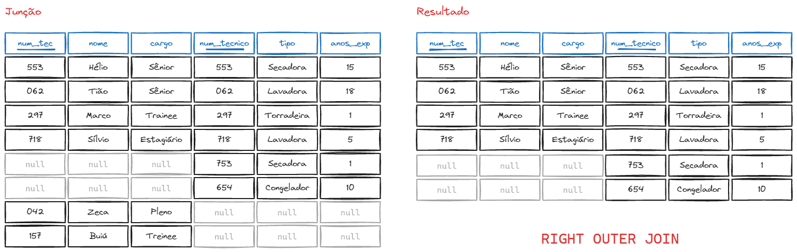


**Sintaxe**

```sql
SELECT coluna1, coluna2...
FROM tabela1 RIGHT OUTER JOIN tabela2;
```

_Exemplo_

```sql
SELECT * FROM (tecnicos RIGHT OUTER JOIN experiencia);
```

#### `FULL OUTER JOIN`

Faz o `RIGHT{:sql}` e o `LEFT{:sql}` ao mesmo tempo, ou seja, vai retornar dados que não tem em comum nas duas tabelas, e não só na tabela da direita ou da esquerda.

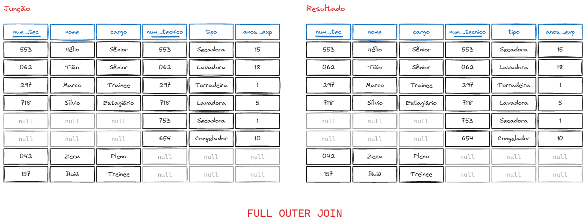
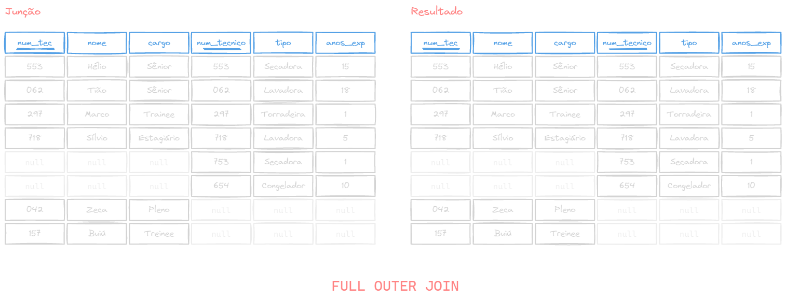

**Sintaxe**

```sql
SELECT coluna1, coluna2...
FROM tabela1 FULL OUTER JOIN tabela2;
```

_Exemplo_

```sql
SELECT * FROM (tecnicos FULL OUTER JOIN experiencia);
```

## Funções Matemáticas

Função | Descrição | Exemplo
---|---|---
`ABS(x){:sql}` | Retorna o valor absoluto de $x$ | `ABS(-5)` retorna `5`
`ROUND(x){:sql}` | Retorna $x$ arredondado | `ROUND(5.5)` retorna `6`
`ROUND(x, d){:sql}` | Retorna $x$ arredondado para $d$ casas decimais | `ROUND(5.3, 0)` retorna `5`
`CEIL(x){:sql}` | Retorna o menor número inteiro maior ou igual a $x$ | `CEIL(5.3)` retorna `6`
`FLOOR(x){:sql}` | Retorna o maior número inteiro menor ou igual a $x$ | `FLOOR(5.3)` retorna `5`
`FACTORIAL(x){:sql}` | Retorna o fatorial de $x$ | `FACTORIAL(5)` retorna `120`
`TRUNC(x, d){:sql}` | Retorna $x$ truncado para $d$ casas decimais | `TRUNC(5.3, 0)` retorna `5`
`MOD(x, y){:sql}` | Retorna o resto da divisão de $x$ por $y$ | `MOD(5, 2)` retorna `1`
`PI(){:sql}` | Retorna o valor de $\pi$ | `PI()` retorna `3.141592653589793`
`LOG(x){:sql}` | Retorna o logaritmo natural de $x$ | `LOG(10)` retorna `2.302585092994046`
`RANDOM(){:sql}` | Retorna um número aleatório entre 0 e 1 | `RANDOM()` retornar algo como `0.123456789`

<Tip>
_Consulte a [documentação oficial](https://www.postgresql.org/docs/8.1/functions-math.html) do PostgreSQL para mais funções._
</Tip>

## Funções de String

Função | Descrição | Exemplo
---|---|---
`CHARACTER_LENGTH(string){:sql}` ou `CHAR_LENGHT(string){:sql}` | Retorna o número de caracteres em `string{:sql}` | `CHARACTER_LENGTH('Hello'){:sql}` retorna `5`
`LOWER(string){:sql}` | Retorna `string` em minúsculo | `LOWER('Hello'){:sql}` retorna `hello`
`UPPER(string){:sql}` | Retorna `string` em maiúsculo | `UPPER('Hello'){:sql}` retorna `HELLO`
`POSITION(substring IN string){:sql}` | Retorna a posição da primeira ocorrência de `substring` em `string` | `POSITION('l' IN 'Hello'){:sql}` retorna `3`
`SUBSTRING(string FROM start FOR length){:sql}` | Retorna uma parte de `string`, onde `start` determina a posicão do primeiro caractere e `length` determina quantos caracteres serão usados apartir de `start` | `SUBSTRING('Hello' FROM 2 FOR 3){:sql}` retorna `ell`
`CONCAT(string1, string2, ...){:sql}` | Concatena `string1`, `string2` e outras _strings_ posteriores | `CONCAT('Hello', ' ', 'World'){:sql}` retorna `Hello World`

<Tip>
_Consulte a [documentação oficial](https://www.postgresql.org/docs/9.1/functions-string.html) do PostgreSQL para mais funções._
</Tip>

## Conversão de dados

Existem alguns métodos para se converter um tipo de um dado em outro. O mais comum é utilizando a função `CAST{:sql}`, que converte um valor de um tipo de dado para outro.

**Sinatxe**
```sql
CAST(valor AS tipo_de_dado);
```

Onde `valor` é o valor que será convertido e `tipo_de_dado` é o tipo para o qual o valor será convertido. Exemplo:

```sql
CAST('5' AS NUMERIC);
```

_Repare que no exemplo acima, `'5'` está como string por causa das aspas simples `'`, e queremos converter para um inteiro._

O mesmo pode ser feito utilizando a sintaxe `valor::tipo{:sql}`, onde `valor` é o valor que será convertido e `tipo` é o tipo para o qual o valor será convertido. Exemplo:

```sql
5::TEXT;
```

_Aqui, `5` está como inteiro, e estamos convertendo para o formato texto (string)._

### Formato de dados

```txt caption="Converte um timestamp para string de acordo com um formato"
to_char ( timestamp, formato ) → texto
to_char ( timestamp com fuzo horário, formato ) → texto

to_char(timestamp '2002-04-20 17:31:12.66', 'HH12:MI:SS') → 05:31:12
```

```txt caption="Converte um intervalo para string de acordo com um formato"
to_char ( intervalor, formato ) → texto

to_char(interval '15h 2m 12s', 'HH24:MI:SS') → 15:02:12
```

```txt caption="Converte um número para string de acordo com um formato, disponível pra inteiros, bigint, numeric, real e double precision."
to_char ( numeric_type, text ) → text

to_char(125, '999') → 125
to_char(125.8::real, '999D9') → 125.8
to_char(-125.8, '999D99S') → 125.80-
```

```txt caption="Converte um número para string de acordo com um formato, disponível pra inteiros, bigint, numeric, real e double precision."
to_char ( numeric_type, text ) → text

to_char(125, '999') → 125
to_char(125.8::real, '999D9') → 125.8
to_char(-125.8, '999D99S') → 125.80-
```

```txt caption="Converte um texto para data de acordo com um formato"
to_date ( texto, data ) → data

to_date('05 Dec 2000', 'DD Mon YYYY') → 2000-12-05
```

```txt caption="Converte um texto para numero de acordo com um formato"
to_number ( texto, formato ) → numero

to_number('12,454.8-', '99G999D9S') → -12454.8
```

```txt caption="Converte um texto em um timestamp de acordo com um formato"
to_timestamp ( texto, formato ) → timestamp com fuso horário

to_timestamp('05 Dec 2000', 'DD Mon YYYY') → 2000-12-05 00:00:00-05
```


<Tip>
_Consulte a [documentação oficial](https://www.postgresql.org/docs/current/functions-formatting.html) do PostgreSQL para ver a tabela de template de formatos._
</Tip>
