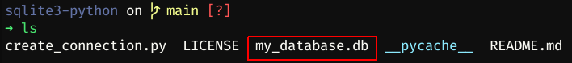
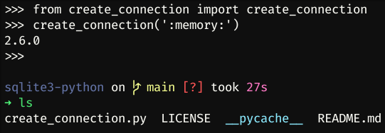
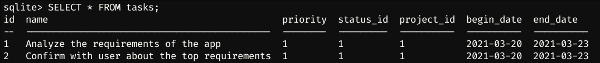

## Connection

First, we need to create a connection with database:

```python
import sqlite3
from sqlite3 import Error

def create_connection(db_file):
  '''Create a database connection to a SQLite database'''

  conn = None

  try:
    conn = sqlite3.connect(db_file)
    print(sqlite3.version)
  except Error as e:
    print(e)
  finally:
    if conn:
    conn.close()
```

To create a connection, it's needed to invoke the function `connect()` from `sqlite3`, and save it in a variable.
In this case the connection was saved in `conn`, this variable will receive all the queries.

After running this on python3 interactive shell we will receive the version of sqlite library and the database will be generated:

`$ python3`

```
>>> from create_connection import create_connection
>>> create_connection('my_database.db')
2.6.0
>>>
```



If you pass file name as ':memory:', the database will be saved on the memory of computer:



## Refactor 1

Before of all, lets create a class where will contain all the methods:

`db_manager.py`

```python
class DB_Manager:
  def __init__(self):
    self.conn = None

  def create_connection(self, db_file="database.db"):
    try:
      self.conn = sqlite3.connect(db_file)
    except Error as e:
      print(e)
```

## Create tables

let's add the function `create_table()` to the class:

```python
def create_table(self, create_table_sql):
  """ create a table from the create_table_sql statement
  :param conn: Connection object
  :param create_table_sql: a CREATE TABLE statement
  :return:
  """

  try:
    c = self.conn.cursor()
    c.execute(create_table_sql)
  except Error as e:
    print(e)

```

With the `DB_Manager`, let's run the Python Interactive Shell:

```bash
$ python3
```

Let's import the `DB_Manager`:

```python
>>> from db_manager import DB_manager
```

then declare the variable containing the database name:

```python
>>> database = 'pythonsqlite.db'
```

then, declare the variable containing the SQL statement of project table and the task table:

```python
>>> sql_create_projects_table = """ CREATE TABLE IF NOT EXISTS projects (
                                      id integer PRIMARY KEY,
                                      name text NOT NULL,
                                      begin_date text,
                                      end_date text
                                    ); """
>>> sql_create_tasks_table = """ CREATE TABLE IF NOT EXISTS tasks (
                                  id integer PRIMARY KEY,
                                  name text NOT NULL,
                                  priority integer,
                                  status_id integer NOT NULL,
                                  project_id integer NOT NULL,
                                  begin_date text NOT NULL,
                                  end_date text NOT NULL,
                                  FOREIGN KEY (project_id) REFERENCES projects (id)
                                ); """
```

then, we will instantiate the `DB_Manager` and create the connection:

```python
>>> db_manager = DB_Manager()
>>> db_manager.create_connection()
```

after, let's create the tables:

```python
>>> if db_manager.conn is not None:
        # create projects table
        db_manager.create_table(sql_create_projects_table)

        # create tasks table
        db_manager.create_table(sql_create_tasks_table)
    else:
        print("Error! cannot create the database connection.")
```

If we run `ls` we will see that `database.db` was created:


Now we can use the command `sqlite3` passing our database as a param, then, run the `.tables` command to see the tables that we created:


## Refactor 2

First, let's write the connection and the insert statement as a hard code on `__init__` function:

```python
# ...code

  def __init__(self, db_file="database.db"):
    try:
      # create connection
      self.conn = sqlite3.connect(db_file)
    except Error as e:
      print(e)

    # create projects table
    self.create_table(""" CREATE TABLE IF NOT EXISTS projects (
                            id integer PRIMARY KEY,
                            name text NOT NULL,
                            begin_date text,
                            end_date text
                          );
                      """)

    # create tasks table
    self.create_table(""" CREATE TABLE IF NOT EXISTS tasks (
                            id integer PRIMARY KEY,
                            name text NOT NULL,
                            priority integer,
                            status_id integer NOT NULL,
                            project_id integer NOT NULL,
                            begin_date text NOT NULL,
                            end_date text NOT NULL,
                            FOREIGN KEY (project_id) REFERENCES projects (id)
                          );
                      """)


# code...
```

Then, delete the `create_connection` function.

## Insert Data

To add data to the tables, we need the function `execute` of the `Cursor` object. The `execute` function receive two params, the sql statement and a tuple with the data, after this, we need to run the `commit` function of the connection, something like this:

```python
cur = conn.cursor()
cur.execute(sql, data)
conn.commit()
```

Let's create the function to add data on projects table and the tasks tables with this logic:

```python
# ...code

def create_project(self, project):
  """ create new project into the project table
  :param conn:
  :param project:
  :return: project id
  """

  sql = ''' INSERT INTO projects(name, begin_date, end_date)
  VALUES(?,?,?) '''

  cur = self.conn.cursor()

  cur.execute(sql, project)
  self.conn.commit()

  return cur.lastrowid

def create_task(self, task):
  """ create new task
  :param conn:
  :param task:
  :return:
  """

  slq = ''' INSERT INTO tasks(name, priority, status_id, project_id, begin_date, end_date)
  VALUES(?,?,?,?,?,?)'''

  cur = self.conn.cursor()

  cur.execute(slq, task)
  self.conn.commit()

  return cur.lastrowid


# code...
```

Running the python3 interactive shell, import the class and instantiate it in the `db_manager` variable:

```python
>>> from db_manager import DB_Manager
>>> db_manager = DB_Manager()
```

after that, create the variable containing the project data, and a variable to save the project id on database:

```python
>>> project = ('Cool App with SQLite & Python', '2021-03-20', '2021-03-23')
>>> project_id = db_manager.create_project(project)
```

then, create two tasks and save it on the database:

```python
>>> task_1 = ('Analyze the requirements of the app', 1, 1, project_id, '2021-03-20', '2021-03-23')
>>> task_2 = ('Confirm with user about the top requirements', 1, 1, project_id, '2021-03-20', '2021-03-23')
>>> db_manager.create_task(task_1)
1
>>> db_manager.create_task(task_2)
2
```

The project and the tasks are saved now. Open the database to see the data.

With the open database, use this commands to format the output:

```bash
sqlite> .header on
sqlite> .mode column
```

Use the `SELECT` statement to get data from `projects` table:

```sql
SELECT * FROM projects;
```


Use the same statement to get data from `tasks` table:

```sql
SELECT * FROM tasks;
```



---

## referencies:

SQLite Python: [https://www.sqlitetutorial.net/sqlite-python/](https://www.sqlitetutorial.net/sqlite-python/) [[_archive_](https://web.archive.org/web/20210922122212/https://www.sqlitetutorial.net/sqlite-python/)]

- Creating a New Database: [https://www.sqlitetutorial.net/sqlite-python/creating-database/](https://www.sqlitetutorial.net/sqlite-python/creating-database/) [[_archive_](https://web.archive.org/web/20210922122523/https://www.sqlitetutorial.net/sqlite-python/creating-database/)]
- Creating Tables: [https://www.sqlitetutorial.net/sqlite-python/create-tables/](https://www.sqlitetutorial.net/sqlite-python/create-tables/) [[_archive_](https://web.archive.org/web/20210922122450/https://www.sqlitetutorial.net/sqlite-python/create-tables/)]
- Insert data: [https://www.sqlitetutorial.net/sqlite-python/insert/](https://www.sqlitetutorial.net/sqlite-python/insert/) [[_archive_](https://web.archive.org/web/20210922122231/https://www.sqlitetutorial.net/sqlite-python/insert/)]
