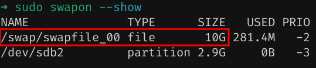

# Introdução

O Linux divide sua RAM física (memória de acesso aleatório) em pedaços de memória chamados páginas. _Swapping_, ou troca, é o processo pelo qual uma página de memória é copiada para o espaço pré-configurado no disco rígido, chamado espaço swap ou espaço de troca ou swap space, para liberar essa página de memória. Os tamanhos combinados da memória física e do espaço swap são a quantidade de memória virtual disponível.

Os usuários podem criar um espaço swap durante a instalação ou em qualquer momento posterior, conforme desejado. O espaço swap pode ser usado para duas finalidades, estender a memória virtual além da memória física instalada (RAM), também conhecido como "ativar swap", e também para suporte de suspensão para disco.

Veja [esse artigo](https://wiki.archlinux.org/title/Swap_(Português)) no Arch Wiki para informações mais detalhadas.

# How To

O btrf só comessou a suportar a utilização de swap files apartir do kernel 5.0.0, e exige alguns comandos extras:

Primeiro vamos criar um diretório _"non-snapshotted"_ na raiz do sistema, onde estará nossos swap files
```console
sudo btrfs subvolume create /swap
```

Agora vamos criar o swap file em si, com o comando próprio do btrfs, já passando o tamanho que queremos alocar:
```console
sudo btrfs filesystem mkswapfile --size 10g --uuid clear /swap/swapfile
```
_note em que estou criando um arquivo de **10 gigabytes** em `10g`, mas você pode passar o tamanho que quiser. Se `--size` for omitido, será criado um arquivo de 2GiB por padrão._

Depois de criado, vamos ativar o swap file com o comando padrão `swapon`:
```console
sudo swapon /swap/swapfile
```

Para vermos se o swap que criamos está ativado. basta rodar o comando:
```console
sudo swapon --show
```


Com o swap file criado e ativado, basta adicionarmos a configuração no arquivo `fstab` para que o sistema use-o automaticamente quado reiniciar:
```bash title="/etc/fstab"
/swap/swapfile none swap defaults 0 0
```

---

# Referências

How to Create a Linux Swap File: [https://phoenixnap.com/kb/linux-swap-file](https://phoenixnap.com/kb/linux-swap-file) [[_archive_](https://web.archive.org/web/20230613132919/https://phoenixnap.com/kb/linux-swap-file)]

Create a Linux Swap File: [https://linuxize.com/post/create-a-linux-swap-file/](https://linuxize.com/post/create-a-linux-swap-file/) [[_archive_](https://web.archive.org/web/20230613133106/https://linuxize.com/post/create-a-linux-swap-file/)]

Swap file vs swap partition ? when to use what ? any disadvantages or advantage …: [https://kodekloud.com/community/t/swap-file-vs-swap-partition-when-to-use-what-any-disadvantages-or-advantage/146383](https://kodekloud.com/community/t/swap-file-vs-swap-partition-when-to-use-what-any-disadvantages-or-advantage/146383) [[_archive_](https://web.archive.org/web/20230613133939/https://kodekloud.com/community/t/swap-file-vs-swap-partition-when-to-use-what-any-disadvantages-or-advantage/146383)]

Btrfs - ArchWiki: [https://wiki.archlinux.org/title/Btrfs#Swap_file](https://wiki.archlinux.org/title/Btrfs#Swap_file) [[_archive_](https://web.archive.org/web/20230613134129/https://wiki.archlinux.org/title/Btrfs)]

btrfs(5) - Arch manual pages: [https://man.archlinux.org/man/btrfs.5#SWAPFILE_SUPPORT](https://man.archlinux.org/man/btrfs.5#SWAPFILE_SUPPORT) [[_archive_](https://web.archive.org/web/20230613134710/https://man.archlinux.org/man/btrfs.5)]

Swap (Português): [https://wiki.archlinux.org/title/Swap_(Portugu%C3%AAs)](https://wiki.archlinux.org/title/Swap_(Portugu%C3%AAs)) [[_archive_](https://web.archive.org/web/20230616141949/https://wiki.archlinux.org/title/Swap_%28Portugu%C3%AAs%29)]
