# Introdução

## O GPG

O GPG é um programa de linha de comando que possibilita encriptar mensagens e arquivos usando um sistema de chaves assimétricas. Segundo o site do próprio GPG:

> GnuPG is a complete and free implementation of the OpenPGP standard as defined by [RFC4880](https://www.ietf.org/rfc/rfc4880.txt) (also known as*PGP*). GnuPG allows you to encrypt and sign your data and communications; it features a versatile key management system, along with access modules for all kinds of public key directories. GnuPG, also known as*GPG*, is a command line tool with features for easy integration with other applications.

Para entender a diferença de PGP e GPG, veja [esse artigo](https://mfg-b.vercel.app/knowledge/difference-between-pgp-and-gpg).

O GPG usa um sistema de chave publica/privada, que possibilita encriptar mensagens e arquivos, e assinar os mesmos.

## Criptografia assimétrica x simétrica

Na criptografia simétrica, a chave que usamos para criptografar é a mesma usada para descriptografar. O problema disso, é que a chave precisa ser passada para o destinatário da mensagem criptografada, oque corre o risco de ser interceptada, se tornando inútil a criptografia, visto que o interceptador tem acesso tanto a mensagem quanto a chave que vai descriptografa-la.

Na criptografia assimétrica, a chave que usamos para criptografar será diferente da que usamos para criptografar. Neste caso o destinatário só terá que enviar sua chave pública para o remetente criptografar a mensagem usando a mesma, esta mensagem só poderá ser descriptografada usando a chave privada do destinatário, chave essa que não será enviada na transação, não correndo o risco de ser interceptada.

# Ambiente

- **OS**: _Parrot OS 4.11 x86_64_
- **Kernel**: _5.10.0-8parrot1-amd64_
- **Shell**: _ZSH 5.8_
- **gpg (GnuPG)**: _2.2.27_

## Instalação

O GnuPG pode ser baixado nesta página: https://gnupg.org/download/index.html

No caso de sistemas baseados em Debian, que usa o gerenciador de pacotes APT, é só rodar o seguinte comando no terminal:

```bash
$ sudo apt install gnupg
```

Existe também uma lista de front-ends do gpg com interface gráfica no site do GnuPG: https://www.gnupg.org/software/frontends.html

# Criptografia Simétrica

O foco da criptografia PGP, é a criptografia assimétrica, mas o GnuPG também tem a opção de criptografar algo usando apenas a criptografia assimétrica.

## Encrypt

Primeiro vamos criar um arquivo chamado `mensagem.txt`, com a mensagem "Mensagem super secreta". Nós queremos proteger essa mensagem, para que ninguém que possua a chave possa ter acesso a esta mensagem. Para criptografar a mensagem basta usar a opção `--symmetric` e o nome do arquivo:

```bash
$ gpg --symmetric mensagem.txt
```

O software pedirá para que você digite a senha a ser usada, neste caso estou usando a senha `123456`.

Note que foi criado um arquivo com a extensão `.gpg` (`mensagem.txt.gpg`), esse arquivo é o arquivo criptografado, agora é só deletar o arquivo original, e ficar apenas com o arquivo criptografado.

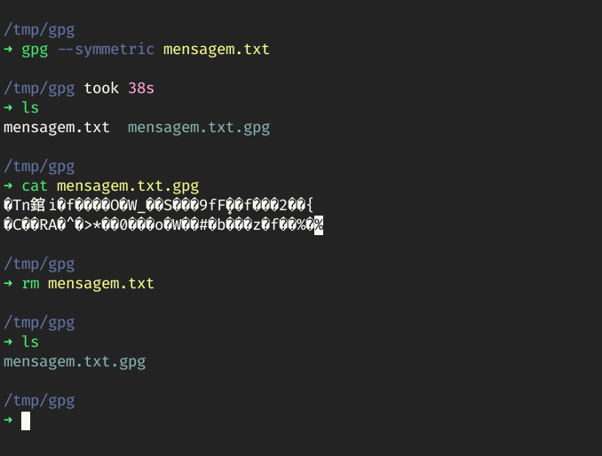

## Decrypt

Para descriptografar a mensagem, usamos o seguinte comando:

```bash
$ pgp --output mensagem.txt --decrypt mensagem.txt.gpg
```

Opções:

- `--output [arquivo]`: _Define o arquivo de saída a partir do arquivo criptografado._
- `--decrypt [arquivo]`: _Define o arquivo a ser descriptografado._

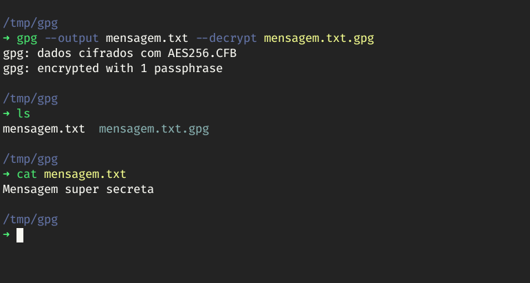

# Criptografia Assimétrica

Como já citado, a criptografia assimétrica usa um conceito de chave pública-privada, então para usarmos essa categoria de criptografia precisamos primeiro criar nosso par de chaves (key-pair).

## Criar o key-pair

Para criar o key-pair basta passar a opção `--full-generate-key`, sem nenhum outro argumento, o gpg fará uma série de perguntas:

1. O tipo de criptografia a ser usada na hora de gerar as chaves.
2. O tamanho da chave. Quanto maior a chave mais seguro, mas creio que o padrão recomendado pelo gpg (3072) é o suficiente.
3. Tempo de duração até a chave expirar. Você tem a opção de expirar a chave em alguns dias, semana, meses, ou anos, ou até sem nenhuma data de expiração. Ai vai da utilidade que terá essa chave.
4. Ele pede seu nome, email e um comentário, para poder facilitar na identificação do dono da chave. O gpg não verifica a validade de nome e email, então não ha problema em usar informações fictícias. O comentário é exibido ao lado do nome, e pode ser usado para informar um apelido (nickname), ou uma informação adicional sua, ou até pode-se deixar em branco.
5. Logo após, aparecera uma janela para criar a senha principal da sua chave privada. Escolha uma senha forte.

```text
$ gpg  --full-generate-key

gpg (GnuPG) 2.2.27; Copyright (C) 2021 Free Software Foundation, Inc.
This is free software: you are free to change and redistribute it.
There is NO WARRANTY, to the extent permitted by law.

Por favor selecione o tipo de chave desejado:
    (1) RSA and RSA (default)
    (2) DSA and Elgamal
    (3) DSA (apenas assinatura)
    (4) RSA (apenas assinatura)
    (14) Existing key from card
Opção? 1

RSA keys may be between 1024 and 4096 bits long.
What keysize do you want? (3072)
O tamanho de chave pedido é 3072 bits

Por favor especifique por quanto tempo a chave deve ser válida.
    0 = chave não expira
    <n> = chave expira em n dias
    <n>w = chave expira em n semanas
    <n>m = chave expira em n meses
    <n>y = chave expira em n anos
A chave é valida por? (0) 1
Key expires at sáb 04 set 2021 12:20:51 -03
Is this correct? (y/N) y

GnuPG needs to construct a user ID to identify your key.

Nome completo: Oh tal doh Mattewz
Endereço de correio eletrónico: mateusfg7@email.eu
Comentário: mateusfg7
Você selecionou este identificador de utilizador:
"Oh tal doh Mattewz (mateusfg7) <mateusfg7@email.eu>"

Mudar (N)ome, (C)omentário, (E)ndereço ou (O)k/(S)air? O

Precisamos gerar muitos bytes aleatórios. É uma boa ideia realizar outra
actividade (escrever no teclado, mover o rato, usar os discos) durante a
geração dos números primos; isso dá ao gerador de números aleatórios
uma hipótese maior de ganhar entropia suficiente.
Precisamos gerar muitos bytes aleatórios. É uma boa ideia realizar outra
actividade (escrever no teclado, mover o rato, usar os discos) durante a
geração dos números primos; isso dá ao gerador de números aleatórios
uma hipótese maior de ganhar entropia suficiente.

gpg: key 0DA9480F7387D94C marked as ultimately trusted
gpg: revocation certificate stored as '/home/mateusfg7/.gnupg/openpgp-revocs.d/D3EED251C38AE4F4F3EE39310DA9480F7387D94C.rev'
chaves pública e privada criadas e assinadas.

pub   rsa3072 2021-09-03 [SC] [expires: 2021-09-04]
D3EED251C38AE4F4F3EE39310DA9480F7387D94C
uid                      Oh tal doh Mattewz (mateusfg7) <mateusfg7@email.eu>
sub   rsa3072 2021-09-03 [E] [expires: 2021-09-04]
```


## A Chave Pública

A key-pair já foi gerada e salva no nosso keyring (chaveiro), agora queremos visualizar a nossa chave pública. Primeiro listamos nossas chaves, para isto, usamos a opção `--list-key`.

```text
$ gpg --list-key
```


Irá aparecer várias chaves, e por último a chave que acabamos de criar. Podemos extrair algumas informações importantes da nossa chave, como:

- Algorítimo usado e o tamanho da chave: **rsa3072**.
- A data de criação da chave: **2021-09-03**.
- A data de expiração da chave: **2021-09-04**.
- E o fingerprint (digital) da chave: `D3EED251C38AE4F4F3EE39310DA9480F7387D94C`.
  

É com o fingerprint da chave que usaremos para fazer algumas operações com ela.

### Exportar

Primeiro precisamos exportar nossa chave para poder compartilhar com outras pessoas. Pediremos o gpg para exportar a chave, usando a opção `--export`. Também usaremos a opção `--armor`, para exportar a chave no formato ASCII, sem essa opção a chave será exibida com vários caracteres estranhos.

_sem a opção `--armor`_

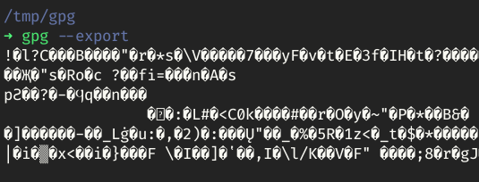

_com a opção `--armor`_

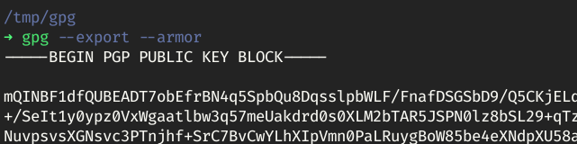

Essa saída não é muito fácil de decorar, então costumamos a direcionar essa saída para um arquivo. Para isto usamos a opção `--output`, esse comando por sua vez recebe o nome do arquivo de destino como argumento. Por convenção, criamos esse arquivo com a extensão `.pub`, de _public_. Logo após, passaremos o fingerprint da chave que queremos exportar. Nosso comando ficará assim:

```text
$ gpg --export --armor --output minha_chave.pub D3EED251C38AE4F4F3EE39310DA9480F7387D94C
```


É esse arquivo que disponibilizaremos de forma pública.

### Importar

Para importar uma chave pública para nossa keyring usamos a opção `--import`, e o arquivo da chave:

```text
$ gpg --import minha_chave.pub
```

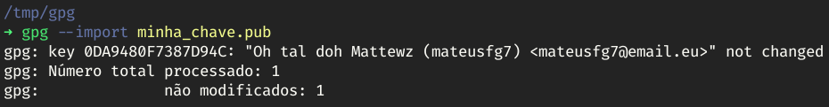

### Publicar

Podemos publicar a nossa chave de forma pública em servidor de chave na internet, para isto basta usar a opção `--send-keys` e o fingerprint da chave pública que você deseja publicar:

```text
$ gpg --send-keys D3EED251C38AE4F4F3EE39310DA9480F7387D94C
```

No meu caso minha chave foi enviada para [hkps://keys.openpgp.org](hkps://keys.openpgp.org), se o seu for diferente não tem problema.

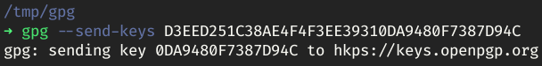

Para pesquisar uma chave bastar usar a opção `--search-keys` seguido do fingerprint da chave ou o email da pessoa que você quer pesquisar:

```text
gpg --search-keys D3EED251C38AE4F4F3EE39310DA9480F7387D94C
```

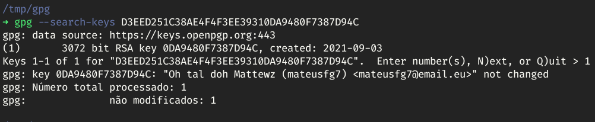

### Editar

Nós também podemos editar nossa chave. Para isto, usamos a opção `--edit-key` mais o fingerprint da chave que queremos editar:

```text
$ gpg --edit-key D3EED251C38AE4F4F3EE39310DA9480F7387D94C
```

Após rodarmos o comando, ira abrir um shell interativo do próprio gpg, com inúmeros comandos e opções para poder editar, para ver todas, basta digitar o comando `help`.

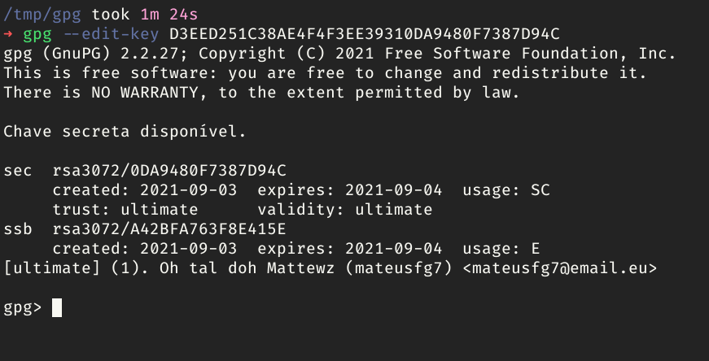


Para exemplificar, mudarei a data de expiração da minha chave para 0, ou seja, vou desativa-la. Após rodar o comando, será pedido o tempo para chave expirar e a senha da chave, para poder realizar as alterações.

```text
gpg> expire
Modificar a data de validade para uma chave primária.
Por favor especifique por quanto tempo a chave deve ser válida.
  0 = chave não expira
  <n>  = chave expira em n dias
  <n>w = chave expira em n semanas
  <n>m = chave expira em n meses
  <n>y = chave expira em n anos
A chave é valida por? (0) 0
Key does not expire at all
Is this correct? (y/N) y

sec   rsa3072/0DA9480F7387D94C
      created: 2021-09-03  expires: never       usage: SC
      trust: ultimate      validity: ultimate
ssb   rsa3072/A42BFA763F8E415E
      created: 2021-09-03  expires: 2021-09-04  usage: E
[ultimate] (1). Oh tal doh Mattewz (mateusfg7) <mateusfg7@email.eu>

gpg: WARNING: Your encryption subkey expires soon.
gpg: You may want to change its expiration date too.
```

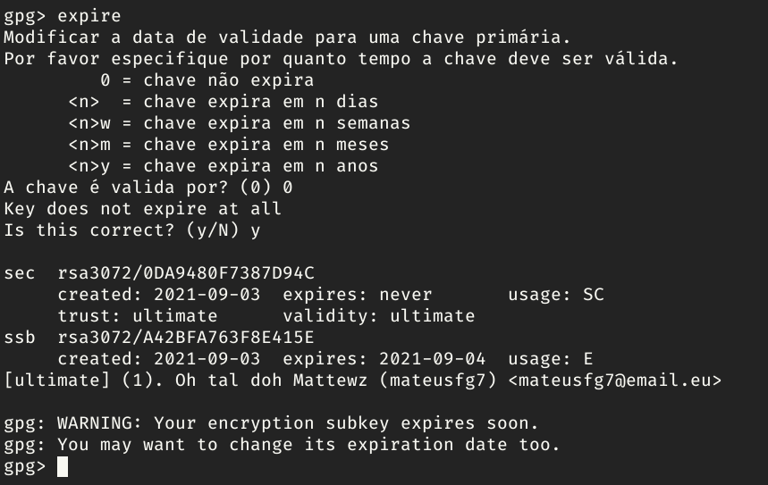

Para salva as alterações e sair do modo interativo, basta digitar `quit`. Pronto, minha chave agora não tem mais uma data de expiração.

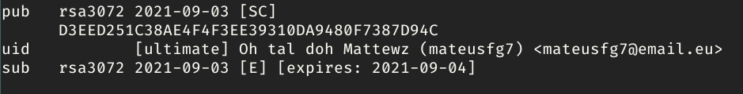

## Usando o key-pair

### Criptografando arquivos

Para criptografar um arquivo, usamos a opção `--encrypt`, seguido da opção `--recipient`, que por sua vez tem como parâmetro o fingerprint de quem receberá a mensagem/arquivo criptografado. Nosso comando final ficará assim:

```text
$ gpg --encrypt --recipient 5863874C7BBAFFE7829FB89C4151BFF1C8B0B523 mensagem.txt
```


### Descriptografando arquivos

Para descriptografar um arquivo usando a chave privada, basta usar a opção `--decrypt`, e o arquivo criptografado:

```text
$ gpg --decrypt mensagem.txt.gpg
```

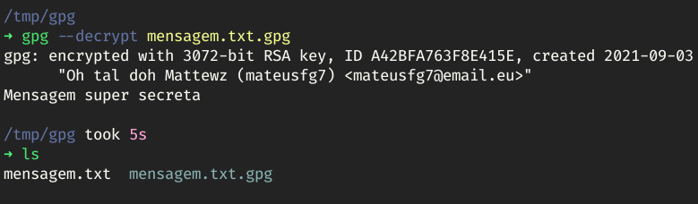

### Assinando mensagens

Outra função só gpg é assinar mensagens, imagine um cenário em que você não quer esconder a mensagem, e sim certificar que foi você quem escreveu a mesma. Esse é o objetivo de assinar mensagens, a ideia é você usar a chave privada para assinar a mensagem, e alguém que queira validar que aquela assinatura é sua, irá usar a sua chave pública.

Digamos que escrevi algo muito importante para a humanidade, salvei em um arquivo, e quero assinar esse arquivo, para provar que a descoberta foi minha. Para isto assinaremos a mensagem usando a opção `--clear-sign`, depois usaremos a opção `--default-key`, com o fingerprint da chave que será usada para assinar a mensagem, e o arquivo a ser assinado:

```text
$ gpg --clear-sign --default-key D3EED251C38AE4F4F3EE39310DA9480F7387D94C mensagem.txt
```

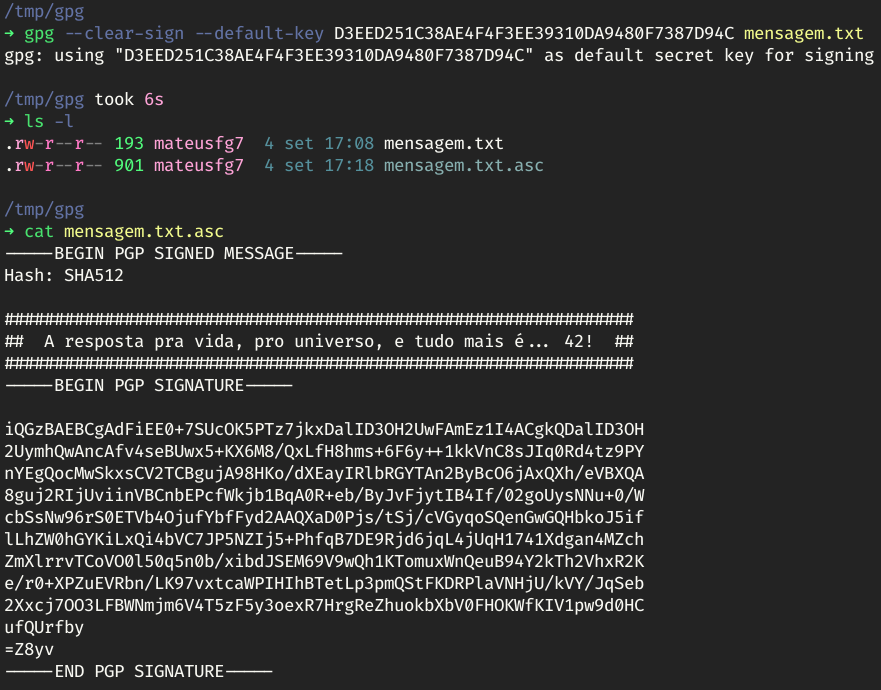

Para verificar a mensagem, basta usar a opção `--verify`, e o arquivo assinado:

```text
$ gpg --verify mensagem.txt.asc
```

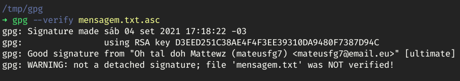

Se alguém alterar a mensagem, a verificação de assinatura irá falhar.


Também podemos assinar um arquivo binário, como PDF, imagem, vídeos, executáveis binários, etc. O processo para assinar esse tipo de arquivo será um pouco diferente porque não se abre um arquivo binário para ler, então o gpg criará outro arquivo separado onde contem a assinatura, e para verificarmos se nosso binário é válido, precisamos tanto do arquivo original quanto do arquivo de assinatura. Primeiro criaremos um arquivo binário com dados aleatórios para fins educacionais, mas o processo pode ser feito com qualquer arquivo binário.

```text
$ dd if=/dev/zero bs=1000000 count=10 > binary.dat
```


Para assinarmos arquivos binários usaremos a opção `--sign`, também usaremos a opção `--default-key` com o fingerprint da chave que usaremos para assinar o arquivo, e o arquivo:

```text
$ gpg --sign --default-key D3EED251C38AE4F4F3EE39310DA9480F7387D94C binary.dat
```

Com isso o gpg gerará um outro binário contendo a assinatura do arquivo.

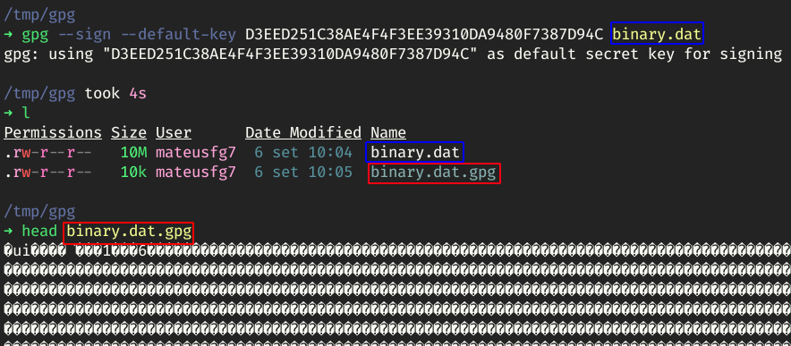

Para verificar a assinatura o processo é mesmo citado acima.


## Backup

O backup da chave privada é extremamente importante, pois se você perder o dispositivo onde esta armazenada a chave privada, não há nenhum meio de recupera-la. Para exportar a chave privada, usamos a opção `--output` seguido do arquivo de saída da chave, depois a opção `--export-secret-keys` seguido do fingerprint da chave que deseja exportar:

```text
$ gpg --output private_key.key  --export-secret-keys D3EED251C38AE4F4F3EE39310DA9480F7387D94C
```

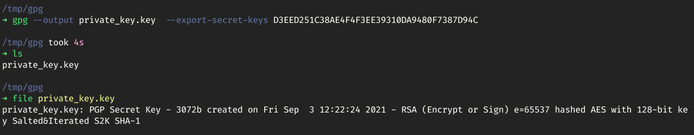

Para importa-la basta usar a opção `--import` e o arquivo:

```text
$ gpg --import private_key.key
```


# Conclusão

Esse foi só um apanhado do básico do GnuPG, há muito mais a se fazer com essa ferramenta. Para conhecer melhor ela basta usar a opção `--help`, que será listada todas as opções possíveis, ou até, no caso de sistemas Linux, usar o comando `man` seguido do programa que você quer ver o manual, no caso:

```text
$ man gpg
```

Isto irá abrir o manual do comando `gpg`.

Você também pode conferir o site oficial do GnuPG, listado abaixo nas referências.

---

# Referências

GnuPG: [_https://gnupg.org/_](https://gnupg.org/) [[_archive_](https://web.archive.org/web/20210903075632/https://www.gnupg.org/)]

Conheça o PGP: mensagens INVIOLÁVEIS com criptografia assimétrica: [https://www.youtube.com/watch?v=p_TYYOtA2LU](https://www.youtube.com/watch?v=p_TYYOtA2LU)

Tutorial GPG (em português): [https://www.youtube.com/watch?v=r8k-jJ-EHP8](https://www.youtube.com/watch?v=r8k-jJ-EHP8)

How to Encrypt and Decrypt Files With GPG on Linux: [https://www.howtogeek.com/427982/how-to-encrypt-and-decrypt-files-with-gpg-on-linux/](https://www.howtogeek.com/427982/how-to-encrypt-and-decrypt-files-with-gpg-on-linux/) [[_archive_](https://web.archive.org/web/20210906144246/https://www.howtogeek.com/427982/how-to-encrypt-and-decrypt-files-with-gpg-on-linux/)]

How to specify private key when decrypting a file using GnuPG?: [https://superuser.com/questions/920793/how-to-specify-private-key-when-decrypting-a-file-using-gnupg](https://superuser.com/questions/920793/how-to-specify-private-key-when-decrypting-a-file-using-gnupg) [[_archive_](https://web.archive.org/web/20210906144523/https://superuser.com/questions/920793/how-to-specify-private-key-when-decrypting-a-file-using-gnupg)]

Encrypt and sign with specific secret key: [https://unix.stackexchange.com/questions/171715/encrypt-and-sign-with-specific-secret-key](https://unix.stackexchange.com/questions/171715/encrypt-and-sign-with-specific-secret-key) [[_archive_](https://web.archive.org/web/20210906144656/https://unix.stackexchange.com/questions/171715/encrypt-and-sign-with-specific-secret-key)]

How to create binary file using Bash?: [https://stackoverflow.com/questions/8521240/how-to-create-binary-file-using-bash](https://stackoverflow.com/questions/8521240/how-to-create-binary-file-using-bash) [[_archive_](https://web.archive.org/web/20191109132407/https://stackoverflow.com/questions/8521240/how-to-create-binary-file-using-bash)]
