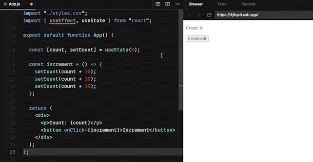

<Tip>
This post is a resume of post [Choosing the Right State Update Method Normal vs. Functional State Updates in React](https://www.linkedin.com/pulse/choosing-right-state-update-method-normal-vs-updates-react-verma-/), by [Apoorve Verma](https://www.linkedin.com/in/apoorveverma/?lipi=urn%3Ali%3Apage%3Ad_flagship3_pulse_read%3BudVa6%2FuETiu9EDMDaWJFkA%3D%3D).
</Tip>


# Diferences between `setState` methods

Before all, let's see the difference between the state update methods treated here.

## Normal States Updates

```tsx /count + 1/
import React, { useState } from 'react'

const Counter = () => {
  const [count, setCount] = useState(0);

  const increment = () => {
    setCount(count + 1);
  };

  return (
    <div>
      <p>Count: {count}</p>
      <button onClick={increment}>Increment</button>
    </div>
  );
};

export default Counter;
```

## Functional State Updates

```tsx /(prevCount) => prevCount + 1/
import React, { useState } from 'react'

const Counter = () => {
  const [count, setCount] = useState(0);

  const increment = () => {
    setCount((prevCount) => prevCount + 1);
  };

  return (
    <div>
      <p>Count: {count}</p>
      <button onClick={increment}>Increment</button>
    </div>
  );
};

export default Counter;
```

# When use functional state updates

The need for **functional state updates** arises from the **problem of stale state** and ensuring accurate state transitions. In **normal state updates**, subsequent state updates are based on the previous state value. However, when dealing with asynchronous updates or multiple state updates within a single function or event handler, the current state may not be up to date. This can lead to inconsistencies and unexpected behavior in your application.

## Problem

I.e., suppose you have a component that increments the count by 10 three times when a button is clicked:

```tsx {6-10}
import React, { useState } from 'react'

const Counter = () => {
  const [count, setCount] = useState(0);

  const increment = () => {
    setCount(count + 10);
    setCount(count + 10);
    setCount(count + 10);
  };

  return (
    <div>
      <p>Count: {count}</p>
      <button onClick={increment}>Increment</button>
    </div>
  );
};

export default Counter;
```

In this case, you might expect the count to increase by 30 after three button clicks. However, due to the nature of normal state updates, the value of count will only increase by 10, as each setCount call operates on the stale value of count.



## Solution

Functional state updates solve this problem by **providing the previous state value** as an argument within the updater function.
To fix the example above using functional state updates, you can modify the increment function as follows:

```tsx
const increment = () => {
  setCount((prevCount) => prevCount + 10);
  setCount((prevCount) => prevCount + 10);
  setCount((prevCount) => prevCount + 10);
};
```


# Referencies

Updating state based on the previous state (**oficial React docs**): _https://react.dev/reference/react/useState#updating-state-based-on-the-previous-state_
