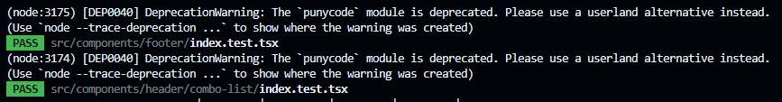

When we run a node script, we can see incovenie warnings like:



```console
(node:3174) [DEP0040] DeprecationWarning: The `punycode` module is deprecated. Please use a userland alternative instead.
(Use `node --trace-deprecation ...` to show where the warning was created)
```

For disable this warnings, just pass `NODE_NO_WARNINGS=1` as environment variable before node command or script, e.g.:

```console
NODE_NO_WARNINGS=1 node index.js
```

On `package.json` script:

```json /NODE_NO_WARNINGS=1/
// ...
  "script": {
    "test": "NODE_NO_WARNINGS=1 jest --watch"
  }
// ...
```
