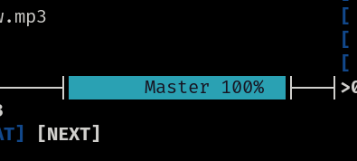
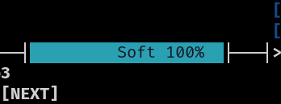

I was using MOCP on linux for a while to listenning some musics that I have downloaded on my machine, but the only defect of MOCP is the volume controll... until now...

The default volume controll of MOCP controlls the volume from ALSA hardware mixer setting, which change the volume from all system. That is a pain when you want to listennig musics as background music, while listenning another sounds too (like [noisekun.com](https://noisekun.com)).

Today I discovered that there is a way to make mocp volume controll independent from system volume.

You may see that on volume bar (lower left corner) was writen "Master":

This mean that the volume controll reflect the system volume, so we need to change this with the key <kbd>X</kbd>. Now our bar is:

And the volume is independent of system volume.

> If your volume bar is writen "S.Off", you can type <kbd>W</kbd> to change to "Soft"

**ref:** https://moc.daper.net/node/1512
