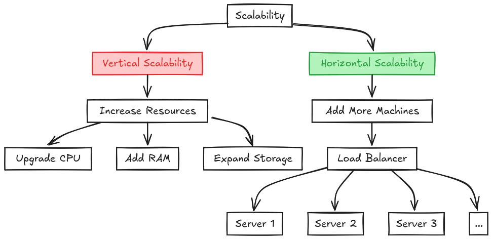
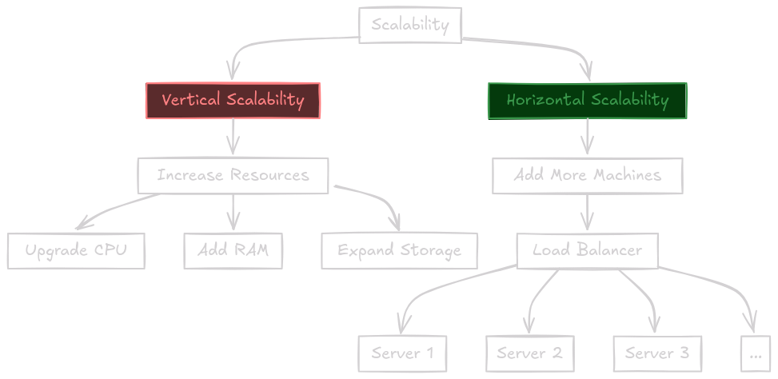
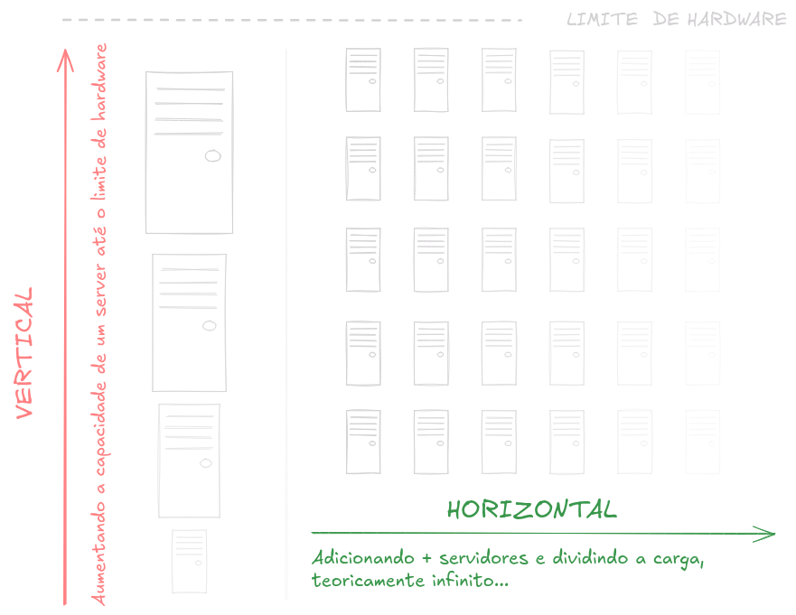
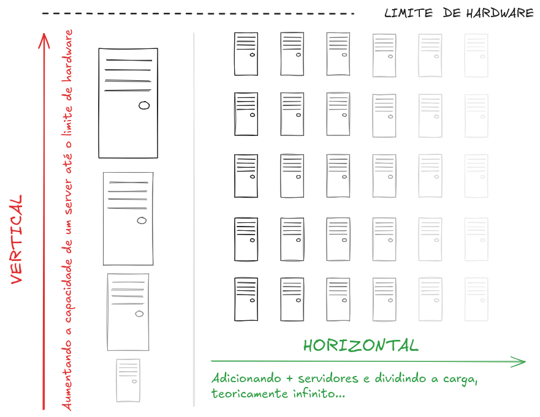

Sistemas que **escalam verticalmente** são aqueles que crescem em capacidade **adicionando mais recursos** ao **mesmo** servidor.
Sistemas que **escalam horizontalmente** são aqueles que crescem em capacidade adicionando **mais servidores** ao sistema.

Sistemas que escalam verticalmente possuem um limite de capacidade, pois a quantidade de recursos que um único servidor pode ter é limitada. Já os sistemas que escalam horizontalmente são mais flexíveis, pois podem crescer de forma quase ilimitada, já que podemos adicionar mais servidores em paralelo para dividirem a carga de recursos.

Um exemplo de sistema que escala verticalmente é um servidor de banco de dados relacional (PostgreSQL, MySQL, MariaDB, SQL Server...), onde se quisermos aumentar a capacidade de processamento, memória ou armazenamento, precisamos adicionar mais recursos ao mesmo servidor.

Em paralelo temos os bancos NoSQL, como o Cassandra, MongoDB, Couchbase, que são sistemas que escalam horizontalmente, pois podemos adicionar mais servidores ao cluster para aumentar a capacidade de armazenamento e processamento, dividindo a carga de consumo de recursos pelo sistema entre os servidores do cluster.
