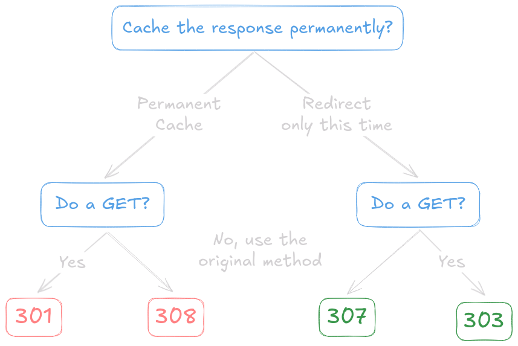
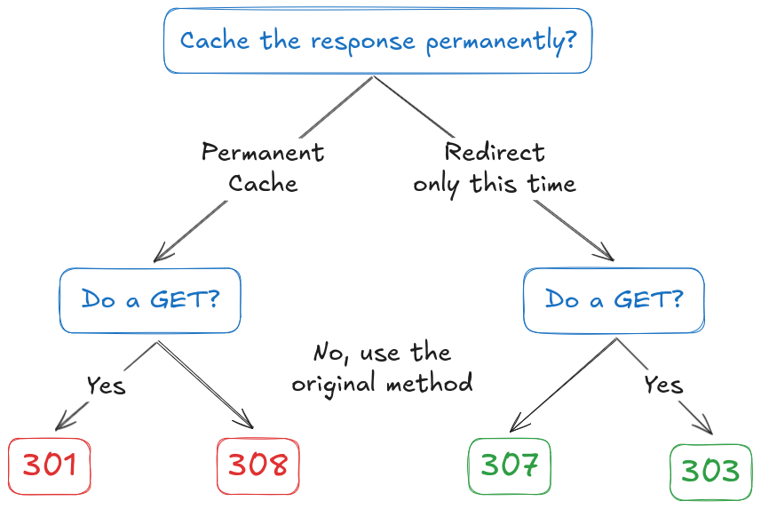

 
 

## 301: Permanent redirect

**The URL is old, and should be replaced**. Browsers will cache this, the method will change to GET, as per RFC 7231:

> For historical reasons, a user agent MAY change the request method from POST to GET for the subsequent requests.

**Example**: _URL move from `/register-form.html` to `signup-form.html`._

## 302: Temporary redirect

**Only use for HTTP/1.0 clients**. This status code should not change the method, but browsers did it anyway. The RFC says:

> Many pre-HTTP/1.1 user agents do not understand [303]. When interoperability which such clients is a concern, the 302 status code may be used instead, since most user agents react to a 302 response as described here for 303.

Of course, some clients may implement it according to the spec, so if interoperability with such ancient clients is not a real concern, **303 is better for consistent results**.

## 303: Temporary redirect (change method)

The 303 status code is a temporary redirect that changes the method to GET.

**Example**: _If the browser send a request to `POST /register.php`, then now load `GET /signup.php`_

## 307: Temporary redirect (keep method)

The 307 status code is a temporary redirect that keeps the original status code, repeating requets identically.

**Example**: _If the browsers sent a `POST /register.php` request, then this tells it to redo the `POST /signup.php`._

## 308: Parmanent redirect (keep method)

Where 307 is the "no method change" counterpart of 303, this 308 status code is the "no method change" counterpart of 301.

---

**Refs:**
- https://stackoverflow.com/a/55008140
- https://www.rfc-editor.org/rfc/rfc2616#section-10.3.3
- https://www.rfc-editor.org/rfc/rfc7238
- https://github.com/Fyrd/caniuse/issues/1830#issuecomment-233700576
